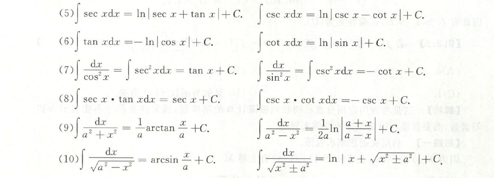

# Mathematics

[toc]

## CH1-极限连续

* 未定式极限 - ==分类== 10分
  * 无穷小：等价无穷小
  * 无穷大：提玛珐 Max
  * 幂指函数：$f^g = e^{glnf}$ 
  * 积分极限：洛必达法则
  * 不会做：夹逼定理（无穷小*有界=无穷小）
* 数列极限 10分
  * 单调有界
  * 夹逼定理
  * 定积分定义：用于求和结构
* 连续性 4分
  * 间断点：分类和定义
  * 零点定理：方程根的个数

* 没提到的
  * 拉格朗日中值定理：$f(b) - f(a) = (b-a)f^{'}(\xi)$ 
  
  * 积分中值定理：$\int_{a}^{b} {f(x)} \ dx = f(\xi)(b-a)$ 
  
    

## CH5-多元函数微分学

1. 可微性
   1. 初等函数：自动可微
   2. 已知$z=f(x,y)$，求出$z'_x, z'_y$，然后计算$\lim \frac {\Delta z-dz} {\rho} = 0$。
   3. 已知一个极限，构造$\lim \frac {\Delta z-dz} {\rho} = 0$。
2. 求导法则
   1. 显函数：四则运算 -> CPR -> 合并
   2. 隐函数：直接求偏导（一阶二阶代入）
3. 极值最值
   1. 无条件：$AC-B^2 > 0$或者用定义。
   2. 有条件：拉格朗日乘数法，十字叉乘。
   3. 闭区域：结合无条件和有条件，然后比较。

## LA1-行列式

1. 一般行列式 —— 消元
   1. 拉普拉斯：副对角线系数$(-1)^{mn}$
   2. 上下三角：副对角线系数$(-1)^{\frac {n(n-1)}2}$ 
   3. 范德蒙：$\prod\limits_{0\le i\lt j\le n}(a_j-a_i)$ 
   4. 不会做还可以考虑拆分或者合并
2. 展开定理 —— 大量为零
   1. 展开递推 + 差分方程
   2. 代数余子式和某行列元素的结合
3. 克拉默法则 —— 求$x_1$ （容易忽略的求解方法）

## PB6-数理统计

* **常用统计量**

  **统计量-样本；数字特征-随机变量；注意区别**

  1. 均值：$\overline X = \frac 1n \sum\limits_{i=1}^{n}X_i$ 注意：$E(\overline X) = \mu,\ D(\overline X) = \frac {\sigma^2}{n}$ 
  2. 方差：$S^2 = \frac 1 {n-1}\sum\limits_{i=1}^{n}(X_i-\overline X)^2 = \frac 1 {n-1}[\sum\limits_{i=1}^{n}(X_i^2)-n\bar X^2]$ 注意：$E(S^2) = \sigma^2,\ D(S^2) = \frac{2\sigma^2}{n-1}$ 
  3. 标准差：$S = \sqrt{\frac 1 {n-1}\sum\limits_{i=1}^{n}(X_i-\overline X)^2}$ 
  4. $k$阶原点矩：$A_k = \frac 1n \sum\limits_{i=1}^{n}X_i^k$ 
  5. $k$阶中心矩：$B_k = \frac 1n \sum\limits_{i=1}^{n} (X_i-\overline X)^k$ 

* **统计量的分布**

  1.  分布 $\chi^2 \sim \chi^2(n)$
     1. 定义：$\chi^2 = X_1^2 + X_2^2 + \dots + X_n^2 = \sum\limits_{i=1}^{n}{X_i^2}$ ，则有$\chi^2 \sim \chi^2(n)$ 
     2. 前提：$X_1,\ X_2,\dots,X_n$相互独立，且都服从标准正态分布$N(0,1)$ 
     3. 数字特征：$E(\chi^2) = n,\ D(\chi^2) = 2n$
     4. 可加性：$\chi_1^2 + \chi_2^2 \sim \chi^2(n_1+n_2)$ 
  2. $t$ 分布 $T\sim t(n)$ 
     1. 定义：$T = \frac {X}{\sqrt{Y/n}},\ 其中\ X\sim N(0,1),\ Y\sim \chi^2(n),\ 还有\ T^2 \sim F(1,n)$  
     2. 对称性：$t_{1-\alpha}(n) = -t_{\alpha}(n)$ 
     3. $n$充分大：由于分母期望为1，所以$n$充分大时t分布区域标准正态分布
  3. $F$ 分布 $F \sim F(n_1, n_2)$
     1. 定义：$F = \frac{X/n_1}{Y/n_2},\ 其中\ X\sim \chi^2(n_1),\ Y\sim \chi^2(n_2)$ 
     2. 倒数：$\frac 1F \sim F(n_2, n_1)$ 
     3. $F_{1-\alpha}(n_1,n_2) = \frac 1 {F_{1}(n_2,n_1)}$ 

* **正态总体**

  **单正态总体：**即$\overline X和S^2$ 相互独立

  1. $\overline X \sim N(\mu, \frac{\sigma^2}{n}),\quad \frac{\overline X - \mu}{\frac {\sigma}{\sqrt n}}\sim N(0,1)$  
  2. $\frac{(n-1)S^2} {\sigma^2} \sim \chi^2(n-1),\quad \frac 1{\sigma^2}\sum\limits_{i=1}^{n}(X_i - \mu)^2 \sim \chi^2(n)$ 
  3. $\frac{\overline X - \mu}{\frac {S}{\sqrt n}}\sim t(n-1)$ 

## PB7-参数检验

**概率统计本人第一大错误 分不清$E(X^2), D(X)=E(X^2)-[E(X)]^2$ ！！！**

* **要用到的四大分布：**
  1. $U=\frac {\overline X - \mu}{\frac {\sigma_0} {\sqrt n}} \sim N(0,1)$ 
  2. $T=\frac {\overline X - \mu}{\frac {S} {\sqrt n}} \sim t(n-1)$ 
  3. $\chi^2= \frac{\sum\limits_{i=1}^{n}(X_i-\overline X)^2}{\sigma_0^2} \sim \chi^2(n-1)$ 
  4. $\chi^2= \frac{\sum\limits_{i=1}^{n}(X_i-\mu)^2}{\sigma_0^2} \sim \chi^2(n)$ 

##  CH7-无穷级数

1. 数项级数

   1. 一般级数：绝对值、定义法
   2. 正项级数：比较审敛、极限审敛、比值审敛、根植审敛
   3. 交错级数：绝对收敛、莱布尼茨（单减趋于零）、定义法

2. 幂级数求和

   1. 常规：拆、配、凑、补
   2. 微分方程：代入、合并
   3. 其他：求导、积分

3. 展开麦克劳林级数

   1. 确保在零处展开
   2. 求导、积分、四则运算 
   3. 合并成最简

4. 傅里叶级数

   1. 奇偶性

   2. 周期性

   3. 收敛性

   4. 记住公式：正弦级数 - 奇延拓；余弦级数 - 偶延拓

      $f(x) = \frac {a_0}2 + \sum\limits_{n=1}^{\infin}{a_n \cos{n \omega x} + b_n \sin{n \omega x}}$ 

      $a_0 = \frac 1 \pi \int_{-\pi}^\pi{f(x)dx}$ 

      $a_n = \frac 1 \pi \int_{-\pi}^{\pi}{f(x) \cos{nx} dx}$

      $b_n = \frac 1 \pi \int_{-\pi}^\pi{f(x) \sin nx dx}$ 

      

## LA4-线性方程组

1. 齐次非齐次

   1. 齐次方程：基础解系$s=n-r(A)$ 
   2. 非齐次方程：判定$r(A)=r(A:B)$，求解初等变换
   3. 基础解系特点：方程的解、线性无关、数量关系

2. 矩阵方程$Ax=B$ 

   1. **可逆**：$x=A^{-1}B$
   2. **不可逆**：分别解$Ax_1=\beta_1, Ax_2=\beta_2$ 

3. 公共解、同解

   1. 同解：$r(\frac AB) = r(A^T) = r(B^T)$

   2. 公共解：联立方程、联立解系

      

## CH2-一元函数微分学

1. 导数与微分

   1. 可导/微：动静结合，左右兼备，极限存在
   2. 微分的意义：$\Delta y = dy+o(\Delta x) = f'(x_0) \Delta x + o(\Delta x)$ 
2. 导数计算：复合函数、隐函数、参数方程、反函数、高阶导
3. 中值定理 - 注意区间需要分割

   1. 一阶导数（一次求导）
      1. 父子关系：罗尔定理（等式中）
      2. $a, b, f(a), f(b)$：拉格朗日或者柯西
   2. 高阶导数：泰勒中值定理（选 展 赋 凑）
4. 应用：驻点、极值点、拐点、不等式-拉格朗日/单调性、方程的根，曲率和渐近线

## LA5-特征值与特征向量

1. 特征值、特征向量
   1. 数字型：直接算，先$\lambda$后$\alpha$ （秩为1特殊计算）
   2. 抽象型：构造，秩，$r(A) = 1$ 
   3. 保值运算（相似）、保向运算（大部分其他）；
   4. 传递性
2. 矩阵相似
   1. 必要性：秩，特征值，$f(A) \sim f(B)$ 
   2. 
   3. 充分性：$P_1^{-1}AP_1 = \Lambda = P_2^{-1}AP_2$ 
   4. **对称**矩阵：$Q^TAQ=Q^{-1}AQ=\Lambda$，特征值，特征向量（叉乘），单位化

## PB4-数字特征

1. 期望方差
   1. 定义
   2. 性质
   3. 常见分布 - 曹冲称象
2. 协方差相关系数
   1. 协方差：自由组合
   2. 相关系数：独立性推不相关；线性组合推相关系数
3. 独立性单向推得不独立 - 特例二维正态分布

## PB5-大数中心

1. 切比雪夫不等式

   **一个数偏离其期望的概率的上限：**$P\{|X-E(X)| \ge \epsilon\} \le \frac {D(X)}{\epsilon^2}$  

2. 大数定律

   **依概率收敛：**$\lim\limits_{n\rarr\infin}P\{|X_n - a| < \epsilon\} = 1$ 

   **均值依概率收敛于数学期望**

   * 切比雪夫大数定律：独立、期望存在、方差有上界；均值依概率收敛于其数学期望
   * 伯努利大数定律：独立、同服从0-1分布；均值依概率收敛于其数学期望$p$ 
   * 辛钦大数定律：独立同分布、期望为$\mu$；均值依概率收敛域其数学期望$p$，$\lim\limits_{n\rarr\infin}P\{|\frac1n\sum\limits_{i=1}^{n} X_i-\mu|\le \epsilon\} = 1$

3. 中心极限定理

   **大量独立同分布均值近似服从正态分布：**$\overline X \sim N(\mu, \frac{\sigma^2}{n})$ ；特殊$Y_n \sim B(n,p) \sim N(np, np(1-p))$ ，期望方差存在

## LA6-二次型

**二次型的矩阵都是对称矩阵，都有正交矩阵Q使得** $Q^TAQ=Q^{-1}AQ=\Lambda$ 

1. 标准型 规范型
   1. 正交变换：$Q^TAQ= B$ 
   2. 配方法：$C^TAC= B$ 
   3. 惯性指数：$p+q=r(A)$ $p,q$分别为正负惯性指数，也等于正负特征值个数。
2. 正定
   1. $p=n, q=0$ 
   2. $\lambda_i > 0$ 
   3. $A=C^TEC$ 
3. 合同
   1. $p_A=p_B, q_A=q_B$ 
   2. 正负特征值个数相同

## CH6-常微分方程

1. 一阶微分方程
   1. 可分离变量：分离变量再积分
   2. 一阶齐次：换元法$u=\frac yx$
   3. 一阶线性：父子关系构造指数
   4. 伯努利方程：$y'+p(x)y+q(x) = f(x) y^n$
   5. 全微分方程：验证二阶混合偏导，原函数为常数
2. 二阶微分方程
   1. 二阶非线性：降阶法换元$p=y'$
   2. 二阶线性
      1. 一般二阶线性：解的结构
      2. 二阶齐次：特征方程和通解的结构
      3. 常系数微分方程：$y'' + ay' + by = P_m(x)e^{\lambda x}$待定系数法和连环算子法
      4. 设通解 $Q(x)e^{\lambda x}$，==化简==后$Q'' + (2\lambda + a) Q' + (\lambda^2 + \lambda a + b) Q = P_m(x)$  
3. 应用
   1. 建立方程
   2. 求导去积分号
   3. 求解 微分方程解的结构
   4. **初值条件**：一定要注意的是要看题目是否明确给出了初值条件，是否存在隐含的初值条件，比如上下限相等的时候积分为零；！！！==初值条件很关键== 

## CH8-空间几何

1. 曲面

   1. 空间曲面的法向量：$(F_x'(x_0,y_0,z_0), F_y'(x_0,y_0,z_0), F_z'(x_0,y_0,z_0))$
   2. 空间曲面的法线方程：$\frac{x-x_0}{F_x'(x_0,y_0,z_0)} = \frac{y-y_0}{F_y'(x_0,y_0,z_0)} = \frac{z-z_0}{F_z'(x_0,y_0,z_0)}$ 
   3. 空间曲面的切平面方程：$F_x'(x_0,y_0,z_0) \times(x-x_0) + F_y'(x_0,y_0,z_0) \times(y-y_0) + F_z'(x_0,y_0,z_0) \times(z-z_0)=0$ 

2. 空间曲线

   1. 空间曲线参数方程：$\{x=x(t),\ y=y(t),\ z=z(t)\}$
   2. 空间曲线切向量：$(x'(t_0), y'(t_0), z'(t_0))$
   3. 空间曲线切线方程：$\frac{x-x_0}{x'(t_0)} = \frac{y-y_0}{y'(t_0)} = \frac{z-z_0}{z'(t_0)}$ 
   4. 空间曲线法平面方程：${x'(t_0)}\times{(x-x_0)} + {y'(t_0)}\times{(y-y_0)} + {z'(t_0)}\times{(z-z_0)} $ 

   

## CH9-三重线面积分

1. 三重积分

   1. 直角坐标
      1. 交换积分顺序
      2. 先一后二：穿线法
      3. 先二后一：截面法
   2. 球坐标：$(0\le\theta\le\pi, 0\le\varphi\le2\pi)$ 
      1. $x=r\sin\theta\cos\varphi$ 
      2. $y=r\sin\theta\sin\varphi$ 
      3. $z=r\cos\theta$ 
      4. ⚠：$dv=r^2\sin\theta\ dr\ d\theta\ d\varphi$ 
   3. 柱坐标：$(0\le\varphi\le2\pi)$ 
      1. $x = r \cos\varphi$ 
      2. $y=r\sin\varphi$ 
      3. $z=z$ 
      4. ⚠：$dv=r\ dr\ d\varphi\ dz$ 
   4. 奇偶性：尤其是奇函数
   5. 轮换对称性：部分轮换对称、完全轮换对称
   6. 回忆一下二重积分的极坐标补上$r$ 

2. 曲线积分

   1. Ⅰ类曲线-无方向

      1. 直角坐标：$\int{f(x,y) ds}=\int{f(x,y)\sqrt{1+y'^2}dx}$ 
      2. 参数方程：$\int{f(x,y)ds} = \int{f[(x(t), y(t)]\sqrt{x(t)'^2, y(t)'^2}dt}$ 
      3. 极坐标：$\int{f(x,y)ds} = \int{f(\rho\cos\theta, \rho\sin\theta)\sqrt{\rho^2+\rho'^2}d\theta}$ 

   2. Ⅱ类曲线-有方向 ==注意符号==

      1. 格林公式：$\oint_L{Pdx+Qdy} = \iint\limits_D{(\frac{\part Q}{\part x}-\frac{\part P}{\part y})dxdy}$，左边为正
      2. 一般计算：$\oint_L{Pdx+Qdy} = \int_a^b{[P+Q\times y_x']dx} = \int_\alpha^\beta{[P(t)x'(t)+Q(t)y'(t)]dt}$，注意有时需要分段

   3. Ⅰ类空间曲线：$\int{f(x,y,z)ds} = \int{f[x(t), y(t), z(t)]\sqrt{x(t)'^2 + y(t)'^2 + z(t)'^2}dt}$ 

   4. Ⅱ类空间曲线：

      1. 参数方程法：由于曲线通常为截面得到，这里通常需要分段计算。
         $\oint_L{Pdx+Qdy+Rdz} = \int_a^b{[P+Q\times y_x'+R\times z_x']dx} = \int_\alpha^\beta{[P(t)x'(t) + Q(t)y'(t) + R(t)z'(t)]dt}$ 
      2. 降维法：将题给的$z=(x,y)$和$dz$的值代入进去，降维成二维曲面（一般是平面），投影到$xOy$平面上。
         1. 斯托克斯公式：将空间曲线转为Ⅱ类的空间曲面（一般是平面），然后利用三合一或者定义计算。
            $\begin{vmatrix}
            dydz & dzdx & dxdy\\
            \frac{\part}{\part x} & \frac{\part}{\part y} & \frac{\part}{\part z}\\
            P & Q & R\\
            \end{vmatrix}$ 

   5. Ⅰ类和Ⅱ类曲线之间的关系

      $\int_L{Pdx + Qdy} = \int_L{(P\cos\alpha + Q\cos\beta) ds}$ 
      其中$\cos\alpha, \cos\beta$是右向曲线$L$在该点的方向余弦。

3. 曲面积分 

   1. Ⅰ类曲面-无方向-投影代入积分-投带积

      1. 一般方法：$\iint\limits_\Sigma {f(x,y,z)dS = \iint\limits_{D_{xy}}{f[x,y,z(x,y)] \sqrt{1 + z_x'^2 + z_y'^2}}dxdy}$ 

   2. Ⅱ类曲面-有方向 ==注意符号==

      1. 高 斯 公 式：$\oiint\limits_\Sigma {Pdydz+Qdzdx+Rdxdy} = \pm \iiint\limits_\Omega{(\frac{\part P}{\part x} + \frac{\part Q}{\part y} + \frac{\part R}{\part z})dv}$ ，向外为正
      2. 三合一公式：$\iint\limits_\Sigma {Pdydz+Qdzdx+Rdxdy} = \pm \iint\limits_{D_{xy}} {(-z_x'P-z_y'Q+R)dxdy}$ ，曲面方向与$z$轴夹角小于$\frac \pi 2$为正
      3. 一般：$\iint_\limits\Sigma{R(x,y,z)dxdy = \pm \iint\limits_{D_{xy}}} {R[x,y,z(x,y)]dxdy}$ ，曲面方向与$z$轴夹角小于$\frac \pi 2$为正

   3. Ⅰ类Ⅱ类曲面之间的关系

      $\iint\limits_\Sigma{Pdydz + Qdzdx + Rdxdy} = \iint\limits_\Sigma{(P \cos \alpha + Q\cos\beta + R\cos\gamma)dS}$ 
      其中$\cos\alpha, \cos\beta, \cos\gamma$是曲面$\Sigma$在点$(x,y,z)$处的正法线向量的方向余弦。

4. 其他

   1. 梯度：$\nabla \vec F = \bold {grad\ F } =  F_x \vec i + F_y \vec j + F_z \vec k$ 
   2. 散度：$div \vec F = \frac{\part P}{\part x}+\frac{\part Q}{\part Y}+\frac{\part R}{\part Z}$  其中$\vec F = P\vec i + Q\vec j + R\vec k$ 
   3. 旋度：$\bold{rot F} = \begin{vmatrix}
      \vec i & \vec j & \vec k\\
      \frac{\part}{\part x} & \frac{\part}{\part y} & \frac{\part}{\part z}\\
      P & Q & R\\
      \end{vmatrix}$  其中$\vec F = P\vec i + Q\vec j + R\vec k$ 
   4. 方向余弦、方向导数

## CH3-一元函数积分学

1. 不定积分：先还元，再分部（凑微分，留数定理）
2. 定积分：一般计算，特殊计算（奇偶性、周期性、华里士、区间再现啊QAAAH），变限积分
3. 反常积分：敛散性判别（关键点、化简并比较级数）
4. 应用：面积，绕轴旋转体积，几何应用（弧长、侧面积、形心）、物理应用。

## CH4-二重积分

1. 画图！

2. 奇偶性、轮换对称性

3. 分类

   1. 直角坐标 - ==交换积分顺序 拆分合并==
   2. 极坐标 - 一定要有 $rdr$ 
   3. 随时灵活换元

4. 积分表

   

## LA2-矩阵

1. 矩阵乘法
   1. 结合律 —— 通用最常用
   2. 消去律 —— 可逆矩阵才可消去，灵活逆用消去律
   3. 交换律 —— 可交换矩阵，一般是单位矩阵
2. 矩阵重要运算
   1. 逆矩阵$A^T$：行列式不等于零、满秩矩阵、齐次方程组没有非零解；加法逆转化乘法逆
   2. 伴随矩阵$A^*$：宏观结构、宏观结构、伴随矩阵的秩(0 1 n)
   3. 初等变换： 左行右列 + 三大初等矩阵 +  保秩
3. 秩
   1. 定义：非零子式最高阶数
   2. 方法：初等变化 $(A:E) \cong (E:A^{-1})$  
   3. 基本性质：转置不变、相乘取小、相加取和、可逆保秩、相乘为零秩和小于N

## LA3-N维向量

1. 线性相关/无关
   1. 秩：增广之后秩数不减小，但是始终小于矩阵尺寸
   2. 定义：列出等于零的等式，然后通过消元来实现
   3. 保秩运算：一个线性无关组A乘一个矩阵B，得到新的矩阵C的秩只和B有关，等于B的秩。
2. 极大无关组：无关 + 极大
3. 向量组等价：$r(A) = r(B) = r(A:B)$ 
4. 向量组线性表示：A可由B表示，即$r(A:B) = r(B)$ ，区别联系向量线性表出

## PB1-随机事件

1. 事件的运算

   1. 包含 $\sub$ 
   2. 和事件 $\cup$，积事件 $\cap$ 
   3. 互斥，对立
   4. 分配律
   5. 德摩根率

2. 概率计算

   1. 加法公式（两个事件、三个事件）
   2. 减法公式
   3. 乘法公式
   4. 条件概率
   5. 全概率贝叶斯：图形
   6. 几何概型

3. 独立性

   $P(AB) = P(A)\times P(B) \Lrarr P(A|B)= P(A) \Lrarr  P(B|A) = P(B)$ 

## PB2-随机变量

1. 分布函数 - 累积性
   1. 右连续性
   2. 规范性
2. 常见随机变量
   1. 离散型：泊松分布 $P(\lambda)$，几何分布 $G(p)$ - 无记忆性
   2. 连续型：指数分布 $E(\lambda)$，正态分布 $N(\mu, \sigma^2)$ - 标准化
3. 随机变量函数的分布
   1. 画出图像
   2. 找出关键点
   3. 解方程

## PB3-二维随机

1. 二维分布
   1. 离散型：联合分布表（边缘分布、条件分布）三者的关系很重要
   2. 连续型：$f(x,y)$是根本，进而得到$F(x,y), f_X(x), f_Y(y), f_{Y|X}(y|x)$ 
   3. 独立性：

2. 二维正态分布

   1. 独立性：$\rho=0$ 
   2. 边缘：一维 - 正态，线性组合 - 正态
   3. 凑：配方、除系数、添因子 

3. 二维随机变量函数分布

   1. 卷积公式：$Z = X - Y \ \rarr\ Y = h(X,Z) = X-Z \ \rarr\ f_Z(z) = \int_a^b|\frac{\part h}{\part z}|f(X, h) dx$ 
      定义求解：$P(Z \le z) = P(X-Y \le z)$ 二重积分做
   2. 全概率公式
   3. 较大较小

4. 正态分布

   **二维正态分布：**$f(x,y) = \frac{1}{2\pi\sigma_1\sigma_2\sqrt{1-\rho^2}}\ exp\{- \frac 1 {2(1-\rho^2)}[\frac{(x-\mu_1)^2}{\sigma_1^2} + \frac{(y-\mu_2)^2}{\sigma_2^2} -2\rho \frac{(x-\mu_1)(y-\mu_2)}{\sigma_1 \sigma_2 }] \}$ 
   **一维正态分布：**$f(x) = \frac 1{\sqrt{2\pi}\sigma}e^{-\frac{(x-\mu^2)}{2\sigma^2}}$ 

