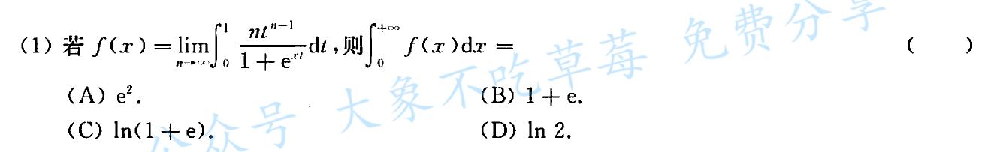
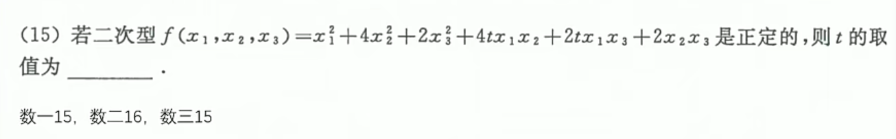
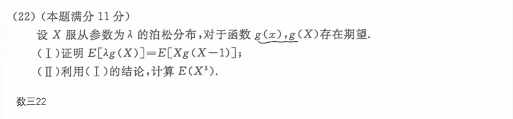

# 第一套

## 高数

1. 
2. 
3. 
4. 
5. 
6. 
   ==特例法==
7. 
8. 
   ==挺难的==
9. 
10. 
11. 
    ==highlight== 
12. 
    ==分部积分==  ==牛顿莱布尼茨公式构造== 
13. 
    ==换元之后 变限积分求导== 
14. 
    ==换元 + 二重积分交换积分顺序==  
15. 
    注意不可以用洛必达，这是陷进，用泰勒展开可以求解；
16. 
    构造罗尔定理，父子函数
17. 
    注意用完高斯之后，就变成了三重积分，不可以用$x^2 + y^2 + z^ 2 = R^2$代入计算了，这是曲面边界上的条件
18. 
    欧拉方程定义，求解
19. 
    画出图形，确定面积，然后求导分析
20. 
    两个瑕点，应该要分开讨论。四次幂太高，所以需要上下除，然后凑微分。
21. 
    变限积分求导，分离变量的微分方程

## 线代

1. 
   矩阵满秩除了行列变换、行列式求值外还可以看$Ax=0$是否有非零解。
2. 
   矩阵正定：特征值、迹、顺序主子式、$x^TAx > 0$ ，根据定义挨个考察；正定矩阵必定满秩且可逆
3. 
   定义去做
4. 
   **相似对角化**的条件：对称矩阵$A^T = A$，否则k重特征值就要有k个无关的向量。
   秩为1的矩阵的特点：秩$r(A) = 1$，拆分组合$A\alpha = \alpha\beta^T\alpha = (\beta^T\alpha) \alpha,\ \lambda = \beta^T\alpha$，方程$Ax=0$ $(n-1)$无关解 
5. 
   判断正定：特征值、顺序主子式、配方；
6. 
   特征值之积就是行列式的值。这道题是对称矩阵，所以利用正交性$Q^TAQ = \Lambda$ 
   第二问先利用相似性，判断待求矩阵的秩。解方程的前提是知道矩阵的秩，这是前提。有伴随，要求通解，首先就想到转换成原矩阵的特征向量。

## 概率

1. 
   二位正态的分布：X一维正态，Y一维正态，$\rho = 0$是X=Y的充要条件，$(aX+bY, cX+dY) \sim N(二维)$ $\ (aX+bY) \sim N(一维)$ 
   协方差的计算：自由组合原理，线性扩展原理，独立为零，相同为方差，有常数为零；
2. 
   $D(X) = E(X^2) - E(X)$ 
3. 
   第一类错误：弃真，原假设成立，但是落在拒绝域内的概率
   第二类错误：存伪，原假设不成立，但是没有落在拒绝域内的概率
4. 
   相关系数：协方差除以二者标准差的乘积
5. 
   中心极限定理指的就是大量同分布的简单随机变量满足$\overline X \sim N(\mu, \frac{\sigma^2}n)$ 
6. 

# 第二套

## 高数

1. 
2. 
   等值线就是z为常数的时候，即得到$z_xdx + z_ydy = 0 $ 
3. 
   特例法：令$f(x) = e^{-x}$ 
4. 
   傅里叶级数 $f(x) = \frac {a_0}2 + \sum(a_n\cos nx + b_n \sin nx)$  $a_n = \frac 1{\pi}\int_{-\pi}^{\pi}f(x)\cos nx$ ，$b_n = \frac 1{\pi}\int_{-\pi}^{\pi}f(x)\sin nx$ 
5. 
   选C，因为只能由泰勒定理推导到这个，无法逆推
6. 
   ==分部积分== 回忆一下强化班有一道题，就是二元积分的二阶导积分求解，只能利用分部积分把积分号中的导数提取出来，然后一步一步得到。如果是二元积分，还需要交换积分顺序。
7. 
   ==隐函数存在定理== $F(x,y,z) = 0\quad F_xdx + F_ydy + F_zdz = 0$，隐函数存在定理就是，当且仅当$F_z \ne 0$时，才可以说$z= z(x,y)$ 
8. 
   可微、偏导；分离极限，然后排除干扰；右边是一个高阶比低阶的情况，然后高阶比低阶，夹逼定理趋于零。前半部分就相当于$f(x,y)-0x-0y$，然后立即推出可微，且两个偏导都是零。==排除干扰项== 极限，积分计算都可以看看是否可以分离，尤其是积分的分离。
9. 
   解题思路：给了偏导，然后构造微分方程求解，其实就是令$z = f(u)$然后求解$f(u)$，最后代入数计算。
10. 
    拉格朗日中值定理，然后消去三角，以后看到都要知道；无穷小乘有界等于无穷小
11. 
    ==反函数求导公式== $y = f(x),\ y = f(y) \ \rarr\ g'(y) = \frac 1 {f'(x)}, g''(y) = \frac{-f''(x)}{[f'(x)]^3}, g[f(x)] = f[g(x)] = x$ 
    三个相乘的求导：$(uvw)' = u'vw + uv'w + uvw'$ 
12. 
    ==二阶线性微分方程== 不是常系数！！！这里只有一种方法，就是三个都带进去；注意变系数的，之前提到的那些方法都没有，特征方程，连环算子等等都不可用；但是可以用的是，非齐次特解相减等于齐次通解，然后这里如果求通解的话要反应过来是，$y = k_1(y_2-y_1) + k_2(y_3-y_1) + y_1$ ，只能用解的性质做
13. 
    三度的计算：梯度、散度、旋度
14. 
    方向导数：怎么求解方向导数，方向导数的最大值就是模值，方向导数的方向就是梯度的方向；这里求$f_x,f_y$即可
15. 
    反常积分一般重点在审敛上，计算的话就是按照定积分计算来算，这里直接换元就可以求解。反常积分的审敛注意两点，一个是每一个瑕点需要单独计算，第二是一般都需要化简变换成为基本形式，即$\frac 1{x^p}$的形式。答案是$\pi $ 
16. 
    这里一看就要换元然后等价无穷小；和之前二元微分中直接替换不同，这里需要做坐标变换，即将其转化为极坐标，然后把二元积分转化成一元积分。**好题** 答案是 7
17. 
    ==切线概念== 在某一点函数值相等，且该点的导数等于其斜率，这题挺难算的啊；虽然只是用定义，但是计算难啊
18. 
    ==极值点的证明== 两侧导数异号，一阶导数为零二阶导数为零；定义法；！！！不要想着解方程，这里解不出来啊；况且这里只是求极值点，不是要这个函数啊，宝贝，太蠢了吧你；对第一个等式反复求导，然后得到四阶导数不为零，虽然根据推论可以得到。但是作为证明题是需要你自己证明的啊！！！==泰勒展开== 可以证明啊，然后根据局部保号性，x在零点附近的领域内都大于零，即$f(x) \sim \frac{x^4}{12}$ 
19. 
    比较简单，就是隐函数求导
20. 
    ==好题== 作差，通分，有理化，然后数学归纳得到其单调有界。其实也可以构造两个等式，然后利用中值定理打开，证明单调性；然后提前求出其界限，然后里用数学归纳法证明都成立。证明数列极限收敛一般两个方法：夹逼定理；单调有界收敛准则；
21. 
    收敛半径内绝对收敛，收敛半径外发散，收敛半径上可能条件可能绝对，可能发散
22. 
    ==好题== 看懂题目，梯度的定义，然后就知道第一部分就是$F_x$第二部分就是$F_y$，然后利用$F_{xy} = F_{yx}$。再对其进行积分，这里采用凑微分的方法，然后得到$\arctan (\frac {x^2}{y^2})$类似的东西。第二问就类似20年考研的题目，就挖去奇点，然后$x^4 + y^4 = {\epsilon}^4$就可以把曲线分为两部分，然后利用格林公式，该消去的消去。然后二重积分，利用奇偶性。
    
23. 
      这个题不难，先换元，然后求解，然后三角换元，然后记得最后要换元。不定积分是基础；先换元再分部随时凑微分，还有一把屠龙刀，就是留数定理。
24. 
      题目不难，要识别一个==隐藏初始条件==，就是$f(0) = 0$，这个非常重要；==渐近线== 一定要分类讨论，水平，垂直，斜渐近线，==正负两个方向==；一定要注意==正负两个== 题目不难，但是很容易错！！！
25. 
      这道题不难，仔细算就行；没有初值条件

## 线代

1. 
   这里配方法就可以解出来。==正定矩阵== 如果全部特征值都大于零，那么必然$f>0$，如果特征值大于等于零，则$f\ge 0$ ，这里可以配方，也可以求特征值
2. 
   对称矩阵必定可以相似对角化，说是求秩，就是求非零的特征值；然后还有一个考点是秩为一的矩阵拆成两个向量秩积；还有就是特征值特征向量的可加性，就是知道了$\alpha \alpha^T$的特征值，要求出$E-\alpha \alpha^T$的特征值，然后就可以求秩；注意矩阵的对称性；
3. 
   伴随矩阵的定义：$A^*$等于每个元素的代数余子式的转置。清楚了概念，这道题就出来了；
4. 
   可以联立方程组计算，也可以把四个系数看作是$x_1, x_2, x_3, x_4$，然后当作系数矩阵，然后进行矩阵变换，求解。最后的结果是带一个系数$k$的。==矩阵方程同解== $Ax = B, Cx = D$，则有$r(\frac{A:B}{C:D}) = r(A:B) = r(C:D)$，当然有一个前提就是各自的方程都要有解才行；
5. 
   ==A^2 = A== 根据这个条件，就知道$A^2-A$，然后就有$\lambda^2-\lambda = 0$ ，即特征值$\in \{0, 1\}$ 这里有一个小技巧$r(A) + r(A-E) \le 0$然后还有$r(A) + r(A-E) = r(A) + r(E-A) \ge r(E) = n$ ，因此证得该矩阵必有$n$个线性无关得特征向量；第二问观察发现该矩阵秩为1；由于$A(A-E) = 0$因此很容易得到属于特征值1的特征向量为A中的无关列；特征值0的特征向量为$A-E$中的无关各列；

## 概率

1. 
2. 
   ==数学期望== 数字特征很少有硬算的，这道题就很巧妙地把两个变量拆开了；一个是二项分布$B(n,\frac 12),G(\frac 12)$ ，真的不会做啊；数字特征除了积分之外，很少有硬算的；
3. 
   大量独立同分布符合中心极限定理，然后利用对称性求解；注意每一次投掷都是一个两点分布；
4. 
   
   ==假设检验== 去真存伪，常看常新
5. 
   根据数学期望的定义计算，然后右边写出第一项，然后统一两边的系数，即得到二者相等；

