# 极限连续

## 函数的几何特性

等价无穷小 泰勒展开

奇函数求导为偶函数、偶函数求导为奇函数、奇函数积分为偶函数、偶函数积分不一定是奇函数（积分变量为零）

对称性的定义$f(x) = f(2a-x)$

## 极限的概念与性质

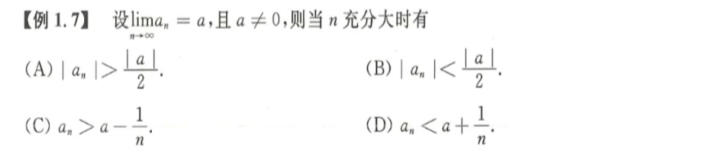
极限的定义和局部保号性。

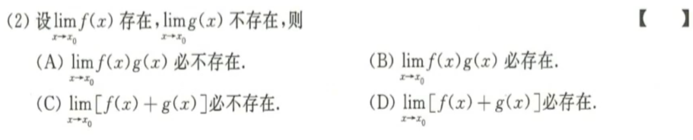
极限存在

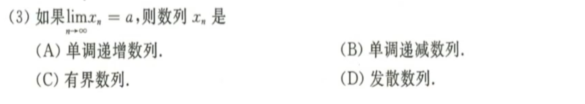
单调有界必收敛，收敛必有界

无穷大的抵消

## 未定式极限的计算

等价无穷小的相对性

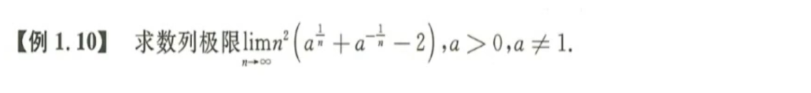
指数函数泰勒展开，化成$e^x$

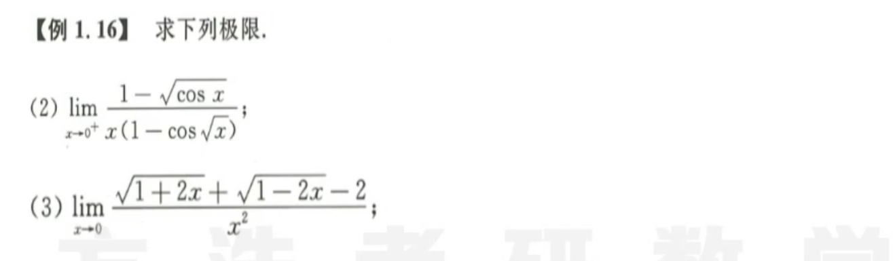
第一问：1/2；第二问：泰勒展开

不能拆开 直接泰勒展开

泰勒展开

拉格朗日 + 泰勒中值定理

提马法，然后等价无穷小，泰勒展开

提马法，然后泰勒展开，把1/x看作t无穷小

提马法 泰勒展开

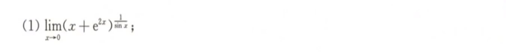
指数型，泰勒展开

泰勒展开 拉格朗日 结合

多次使用指数型极限，然后等价。这里出现了特殊的伪无穷

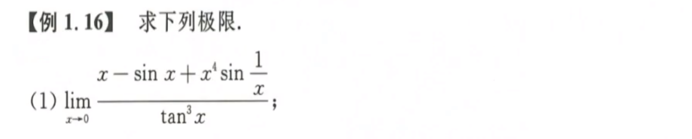
部分泰勒展开即可，注意$\sin{\frac 1 x}$无法处理

洛必达，换元，记得改变积分上下限

洛必达 等价无穷小的函数等价无穷小

分开积分，两次洛必达，然后结合导数定义。上下都有洛必达的，也可以分开洛必达

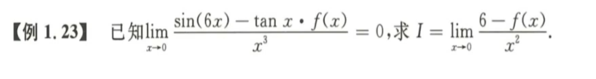
利用极限定义，利用无穷小定义，$o(x)$用于替代$f(x)$ 

换元 指数型 等价无穷小 泰勒展开 拉格朗日

## 数列极限

数列收敛：单调有界必收敛准则，有界已经知道了，单调明显需要作差，分离不等式，然后构造。然后取极限代入原不等式中。 

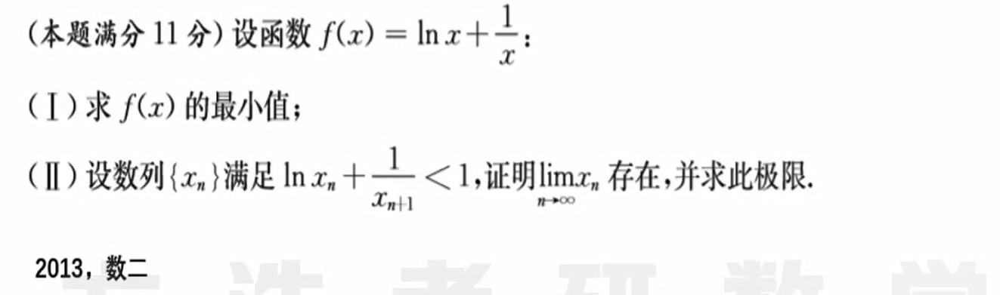
由第一问构造单调性；然后由不等式得到有界性；得到极限存在后再假设代入，由于函数/不等式推极限的时候始终可以取等号，因此求得极限。

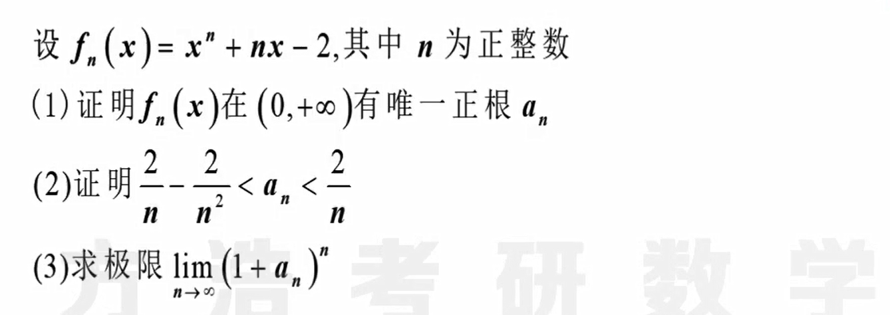
第一问 到第二问 到第三问

这道题直接做不出来，要用夹逼定理 

## 函数连续性

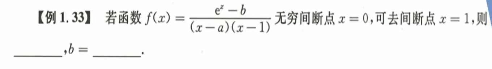
 $a = 0, b = e$ 

举例

找到可能点，排除第一类

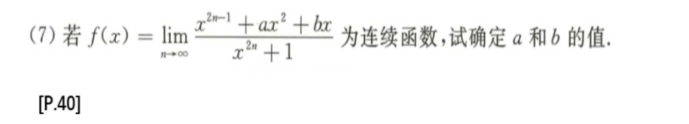
关键是找到分界点，这里由于是指数函数，其底大于1和小于1截然不同

## 本章小结 

* 未定式极限 - ==分类== 10分
  * 无穷小：等价无穷小
  * 无穷大：提玛珐 Max
  * 幂指函数：$f^g = e^{glnf}$ 
  * 积分极限：洛必达法则
  * 不会做：夹逼定理（无穷小*有界=无穷小）
* 数列极限 10分
  * 单调有界
  * 夹逼定理
  * 定积分定义：用于求和结构
* 连续性 4分
  * 间断点：分类和定义
  * 零点定理：方程根的个数

* 没提到的
  * 拉格朗日中值定理：$f(b) - f(a) = (b-a)f^{'}(\xi)$ 
  * 积分中值定理：$\int_{a}^{b} {f(x)} \ dx = f(\xi)(b-a)$ 

