#  一元函数积分学

 

## 求不定积分

1. 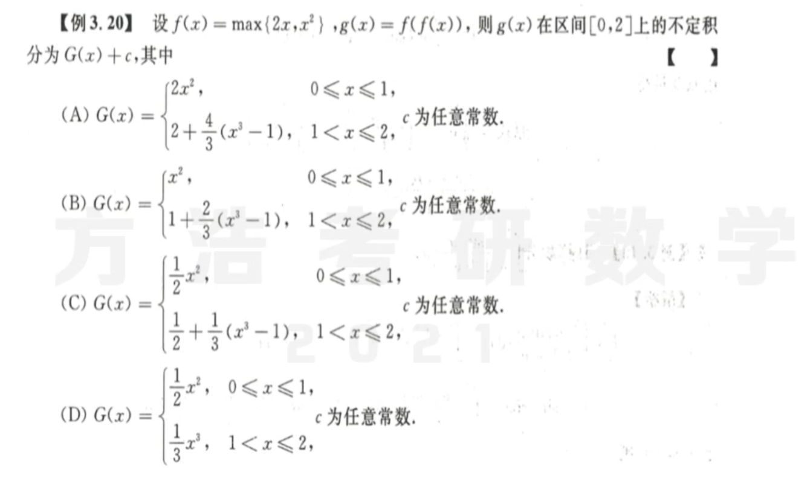
2. 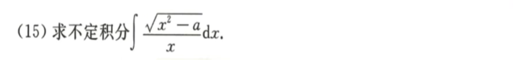
   解题思路：三角代换
3. 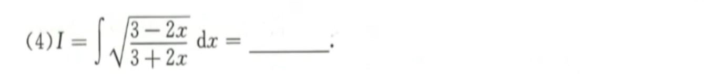
   解题思路：先换元，再分部积分
4. 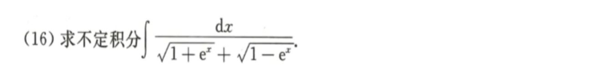
   解题思路：通分，然后分开换元求积分
5. 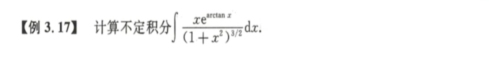
   ==解题思路：换元＋分部== 
6. 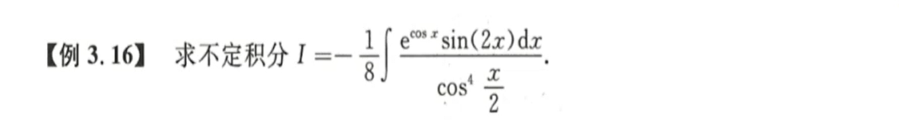
   解题思路：换元+分部，关键是看换什么元，而且要充分利用==积分的可加性==，化腐朽为神奇。
7. 
   ==2009数三真题== 解题思路：一步一步，先换元，再分部，别跳跃，及时分部，然后一步一步呜呜呜
8. 
   ==2019数二真题== 解题思路：留数定理，求导，赋值，全家桶来一套就会了；记得ln中一定要加绝对值符号

## 定积分的性质与计算

1. 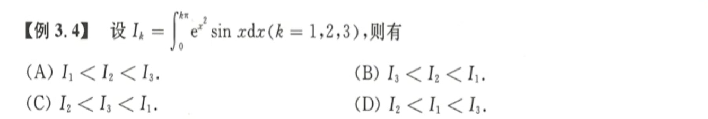
   解题思路：方法一：比较大小-作差法，两两作差比较，然后判断正负性，适当利用区间重现的方法来简化判断；方法二：利用数形结合的方式，画出被积函数的图像，然后比较积分。
2. 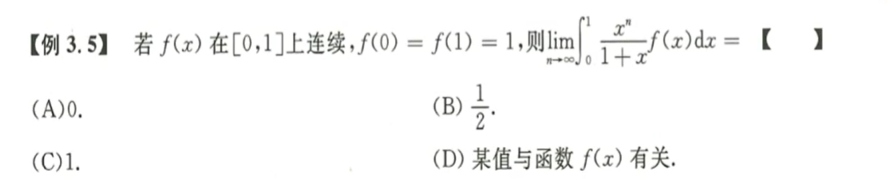
   ==积分和极限结合的一般都是夹逼定理== 解题思路：求积分肯定求不出来，夹逼定理，积分中值定理都可以用上。==放缩要取绝对值== 
3. 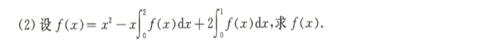
   解题思路：待定系数法，定积分就是一个常数，然后带入原式计算即可。
4. 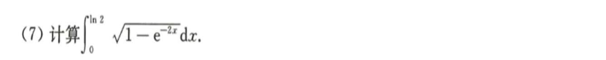
   解题思路：注意换元该换哪个部分，通常选整体，一次性替换最佳，不要分多次换元，可能会搞错积分上下限。换元之后不要急着化简，立马看看换元之后==需不需要立刻分部==计算，哪个是坚强，哪个是脆弱。
5. 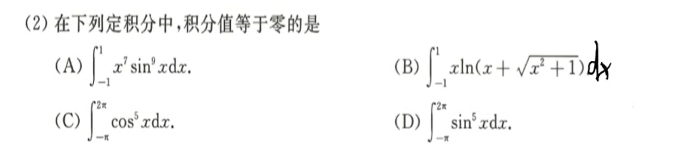
   解题思路：对称区间采用奇偶性；还可以采用数形结合的方法。奇函数在对称区间的积分为零，偶函数也可以为零例如余弦函数在$(-\pi,\ \pi)$区间积分就为零，可以结合正负性来判断。
6. 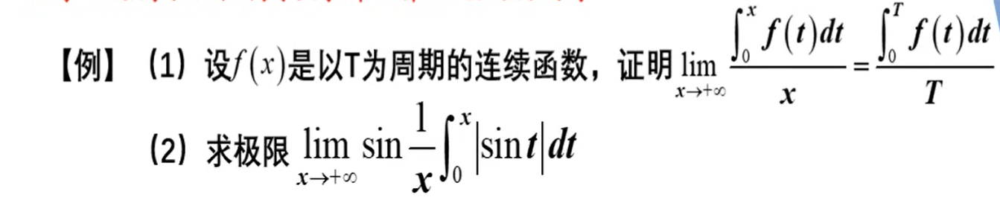
   解题思路：严格利用定义求解，利用周期函数的性质，假设$x=nT+a$，保证x具有任意性，根据定义化简等式左边。这里不可以洛必达，因为没有验证前提条件。无穷比无穷可以用提玛珐。利用有界和无穷大无穷小之间的关系得证。注意，积分的题目还别忘了积分区间的可加性，以及被积函数的四则运算法则。
   第二问：基于第一问的结果，学会构造成第一问的结果。这里可以用等价无穷小。==周期函数想到x=2T+a== 
7. 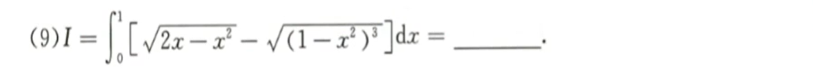
   解题思路：两个根式在一起的可以想办法分开计算，三角代换结合华里士公式计算，注意华里士公式必须掌握。
8. 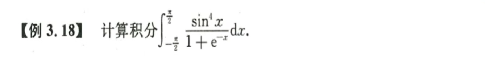
   ==江郎才尽 区间再现== 解题思路：定积分四大特殊解法：奇偶性、周期性、华里士、区间再现；这道题观察区间，发现是对称区间。但其他方法都行不通，因此用区间再现。区间再现如果写出来就是变量代换，考试有时间可以慢慢写全。

## 变上限积分

1. 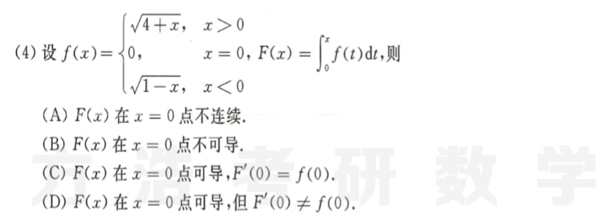
   解题思路：这道题可以回忆一下函数，变限积分函数，变限积分函数导数三者之间的关系。其中变限积分函数必定连续，函数$f(x)$一定不存在Ⅱ类间断点，变限积分导数等于函数$f(x)$当且仅当函数连续时。比较零点左右的函数极限，二者不相等，则必然连续不可导。
2. 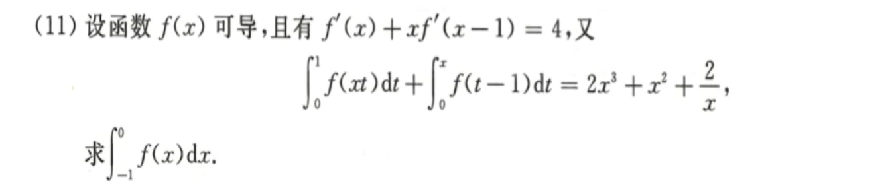
   解题思路：==变限积分的题目通常都要求导==解决，但是求导之前必须分离变量或者换元。只有单一变元的变限积分才能方便求导。两次求导之后发现柳暗花明。求导一定要彻底，将变限积分彻底解脱出来，因为大部分积分都求不出来，而且抽象积分就更重要。

## 反常积分

1. 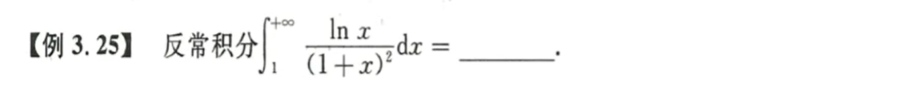
   解题思路：反常积分一般重点考察的并非计算，而是敛散性。这里的计算就当作定积分计算，最后再取极限。积分不难，直接分部，极限的话，也不难。
2. 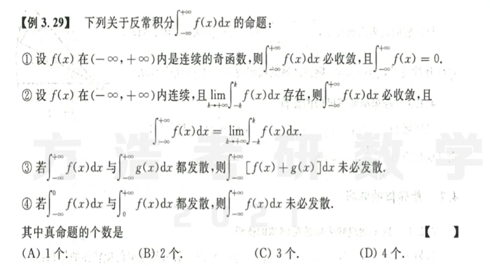
   解题思路：这道题重点考察反常积分敛散性的相关概念；反常积分不等同于定积分的极限；**选项A：**反常积分必须考虑收敛的问题，只有正负两边都收敛，合起来才收敛，有一段发散，反常积分就发散；反常积分发散的话就谈不上求值的问题，那么奇偶性对它丝毫无影响。**选项B：**反常积分$\int\nolimits_{-\infin}^{+\infin}f(x)$相当于两个积分$\int_{0}^{+\infin}$和$\int_{-\infin}^{0}$，只有这两个积分极限都收敛，反常积分才存在。而选项B最大的问题是合二为一了，是不可以的。**选项C：**两个发散加起来不一定发散，相同区间内有可能抵消，因此这是对的。**选项D：**对于同一个函数，必须保证每一个区间收敛，最后才有可能收敛。
3. 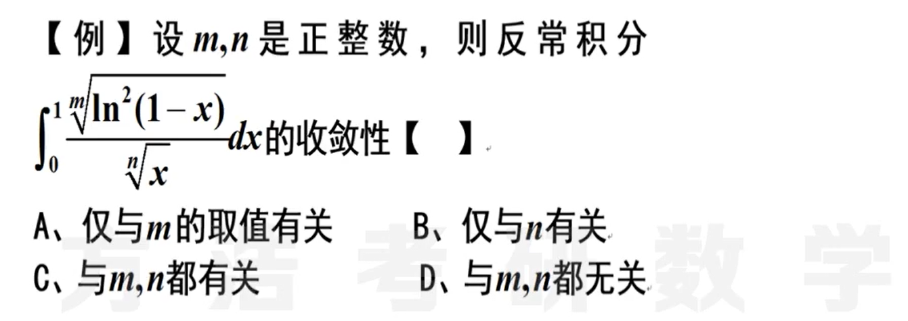
   解题思路：这是一道考察敛散性的典型例题；反常积分有两类：一是区间反常，考察两边区间的敛散性，这时候$\frac {1}{x^p})$的阶数$p>1时$才收敛；而是某点的值反常，即考察无穷间断点附近的敛散性，这时候$\frac 1 {x^p}$的阶数$p<1$时才收敛；区间反常时，无穷大处的极限为0；某点值反常时，该点必须趋于无穷。**2019年的数一考题，老实说还没咋看懂**
4. 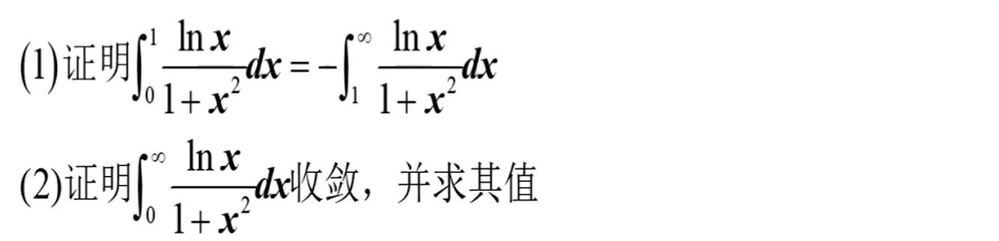
   解题思路：**第一题：**==区间变换的两种方式，一种是取倒数，一种是区间变换==。很明显，这里区间取倒数就可以解决问题。**第二题：**首先观察被积函数，发现两端都是需要考察的点，又据第一问，故把区间分开，分别考察在零点附近以及无穷大处的敛散性；在零点处，原式等价于$ln(x)$这个函数的==敛散性==，又等价于$ln(\frac 1x)$的敛散性，根据伪无穷，真无穷，超无穷的性质，因而收敛；在无穷远处，原式等价于$\frac {ln(x)}{x^2}$的敛散性，又因为伪无穷远小于真无穷，因此原式比$\frac 1{x^{(2-p)}}$还要收敛，因此收敛。根据第一问，所以其值为零。
   注意思考：这种题目一定要注意先考查某点的敛散性，然后再探讨求值的问题。

## 定积分的应用

1. 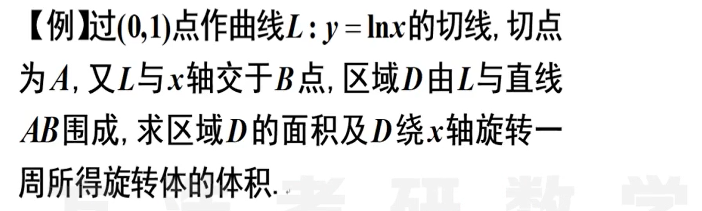
   解题思路：$\int {ln^n(x)}$这个积分可以多次分部积分以简化运算，也可以换元之后分部积分，总之就是要分部计算。其余就是好好计算，搞清楚哪个是面积，哪个是体积。
2. 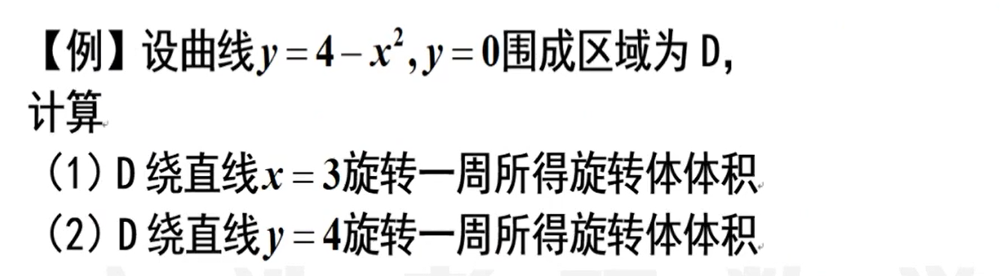
   解题思路：严格按照定义来计算，顺便思考一下书上给出的标准型的公式。这道题看起来简单，但是也是一道易错题。
3. 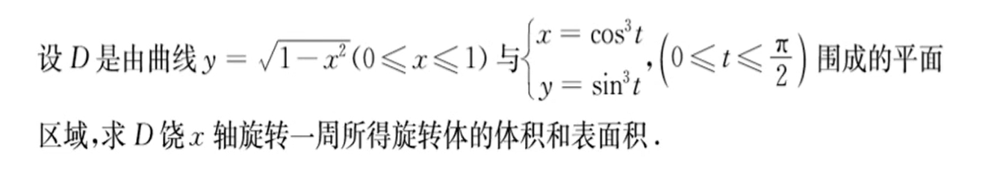
   解题思路：首先利用次数放缩得到两个曲线的相对位置； 求体积的时候可以用到华里士公式从而简便运算；列出公式，仔细计算。
4. 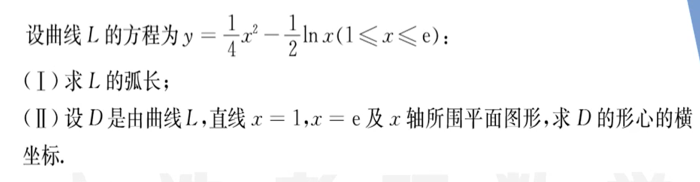
   解题思路：没有太多技术含量，但是一定要记住定义，公式，然后准确计算。                                                                                                                                                                                                                                                                                                                                                                                                                                                                                                                                                                                                                                                                                                                                                                                                                                                                                                                                                                                                                                                                                                                                                                                                                                                                                                                                                                                                                         
5. 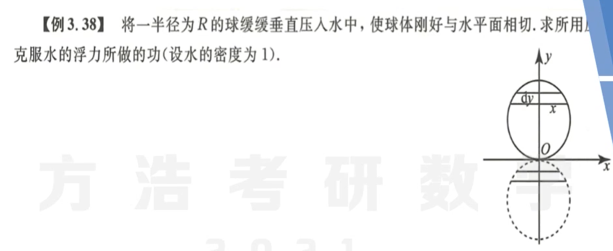
   解题思路：找到变量，列出关系；

## 综合题

1. 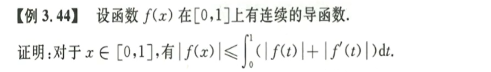
   ==典型例题== 解题思路：看到又有导数又有积分还有函数的，非常紧张。然后注意拆开右边的积分，观察积分项，如何引入。右边第一项，容易想到积分中值定理来消去积分号。然后要通过一个巧妙地构造来解决问题，$f(x) = f(c) + \int _{c}^{x}{f'(t)dt}$，然后对右边进行两次放缩处理，其中$f(c) = \int _{0}^{1}{|f(t)|}$。

2. 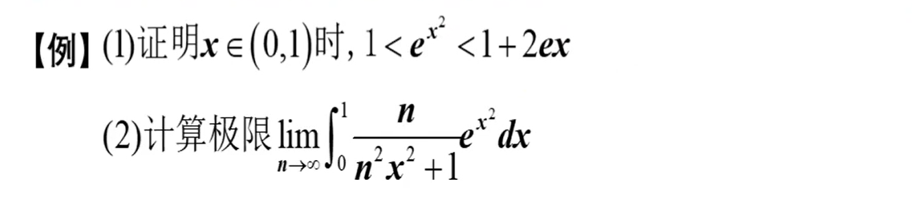

   解题思路：**第一问：**显然左边成立，右边可以直接放缩，也可以用**拉格朗日**消去$e^2$这一项；**第二问：**显然要用到第一问结论，因此第二问直接放缩，又发现放缩之后右边可以拆成左边地项加另一项。因此问题变成了求解左边积分的极限，和右边多余项的极限为零；
   题目提示：==又有积分又有极限八成要用夹逼定理，简化其中某一个特别繁琐的项（指数、三角），或者用积分/微分中值定理消除，这里是拉格朗日中值定理（可以无中生有）==。

## 本章小结

1. 不定积分：先还元，再分部（凑微分，留数定理）
2. 定积分：一般计算，特殊计算（奇偶性、周期性、华里士、区间再现啊QAAAH），变限积分
3. 反常积分：敛散性判别（关键点、化简并比较级数）
4. 应用：面积，绕轴旋转体积，几何应用（弧长、侧面积、形心）、物理应用。

