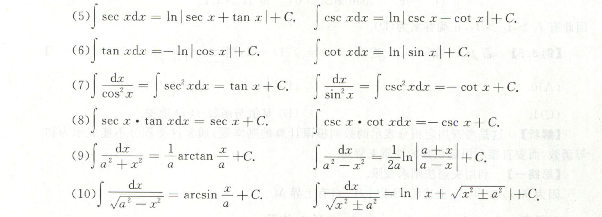

# 二重积分

## 二重积分的概念与性质

1. 
   解题思路： 这道题首先看积分区间，由于积分区间对于X轴和Y轴都对称，因此可以考察被积函数的奇偶性；被积函数只要是关于X或者Y的奇函数，其值都为零，要充分利用积分的被积函数和区间的可加性。还可以利用轮换对称性，将对称的X和Y换成一个变量。在小题中，对称性和奇偶性非常关键。
   1. 积分区域关于X轴对称：若被积函数是关于$y$的奇函数，则积分为零；
   2. 积分区域关于Y轴对称：若被积函数是关于$x$的奇函数，则积分为零；
   3. 积分区域关于$y=x$对称：轮换对称性 $\iint\limits_{D}{f(x, y)} = \iint\limits_{D}{f(y, x)} $ 
2. 
   解题思路： 图像法，画出图形，然后在根据定义找到直角坐标系下的表示方式；
3. 
   解题思路：图像法；1. 画出图形；2. 紧扣定义
4. 
   解题思路：记住一个要点：极坐标和直角坐标转换的时候会出现一个r；
5. 
   解题思路：充分利用奇偶性和对称性，画出图像，无中生有。

## 二重积分的计算

1. 
   ==变换积分顺序+分开积分== 解题思路：直接积分做不出来，交换顺序做不出来，于是还可以分开积分。拆开后，利用图形，交换顺序。还是可以很巧妙的做出来的。最后发现可以消元。
2. 
   解题思路：题目一：数形结合，画出图像，找到区间，变换区间，合并两个积分。题目二：画出图像，转换为极坐标，然后积分。注意：二重积分的内外层的转换。  
3. 
   ==好题== 解题思路： 这道题可以用一重积分做，也可以用二重积分做，二重积分的优势在于可以利用各种几何性质。**方法一：**分部积分法，然后再换元；**方法二：**二重积分法，然后再换元。
5. 
   ==好题== 解题思路：思路早就有了，就是算不出来。首先看区间，画出图像，然后判断对称性，发现区间Y轴对称，函数又是关于X的偶函数，因此简化积分区域。然后根据定义，去掉绝对值符号，然后分开计算。注意中间别出错了。然后利用三角换元，二倍角公式得到最后结果。==真难算== 
6. 
   解题思路： 利用对称性和奇偶性化简到一个这样的等式，$\int _{0} ^{\frac \pi 2} \frac {1}{sin\alpha + cos\alpha} d\alpha$这个时候，如何进行下一步计算，可以利用万能公式，但是确实麻烦。可以上下通分，然后在化简换元计算。最佳的方法是合并两个三角函数，然后利用$\int csc\alpha \ d\alpha = ln|csc \alpha - cot \alpha|$；为啥别人的方法那么好。
7. 
   解题思路： 二重积分一定要做到结合图像，画出区间，发现是一个三角形的区间，于是立马尝试转化为直角坐标系下的积分。先对Y积分，再换元对X积分，再利用华里士等计算结果。关键在第一步找准方向。
8. 
   ==好题== 解题思路：**难题**；这道题不再是具体数据的计算，而是结合了抽象函数的概念。乍一看以为是一个多元微分的题目，实际上二重积分就可以解决。首先对一个变量积分，然后观察后用分部积分的思想，再对另一个变量积分，最后得到结果。要注意概念在里面的应用。
9. 
   ==换元+极坐标 注意区间变化== 解题思路： 首先画图看积分区间，发现有椭圆，因此可以先换元解决掉椭圆的问题；然后积分区间变成了圆，再极坐标解决；注意这道题，有一次换元和一次坐标变换，非常容易出错。一定要严格根据定义来做。
   **注意**：碰到类似圆的积分区域，可以不直接转换为极坐标，而是采取再换元一次的方式，将圆心转化到远点、或者将椭圆变成圆，这样再用极坐标的时候会好做许多，但是一定记得积分换元之后微分的关系。极坐标转换的时候要多一个$\rho d \rho$。
10. 
   解题思路：首先要搞清楚定义，即给定区域的定积分就是一个常数；其次是奇偶性的灵活运用，区间Y对称则关于X的奇函数为零；再者是三角换元和华里士公式；这几个缺一不可，灵活运用即可解出。尤其是在计算的时候，需要熟练在各种坐标、换元、凑微分中切换。
   注意：我们要以最小的代价获取最高的分数，所以积分的方法、顺序都很重要，不然十分钟也解不出一道题，就很糟糕。

## 本章小结

1. 画图！

2. 奇偶性、轮换对称性

3. 分类
   1. 直角坐标 - ==交换积分顺序 拆分合并==
   2. 极坐标 - 一定要有 $rdr$ 
   3. 随时灵活换元
   
4. 积分表

   

