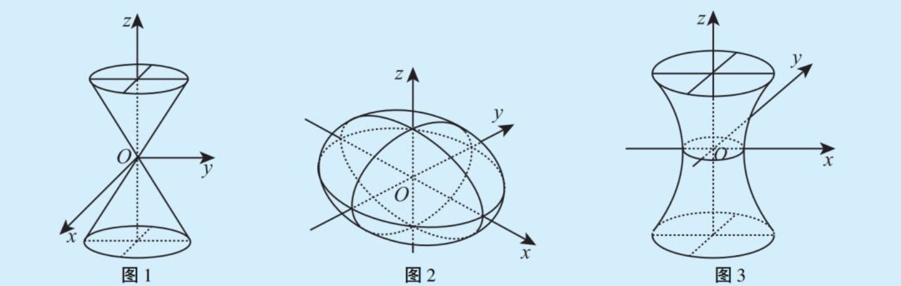
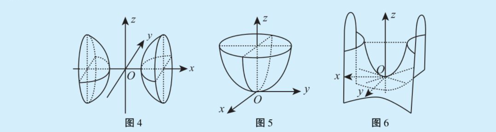
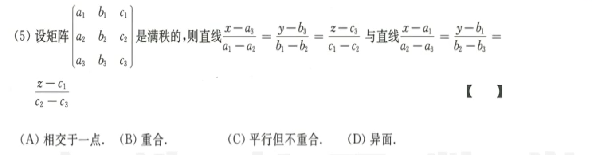
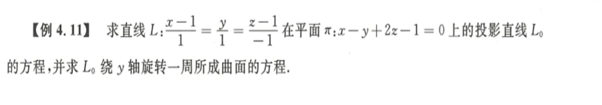
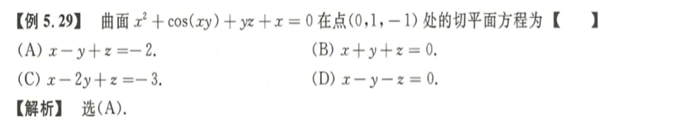
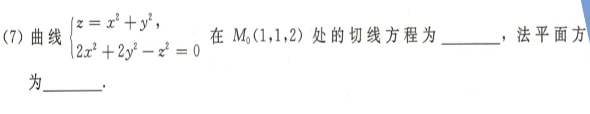

# 空间解析几何

## 常见空间曲面

1. 椭圆锥面：$\frac {x^2}{a^2} + \frac {y^2}{b^2} = z^2$ 
2. 椭球面：$\frac {x^2}{a^2} + \frac {y^2}{b^2} + \frac {z^2}{c^2} = 1$ 
3. 单叶双曲面：$\frac {x^2}{a^2} + \frac {y^2}{b^2} - \frac {z^2}{c^2} = 1$ 
4. 双叶双曲面：$\frac {x^2}{a^2} - \frac {y^2}{b^2} - \frac {z^2}{c^2} = 1$ 
5. 椭圆抛物面：$\frac {x^2}{a^2} + \frac {y^2}{b^2} = z$ 
6. 双曲抛物面：$\frac {x^2}{a^2} - \frac {y^2}{b^2} = z$ 

## 空间解析几何

1. 
   方法一：图像法，由矩阵满秩得到三个向量不共面，或者由混合积定义得到不共面，然后作图。
   方法二：矩阵变换，首先判断是否平行，即方向向量线性相关性；然后判断是否共面，即引入连接向量判断三个向量是否在同一平面上。
2. 
   ==投影线==：即投影面和垂直投影线且过该直线的垂直面的交线。注意方向向量和法向量叉乘的含义。
   旋转曲线：写成参数方程的形式，然后利用到y轴距离不变得到关于$x, y, z$的方程。==投影 旋转 空间曲线 参数方程== 
3. 
   空间曲面的法向量：$(F_x'(x_0,y_0,z_0), F_y'(x_0,y_0,z_0), F_z'(x_0,y_0,z_0))$
   空间曲面的法线方程：$\frac{x-x_0}{F_x'(x_0,y_0,z_0)} = \frac{y-y_0}{F_y'(x_0,y_0,z_0)} = \frac{z-z_0}{F_z'(x_0,y_0,z_0)}$ 
   空间曲面的切平面方程：$F_x'(x_0,y_0,z_0) \times(x-x_0) + F_y'(x_0,y_0,z_0) \times(y-y_0) + F_z'(x_0,y_0,z_0) \times(z-z_0)=0$
4. 
   ==典型例题== 空间曲线参数方程：$\{x=x(t),\ y=y(t),\ z=z(t)\}$
   空间曲线切向量：$(x'(t_0), y'(t_0), z'(t_0))$
   空间曲线切线方程：$\frac{x-x_0}{x'(t_0)} = \frac{y-y_0}{y'(t_0)} = \frac{z-z_0}{z'(t_0)}$ 
   空间曲线法平面方程：${x'(t_0)}\times{(x-x_0)} + {y'(t_0)}\times{(y-y_0)} + {z'(t_0)}\times{(z-z_0)} $ 
   如果不是用参数方程表示的，就把$x$当作参数。
5. 

## 本章小结

1. 曲面
   
   1. 空间曲面的法向量：$(F_x'(x_0,y_0,z_0), F_y'(x_0,y_0,z_0), F_z'(x_0,y_0,z_0))$
   2. 空间曲面的法线方程：$\frac{x-x_0}{F_x'(x_0,y_0,z_0)} = \frac{y-y_0}{F_y'(x_0,y_0,z_0)} = \frac{z-z_0}{F_z'(x_0,y_0,z_0)}$ 
   3. 空间曲面的切平面方程：$F_x'(x_0,y_0,z_0) \times(x-x_0) + F_y'(x_0,y_0,z_0) \times(y-y_0) + F_z'(x_0,y_0,z_0) \times(z-z_0)=0$ 
   
2. 空间曲线

   1. 空间曲线参数方程：$\{x=x(t),\ y=y(t),\ z=z(t)\}$
   2. 空间曲线切向量：$(x'(t_0), y'(t_0), z'(t_0))$
   3. 空间曲线切线方程：$\frac{x-x_0}{x'(t_0)} = \frac{y-y_0}{y'(t_0)} = \frac{z-z_0}{z'(t_0)}$ 
   4. 空间曲线法平面方程：${x'(t_0)}\times{(x-x_0)} + {y'(t_0)}\times{(y-y_0)} + {z'(t_0)}\times{(z-z_0)} $ 

   

