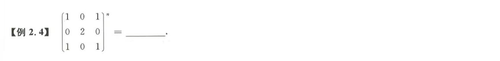
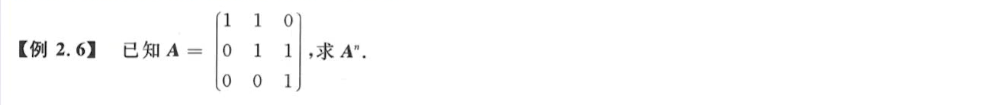
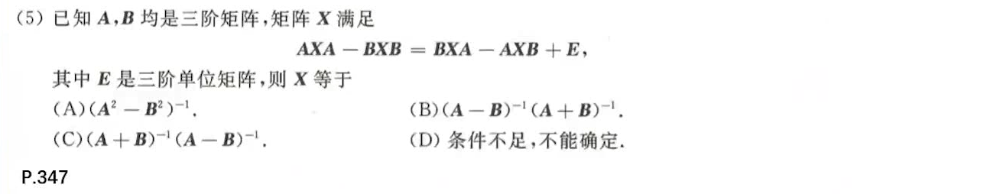
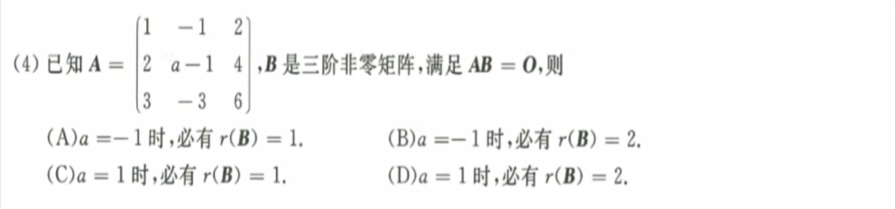
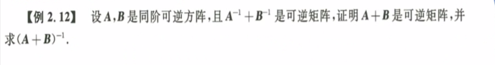

# 矩阵

## 矩阵的乘法与幂

1. 
   考点：可交换矩阵的二项式定理、数学归纳法
2. 
   **n次幂**：找规律、求有限项
3. 
   **n次幂：**能否==拆成两个行列向量的乘积==，然后利 用结合律求高次幂。如果各行/列成比例就可以拆成行列组合。
4. 
   **n次幂：**稀疏矩阵+==二项式定理==，将A拆成一个单位矩阵和另一个稀疏矩阵的幂，利用二项式定理解得。

## 逆矩阵 伴随矩阵

1. 
   解题思路：由$A^2=A$得$A(A-E) = 0$，考察逆矩阵概念理解
2. 
   **求逆矩阵：**
   初等行变换：$(A : E) \cong (E:A^{-1})$ ，先消成上三角，再消成对角。
   伴随矩阵法：$A^{-1} = \frac {A^*}{|A|}$ ，计算伴随矩阵，计算行列式，比较麻烦。
   定义法：$AA^{-1} = E$，可以用待定系数假设一个这样的逆矩阵。
3. 
   解题思路：由于$AE=EA$，利用==**可交换**==的性质，直接除法$(A^2+A-4E)/(A-E)$，即可得到最后结果。
4. 
   ==**逆矩阵加变乘：**==$(E+B)^{-1} = [(E+A)^{-1}(E+A) + (E+A)^{-1}(E-A)]^{-1}$
5. 
   解题思路：根据两个条件式，提出$B$和$C$，然后再减。由$(E-A)B = E$得到$E-A$和$B$都可逆，即可逆的定义。
6. 
   **矩阵加法变乘法：**即矩阵多项式的变换，但是一定要注意是否可以**交换**，是否**可逆**等关键条件。
7. 
   就一点：$(A^*)^{-1}=(A^{-1})^*$ 
8. 
   知识点：==伴随矩阵的秩==$r(A^*)=n/1/0$，其条件分别为$r(A) = n, r(A) = n-1, r(A)<n-1$ 
9. 
   ==宏观结构-行列式；微观结构-展开定理==由条件得$(A^*)^T = A$，然后按第一行展开得到$|A|>0$，最后得到==D==。

## 初等变换 矩阵的秩

1. 
   既然给出了$P和Q$，那么立刻找出两者的关系，即$P$乘什么得到Q，由于是列变化，立刻右乘一个矩阵。注意，可以简写成初等矩阵的形式。
   $[E_{ij}(k)]^T = E_{ji}(k), \quad [E_{i}(k)]^T = E_{i}(k), \quad [E_{ij}]^T = E_{ij}$ 
2. 
   $[E_{ij}(k)]^{-1} = E_{ij}(-k), \quad [E_{i}(k)]^{-1} = E_{i}(\frac 1k), \quad [E_{ij}]^{-1} = E_{ij}$ 
   这种变化用初等矩阵的形式来表示比较方便，记住 $左乘矩阵行变换 \quad 右乘矩阵列变换$ 
3. 
   依旧是考察初等矩阵，“右乘矩阵列变换”，$P_1 = E_{14}$，$P_2 = E_{23}$，特别注意这道题运算顺序不唯一。
4. 
   **矩阵乘法的秩：**$r(AB) \le r(A) \&\& r(AB) \le r(B)$ 
5. 
   **矩阵乘法的秩：**$AB=O \rarr r(A)+r(B) \le n$ ；三阶非零矩阵即$r(B) \ge 1$，由此得到推导式。
6. 
   **伴随矩阵的秩：**$r(A^*) = n/1/0$ ，他们各自的条件又是什么？
7. 
   A选项：可交换；B选项：相似；C选项：捏造；D选项：等价变换。
8. 
   等价矩阵即A和B矩阵秩相等，即A和B通过初等变换得到。

## 综合题

1. 
   ==证明可逆：行列式不等于零、矩阵为满秩矩阵、定义法、证明齐次方程只有零解。==
   反证法：假设$(A+kE)\alpha = 0$，且$\alpha \ne 0$，然后构造出转置矩阵和相应的原矩阵抵消。
   **矩阵加法求逆：**一定要转化为乘法求逆，即构造一对可逆矩阵等于$E$，然后无中生有构造提取公因式。
2. 
   同样：矩阵加法的逆一定要转化为矩阵乘法的逆，提取公因式，然后合并。
   **多个矩阵相乘可逆：**由于矩阵相乘的行列式等于各自行列式相乘，所以多个行列式相乘可逆，则各自都可逆。
3. 
   **矩阵乘法：**结合律、消去律(可逆)、交换律(可交换常单位阵)

## 本章小结

1. 矩阵乘法
   1. 结合律 —— 通用最常用
   2. 消去律 —— 可逆矩阵才可消去，灵活逆用消去律
   3. 交换律 —— 可交换矩阵，一般是单位矩阵
2. 矩阵重要运算
   1. 逆矩阵$A^T$：行列式不等于零、满秩矩阵、齐次方程组没有非零解；加法逆转化乘法逆
   2. 伴随矩阵$A^*$：宏观结构、宏观结构、伴随矩阵的秩(0 1 n)
   3. 初等变换： 左行右列 + 三大初等矩阵 +  保秩
3. 秩
   1. 定义：非零子式最高阶数
   2. 方法：初等变化 $(A:E) \cong (E:A^{-1})$  
   3. 基本性质：转置不变、相乘取小、相加取和、可逆保秩、相乘为零秩和小于N