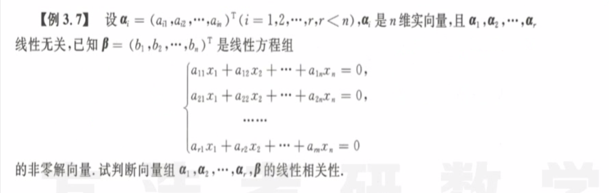
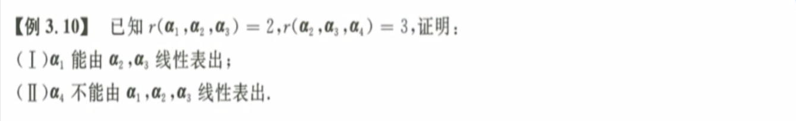

# N维向量

## 线性相关、线性无关、线性表出

1. 
   笨方法：一个一个选项代入，看哪个的行列式恒为零。
   好方法：直接写出$[\alpha_1, \alpha_2, \alpha_3, \alpha_4]$，然后对其进行初等**行**变换，看看哪几个是一定线性相关的。
2. 
   **保秩运算：**一个线性无关的向量组乘一个满秩矩阵，仍然保持线性无关的特点。$B=AC$，其中$B=(\beta_1, \beta_2, \dots, \beta_n)$，$A=(\alpha_1, \alpha_2,\dots,\alpha_n)$，且$A$中各列向量线性无关，即$r(A) = n$，可得到$r(B) = r(C)$。
3. 
   解题思路：少数不能推出多数，同样是保秩运算。
   ==**线性无关类的题目：定义法、初等变换、求秩、保秩运算**==
4. 
   **定义法求解线性无关类题目：**不妨设$L_0\alpha + L_1A\alpha \dots L_{k-1}A^{k-1}\alpha = 0$，两边左乘$A^{k-1}$得$L_0\alpha A^{k-1}=0$，然后依次证明$L_0, L_1, \dots L_{k-1}$都为零。
5. 
   由条件得$(\alpha_1)^T\beta = 0, (\alpha_2)^T\beta = 0,\dots(\alpha_r)^T\beta$，再假设$l_1\alpha_1+l_2\alpha_2+...+l_r\alpha_r + l_{r+1}\beta= 0$，观察如何才能得到条件，因此方程左乘$\beta^T$ ，即得到$L_{r+1}\beta\beta^T=0$，因此$L_{r+1}=0$，因此推到得到全部系数为零，即线性无关。
6. 
   解题思路：这题也不难，还是假设待证的多项式为零，然后利用系数反推条件之间的关系。
   解题思路二：即用秩的方法去思考，线性无关即秩为m；如果线性相关，即可以通过初等变换消去这一列。
   7. 
      注意：这里需要区别线性表出、线性相关和秩三个概念。
      第一问：要证明$\alpha_1$能由$\alpha_2,\alpha_3$线性表出，除了要知道$r(\alpha_1,\alpha_2,\alpha_3)=2$之外，还要知道$\alpha_2,\alpha_3$线性无关。
      第二问：要证明不能由三者表出，可以用反证法，由于$\alpha_2$可以由$\alpha_2,\alpha_3$线性表出，所以假设要成立则$\alpha_4$应该由$\alpha_2,\alpha_3$线性表出，这与题给条件。
      ==整体无关 部分必无关；添加向量，秩只增不减== 

## 向量组的秩、极大线性无关组

1. 
   重要不等式：$AB=O \quad \rarr \quad r(A) + r(B) < n$，根据方程组解的条件可以推导。
2. 
   **如何求极大无关组：**$(\alpha_1, \alpha_2, \alpha_3, \alpha_4)$做行变换（不要列变化，除了求秩）成三角矩阵，然后找到与整个向量组秩相等的子向量组，这个子向量组就是原向量组的极大无关组，极大无关组不唯一。

## 向量组的线性表示与等价

1. 
   ==**矩阵等价**==：秩相等就是矩阵等价（前提是尺寸相等），即$r(A) = r(B)$。这道题只要求知道B是满秩就够了。
   
   ==**向量组等价：**==向量组和向量组之间的等价涉及到的是向量组的**增广矩阵**，即$r(A) = r(B) = r(A:B)$。
   ==**线性表示：**==若B可由A线性表示，充要条件是，$(A:B) \cong (A:0)$，即$r(A) = r(A:B)$ 
2. 
   **向量组等价：**一定要出现增广矩阵这一重要条件，才可以证明向量组等价，即相互可线性表示。
3. 
   **增广矩阵：**一看到就写出增广矩阵，同时能够对两个向量组进行分析。
4. 
   **线性相关：**如果一个向量组的向量个数超过了表示其的线性无关组的向量个数，则其必定线性相关。
5. 
   **向量组等价于矩阵等价：**向量组等价条件更高，不仅要求矩阵等价，还要求增广矩阵的秩。
   **初等矩阵：**初等矩阵变化都是可逆的。
6. 
   同样是上面的线性表示，写出增广矩阵，然后初等行变换，然后比较三者的秩。$r(A)<r(B)=r(A:B)$ 

## 向量空间

1. 
   **过渡矩阵：**从A到B的过渡矩阵C，即$B = AC, C=A^{-1}B$，这道题比较简单，可以直接做。
   **对角矩阵：**对角矩阵的逆等于把主对角线上每个元素取倒数组成的矩阵；

2. 

   **空间的维数：**就是矩阵的秩，就是有多少向量线性无关

## 本章小结

1. 线性相关/无关
   1. 秩：增广之后秩数不减小，但是始终小于矩阵尺寸
   2. 定义：列出等于零的等式，然后通过消元来实现
   3. 保秩运算：一个线性无关组A乘一个矩阵B，得到新的矩阵C的秩只和B有关，等于B的秩。
   
2. 极大无关组：无关 + 极大

3. 向量组等价：$r(A) = r(B) = r(A:B)$ 

4. 向量组线性表示：A可由B表示，即$r(A:B) = r(B)$ ，区别联系向量线性表出

5. 向量基变换：从A到B的过渡矩阵；$B=AC, C = A^{-1}B$ 

6. 概念辨析：

   **矩阵等价**：秩相等就是矩阵等价（前提是尺寸相等），即$r(A) = r(B)$。这道题只要求知道B是满秩就够了。

   **向量组等价：**向量组和向量组之间的等价涉及到的是向量组的**增广矩阵**，即$r(A) = r(B) = r(A:B)$。
   **线性表示：**若B可由A线性表示，充要条件是，$(A:B) \cong (A:0)$，即$r(A) = r(A:B)$ 

   **相似 合同 等价：**相似特征值相等；合同特征值正负个数相同；等价的特征值非零个数相同

   

