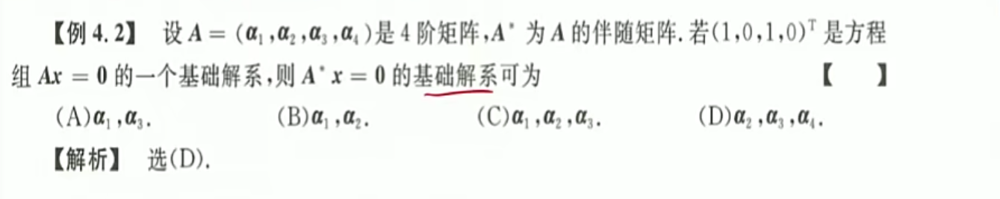

# 线性方程组

## 齐次方程组

1. 
   **基础解系三大特点：**$s(\xi)=n-r(A)$、相互之间线性无关、是$Ax=0$的一组解。
   方法一：利用伴随矩阵和秩、基础解系和秩的关系得到一定是三个基础解系向量，然后由线性无关条件排除C。
   方法二：构造$A^*A=|A|E=0$，即得到题给方程$A^*x = 0$，所以求基础  解系就是求$A$的极大无关组。
2. 
**解题思路：**不可逆，即$r(A)<4, \ |A|=0$。待求问题为$A^*x=0$，即$A^*A=|A|E=0$，即要求$A$的极大线性无关组。某个代数余子式不为零，即$r(A) \ge 3$，因此$r(A) = 3,\ r(A^*)=1$；
   **延伸组相关性：**由于$A_{12} \ne 0$，因此$\alpha_1, \alpha_3, \alpha_4$线性无关，为什么呢？？？
3. 
   **秩的不等式：**$r(A+B) \le r(A) + r(B) \quad r(AB) < r(m) 且 r(AB) < r(n)$等
4. 
   ==好题== **基础解系：**方程的解、线性无关、数量与秩关系。
   **保秩运算：**若$B$为满秩矩阵，则$r(AB) = r(BA) = r(A)$ 
   **行列式计算：**行列式变换三角矩阵、按行列展开、拉普拉斯矩阵
5. 
   **分类讨论：**由$AB=O$可以得到$r(A) + r(B) \le 3$，而由不全为零的条件得到$r(A)  \ge 1$。条件仅此而已，其他都得自己分类讨论，有的情况的结果需要用到$a,b,c$。
6. 
   **概念辨析：**这如果改成$n$元方程组，那么ABD都可以选。这里要考虑到方程组未知数个数和方程组数量不相等的问题。

## 非齐次方程组

**秩 初等变换**

1. 
   **小技巧：**进行初等行变换的时候，注意带字母的行下沉，这样计算会比较快。
   **主元：**求解齐次方程的时候，主元代一。求解非齐次方程特解的时候，主元代零。
2. 
   答案不难，但是背后的原理和推导一定要仔细琢磨。有解，系数矩阵的秩等于增广矩阵的秩；有多个解，秩小于n；而系数矩阵中又有2阶子式，即$r(A)=2$；因此基础解系只有一个向量；而两个线性无关的非齐次方程特解等于齐次方程的解。因此立刻得到非齐次通解为$x=(-2,2,2)^T+\xi_1/\xi_2$。
3. 
   ==典型例题== **非齐次通解：**非齐次方程特解代入、齐次方程通解代入、秩
   第一步：从通解得到$r(A) = r(B) = r(B:*)$；第二步：代入$\beta$，然后选定逐个代入得到通解、特解，答案无数多。

## 矩阵方程

==两种情况：**可逆矩阵**，**不可逆矩阵/非方阵**==

1. 
   ==典型例题== **逆矩阵：**只有**方阵**才有逆矩阵！！！
   **求解步骤：**增广矩阵初等行变换直到最左边是三角矩阵，然后最右边就是非齐次特解的集合。
   **注意：**求解的时候，非齐次特解主元置`0`，齐次通解主元置`1`。
2. 
   **可逆矩阵：**$B=Ax$，即$x = A^{-1}B$，利用矩阵初等变换，即$(A:B) \cong(E:A^{-1}B)$ ，左乘矩阵行变换。

## 方程组的公共解、同解

1. 
   s
2. 
   **核心问题：**到底是由解推秩，还是由秩推解；秩只能用来判断解的个数，不能判断解的内容。由解推秩利用$s=n-r(A)$这一关键条件。
3. 
   **转置：**重要关系，$A^TA = 0 \ \rarr \ A=0$。$A^TAx=0 \ \rarr \ x^TA^TAx=0\ \rarr\ (Ax)^TAx=0$。
   **重要推论：**$r(A) = r(A^T) = r(A^TA) = r(AA^T)$，秩相等不一定同解，但是同解一定秩相等。
4. 
   ==**同解：**==两个方程组同解，那么意味着第二个方程组的系数矩阵可以由第一个矩阵通过初等行变换得到。如果将两个矩阵上下增广，然后转置后进行初等行变换。$r(A^T) = r(B^T) = r(A^T:B^T) \le 2$ 
5. 
   **公共解：**所谓公共解$Ax=0,Bx=0$，即$\frac AB = 0$，按行增广。如果知道基础解系的话怎么做呢？将公共方程列出，然后将其转化为求另一个齐次方程存在非零解的条件，主要是矩阵变换。

## 小结

1. 齐次非齐次
   1. 齐次方程：基础解系$s=n-r(A)$ 
   2. 非齐次方程：判定$r(A)=r(A:B)$，求解初等变换
   3. 基础解系特点：方程的解、线性无关、数量关系
2. 矩阵方程$Ax=B$ 
   1. **可逆**：$x=A^{-1}B$
   2. **不可逆**：分别解$Ax_1=\beta_1, Ax_2=\beta_2$ 最后加上通解
3. 公共解、同解
   1. 同解：$r(\frac AB) = r(A^T) = r(B^T)$
   2. 公共解：联立方程、联立解系

