# 特征值和特征向量

**方阵**

## 特征值和特征向量的基本性质

1. 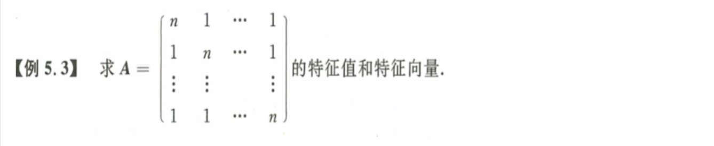
   **传递性：**保秩运算、保值运算、保向运算，一定要把握传递性去做题。
   **秩为1：**一定记得可以拆成行列相乘得到的矩阵。
   **本题思路：**$A=(n-1)E+I_A$ 
2. ==**矩阵拆分：**==类似的矩阵都可以拆开成$A=(n-1)E+B$，其中$r(B)=1$，再拆成行列相乘。
3. 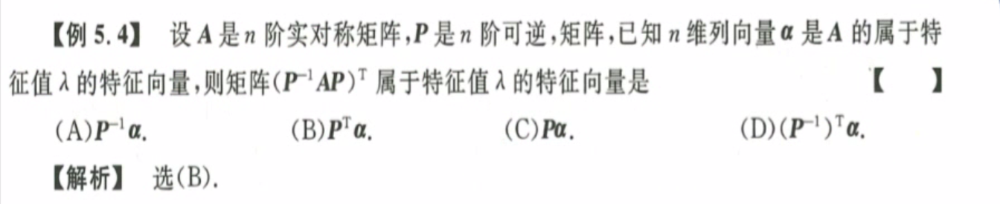
   **观察法：**根据定义写出等式，然后观察，代入可能的值。
4. 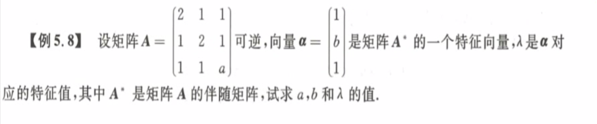
   解题思路：$AA^*=|A|E$，$A^*\alpha = \lambda\alpha \rarr AA^*\alpha = \lambda A\alpha \rarr |A|E\alpha = \lambda A\alpha \rarr A\alpha=\frac{|A|}{\lambda}\alpha$，代入计算。
   **小技巧：**如果题目告诉了特征向量，立刻写出$A\alpha=\lambda\alpha$；如果题目给的是特征值，立刻写出$|A-\lambda E|=0$。
5. 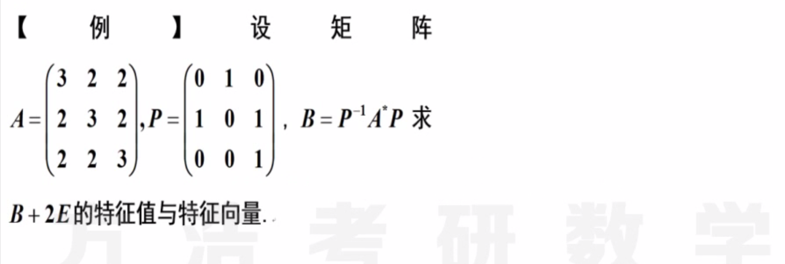
   行列式计算技巧：类似A的行列式可以先求和，然后提一个因子，然后再变换，这样比较快。
   变换计算技巧：如果一个矩阵分别与多个向量相乘，可以直接写成一个大矩阵的形式，这里是$P:C\cong E:P^{{-1}}C$ 
   看到这种复合的题目，优先考虑矩阵计算，最后再代入值，得到计算结果。
   ==矩阵传递性：== 从C出发，加单位阵到A，到A伴随，到B，到B+2E；写出整个过程的特征值和特征向量变化。

## 相似矩阵与相似对角化

1. 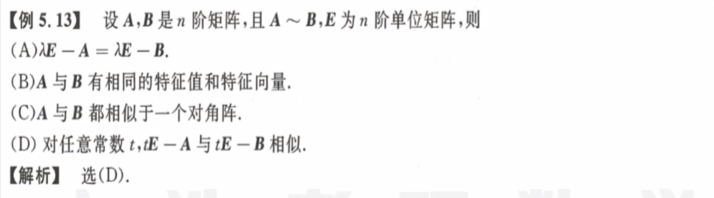
   **保值运算：**可以推导，转置相似运算都是保值但是不保向的运算，即特征值不变，特征向量$\xi=P^{-1}\alpha$
   选项C：都相似一个对角阵，这是充分性，即由C选项可以推出两个矩阵相似，但是反之推不出。
   选项D：相似的传递性，即$f(A)\sim f(B)$ ；所以**矩阵相似：** 
2. 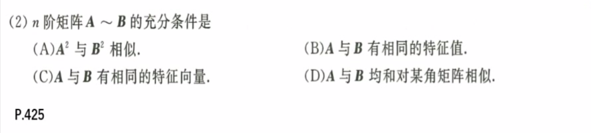
   **相似充分条件：**相似对角化于同一个矩阵；选项B如果指明了是对称矩阵的话，就可以选，因为对称矩阵必可对角化
3. 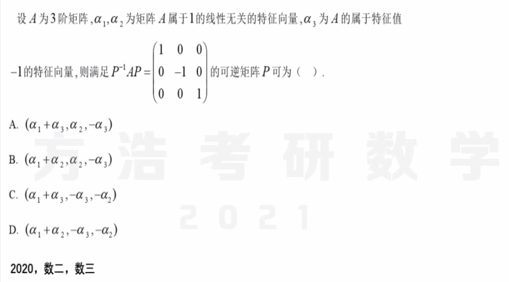
   **矩阵相似对角化的充要条件：**$P=(\xi_{11}, \xi_{12}\dots \xi_{1k_1}, \quad \xi_{21}, \xi_{22}\dots\xi_{2k_2}, \ \dots\ \xi_{m1}, \xi_{m2}\dots \xi_{mk_m},)$ 
   $P^{-1}AP = \Lambda =
   \begin{bmatrix} \lambda_1 
   \\&\ddots 
   \\&&\lambda_1 
   \\&&&\lambda_2 
   \\&&&&\ddots 
   \\&&&&&\lambda_2 
   \\&&&&&&\ddots 
   \\&&&&&&&\lambda_m 
   \\&&&&&&&&\ddots 
   \\&&&&&&&&&\lambda_m   
   \end{bmatrix}$ 特征值和特征向量对应关系。
4. 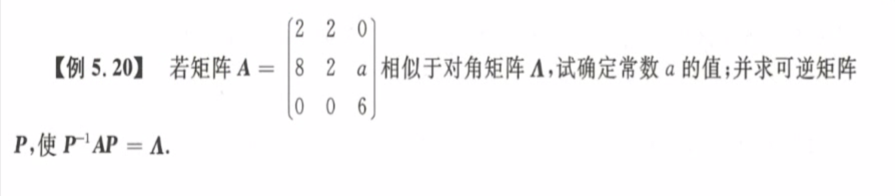
   **相似对角化条件：**$n$个线性无关的特征向量。
   解题思路：先求特征值；有重根则考察对应==特征向量个数；转化为考察矩阵秩的个数==；求出与特征值对应特征向量；
5. 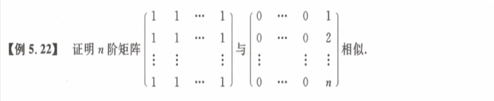
   解题思路：首先求特征值，然后求特征向量，证明有n个线性无关的特征向量。且两个矩阵有相同的特征向量。
6. 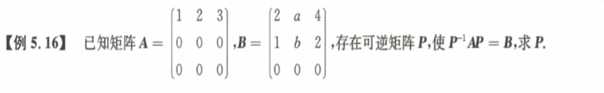
   解题思路：分别找出$P_1^{-1}AP_1=\Lambda$，$P_2^{-1}BP_2 = \Lambda$，然后根据$P=P_1P_2^{-1}$，求得最后的结果。

## 实对称矩阵的对角化

1. 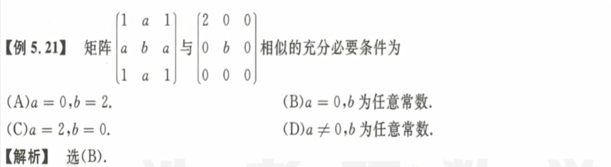
   解题思路：首先观察题给的两个矩阵，矩阵$A$和矩阵$B$相似，而矩阵B是对角矩阵，二者迹相等，立刻得到矩阵$A$的特征值应该是$0,2,b$；代入特征值$\lambda = 2$到矩阵$A$中，立刻得到一个关系式。值得注意的是，一旦确定了一个特征值，就自然确定了全部三个，所以只需要代入依次。
   **矩阵的迹：**$ tr(A) = \lambda_1 + \lambda_2 + \dots + \lambda_n$ 	**矩阵的行列式：**$det(A) = \lambda_1 \times \lambda_2 \times \dots \times \lambda_n$ 
2. 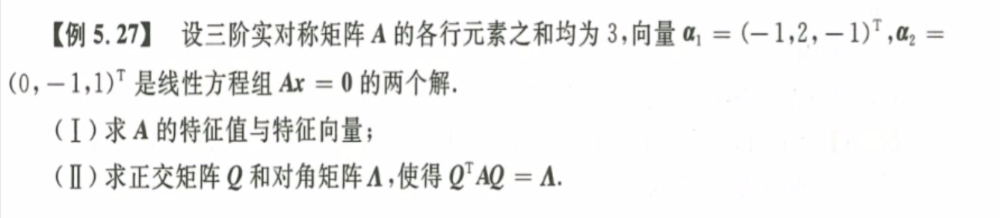
   第一问：特征值与特征向量易得，注意矩阵某行/列的向量之和已知，则可以用来乘$(1,1,1)$或$(1,1,1)^T$。
   第二问：将第一问的特征向量矩阵进行正交化和单位化处理得到$Q$。
3. 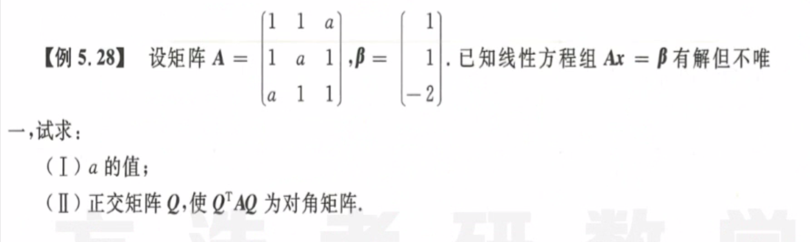
   第一问：有解即系数矩阵的秩等于增广矩阵的秩，不唯一则二者的秩都小于$n$；
   第二问：先求特征值，再求特征向量，然后正交化单位化，注意特征向量和特征值的顺序对应。

## 综合题

1. 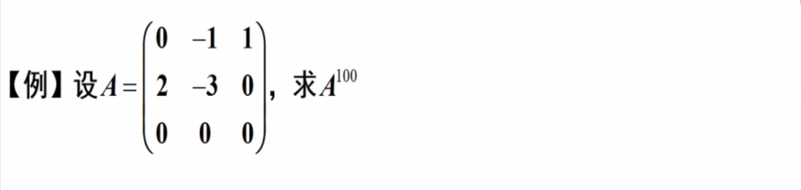
   ==典型例题== **相似矩阵对角化：**$P^{-1}AP=\Lambda \ \rarr \ A = P\Lambda P^{-1} \ \rarr\ A^{100}=P\Lambda^{100}P^{-1} $ ，最简单快捷。
   **特征向量法：**$A\alpha_1=\lambda\alpha_1 \ \rarr\ A^{100}\alpha_1 = \lambda_1^{100}\alpha_1  \ \rarr\ A^{100}(\alpha_1, \alpha_2, \alpha_3) = (\lambda_1^{100}\alpha_1, \lambda_2^{100}\alpha_2, \lambda_3^{100}\alpha_3)$ 
   实对称矩阵不同特征值的特征向量才保证正交，一般矩阵不是这样的哟！！！==这里不可以叉乘正交化== 就是求逆 
2. 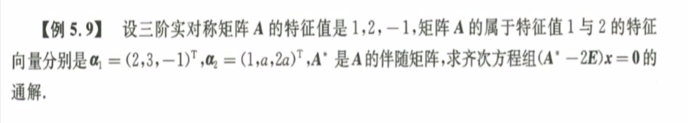
   第一步：看到两个特征向量，立刻根据线性无关，求解出未知数的值。然后立刻叉乘得到第三个特征向量的值。
   第二步：看到方程组，立马开始化简，到最后发现就是求$\alpha_3$。注意：一定要考察矩阵的秩，因为其决定了解的个数==对称矩阵 保秩运算== 
3. 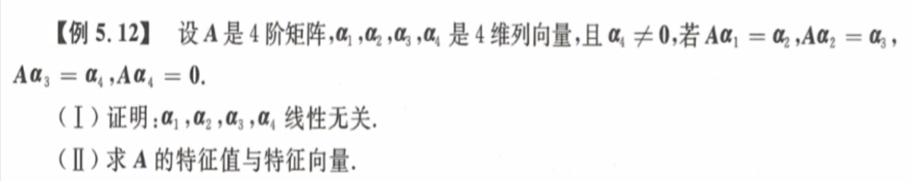
   第一问：定义法，假设系数，两边乘以A的多次方，分别得到系数都为零，即线性无关。
   第二问：构造法，构造$A(\alpha_1 \ \alpha_2 \ \alpha_3 \ \alpha_4 ) = (\alpha_1 \ \alpha_2 \ \alpha_3 \ \alpha_4 ) P$，则立刻有$A\sim P$，因此得到A的特征值、秩；特征向量就是解方程，这里有且只有一个线性无关的解。 ==相似啊 妙啊 我怎么没想到这两矩阵相似啊== 

## 本章小结

1. 特征值、特征向量
   1. 数字型：直接算，先$\lambda$后$\alpha$ （秩为1特殊计算）
   2. 抽象型：构造，秩，$r(A) = 1$ 
   3. 保值运算（相似）、保向运算（大部分其他）；
   4. 传递性
2. 矩阵相似
   1. 必要性：秩，特征值，$f(A) \sim f(B)$ 
   2. 充分性：$P_1^{-1}AP_1 = \Lambda = P_2^{-1}AP_2$ 
   3. 对称矩阵：$Q^TAQ=Q^{-1}AQ=\Lambda$，特征值，特征向量（叉乘），单位化

