# 随机变量

## 分布函数的概念与性质

1. 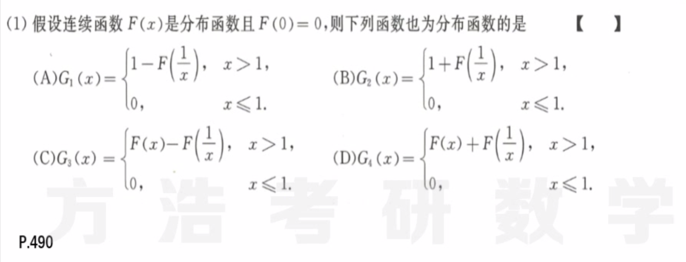
   **分布函数的要求：**非负性 - 不小于零、**规范性** - 正负无穷1/0、**右连续性** - 间断点的值等于右极限、单调不减
2. 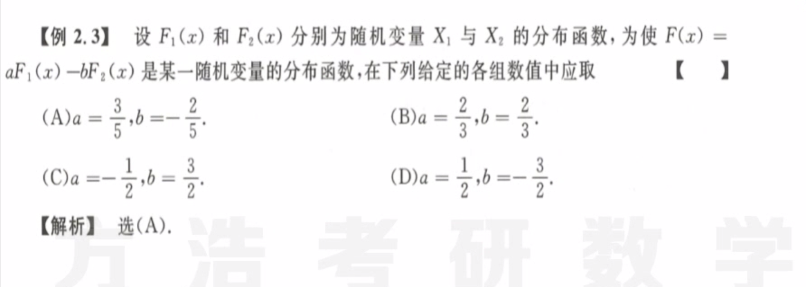
   非负性立刻判定$a > 0, b < 0$；然后根据规范性，立刻得到$D$。然后进行检验。
3. 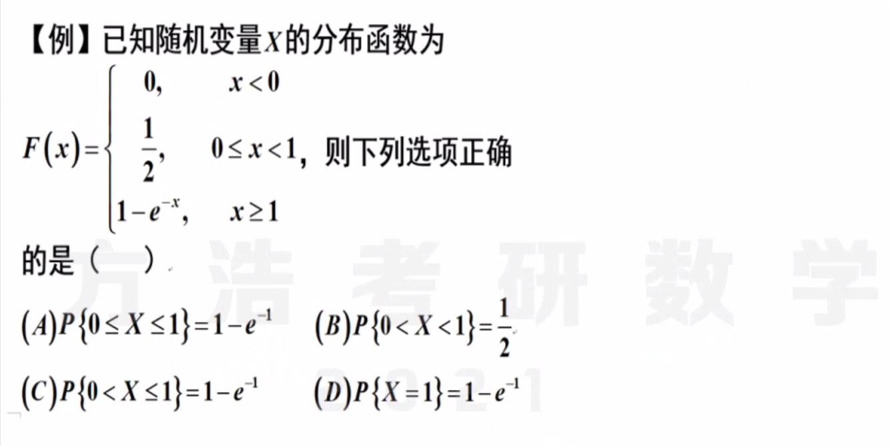
   **离散型随机变量的分布函数：**一定分清楚$P(x\le k)和 P(x <k)$的区别，这里是离散型的，不是连续性的，所以某点概率不为零，考试的时候还有可能出现混合型的，一定要分清楚。
4. 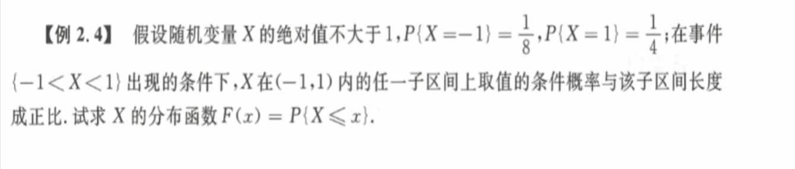
   **离散连续混合型：**条件转换为两个点的概率和一个开区间的均匀分布，因此数形结合得到结果。一定按照右连续的要求来写。
   某点的分布函数的左右极限差值就是该点的概率。

## 离散型和连续型随机变量

1. 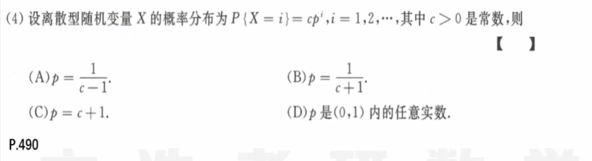
   方法一：利用规范性来求解，即等比数列求和为1；方法二：概念法，想象一个几何分布，利用$cp+p=1$求解；
2. 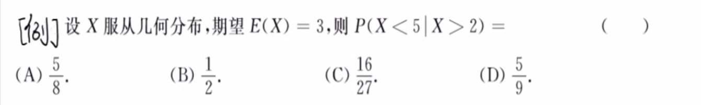
   **几何分布：**离散型随机变量，$P(X=k) = (1-p)^{k-1}p$ ，从1开始，具有**无记忆性** ，最好还是根据定义法，怕记错
3. 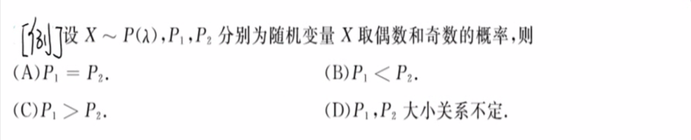
   **泊松分布：**离散型随机变量，$P(X=k) = \frac{\lambda^k}{k!}e^{-\lambda}$，泊松分布和指数的泰勒展开有密切的联系
4. 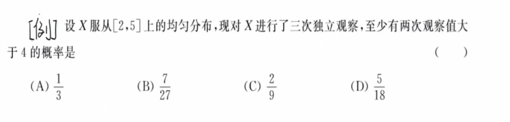
   **二项分布：**离散型随机变量，$P(X=k) = C_n^kp^k(1-p)^{1-k}$要快速识别出题目的意思是让求一个二项分布。
5. 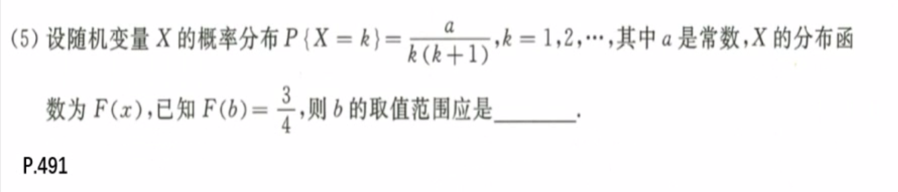
   首先根据规范性，求得$a=1$；然后由于$F(b) = \frac 34$，得到关键点的值。根据离散型随机变量分布函数的阶梯性，得到$b$范围。
6. 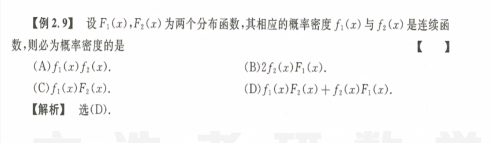
   **连续性：**概率密度函数在连续点等于概率分布函数，概率密度函数在$(-\infin, +\infin)$上的积分一定为1，找到原函数$F_1(x)F_2(x)$ 
7. 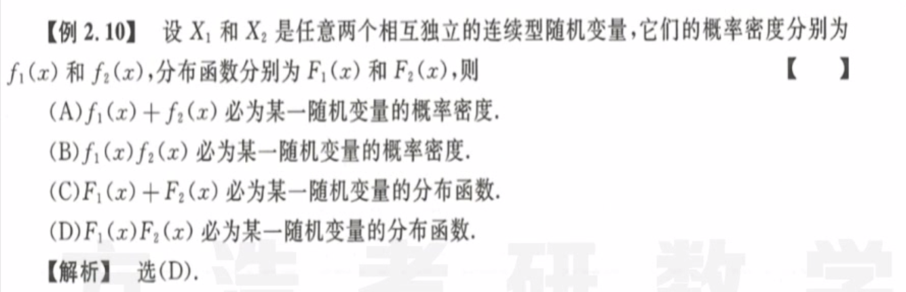
   **概率函数和密度函数：**是否满足规范性的条件，分布乘分布得到还是分布。可以通过规范型、非负性、右连续、单调不减
8. 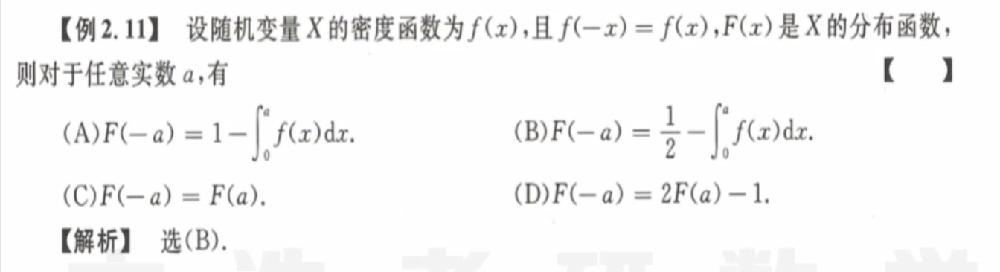
   **数形结合：**奇偶函数可以利用对称性来做，因此很快用坐标轴得到其性质。
9. 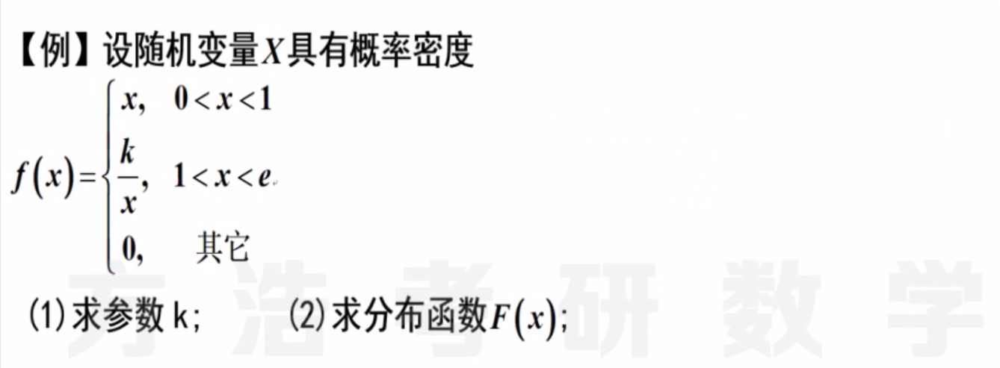
   **连续性随机变量：**利用累积性，即每点的概率都是零，然后分段分析，记住区间按照左闭右开写。
10. 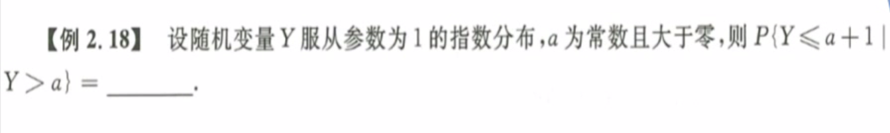
    **指数分布：**连续性随机变量，$F(x) = 1- e^{-\lambda x}$，$f(x) = \lambda e^{-\lambda x}$，可以直接做，也可以利用几何分布和指数分布的无记忆性，即原概率等价于$P(Y\le1) = F(1) = 1-e^{-1}$ 。
11. 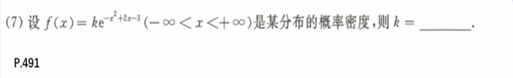
    **正态分布：**连续型随机变量，负一次一定是指数分布，负二次指数的一定是正态分布。凑出正太分布的形式，即配方，除系数，添因子。$P(x) = \frac 1{\sqrt{2\pi}\sigma} e^{- \frac {(x-\mu)^2}{\sigma^2}}$ 
12. 
    正态分布的标准化：标准化之后根据标准正态分布的几大性质接替，对称性、单峰性、单调性
13. 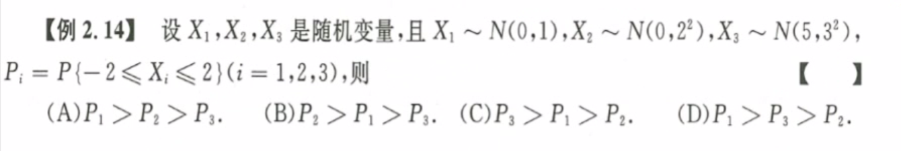
    把区间换成标准正态分布的$\sigma$值，因此很容易根据$\sigma$的系数得到相对大小。
14. 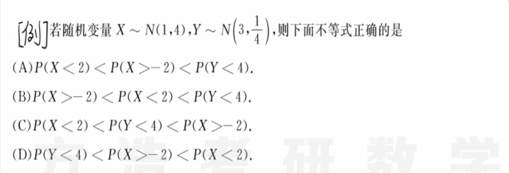
    一般正态分布化为标准正态分布。

## 随机变量函数的分布

1. 
   最好的方法就是定义法，直接对画出函数对应的图像，然后分段定义计算。
2. 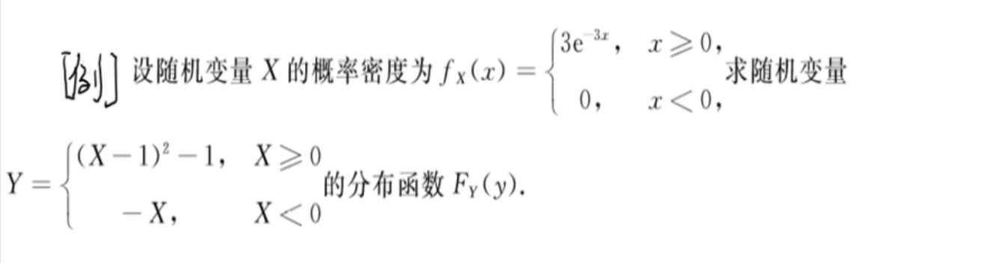
   **技巧：**紧紧抓住概念，即先画出两个随机变量的图像，然后分段写分布函数，根据定义写出分布函数！！！不是密度函数！！！如果有离散的点混合，那么一定记得反复检查等号成立的条件与前提！！！

## 本章小结

1. 分布函数 - 累积性
   1. 右连续性
   2. 规范性
2. 常见随机变量
   1. 离散型：泊松分布 $P(\lambda)$，几何分布 $G(p)$ - 无记忆性
   2. 连续型：指数分布 $E(\lambda)$，正态分布 $N(\mu, \sigma^2)$ - 标准化
3. 随机变量函数的分布
   1. 画出图像
   2. 找出关键点
   3. 解方程

