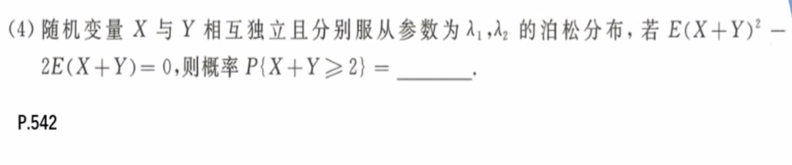
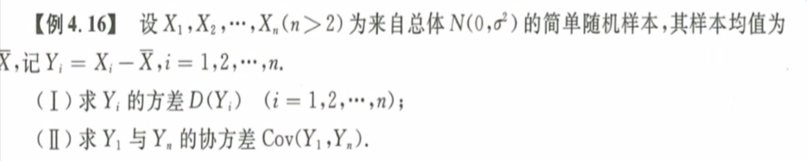

# 数字特征

==看清楚分布函数和密度函数的写法== 规范作答

## 期望与方差

1. 
   **泊松分布独立可加性：**两个独立分布的泊松分布，其和仍然是泊松分布，即$X\sim P(\lambda_1), Y\sim P(\lambda_2)$，则有$(X+Y)\sim P(\lambda_1+\lambda_2)$，泊松分布是从零开始的分布，即取对立事件计算。
2. 
   方法一：直接法，需要用到级数求和的公式，即构造导数来求级数的和。
   方法二：间接法，把不熟悉的分布转换为常见的分布，观察这可能是几何分布，注意起始点，换元法。
3. 
   ==无中生有 好题== 解题思路：理解题意，求出一个的分布，然后根据定义化简得到类似几何分布的等式上$E(t^2+t)$
4. 
   解题思路：定义法，严格按照期望和方差的定义计算，注意换元的时候积分变量也要及时转换。
5. 
   解题思路：定义法，然后可以积分，也可以配方构成一个新的正态分布，即配平方、除系数、添因子。
6. 
   方法一：利用一维随机变量函数的分布，写出Z的分布，然后利用定义求出$E(Z),E(Z^2)$，进而得到$D(Z)$ 
   方法二：利用方差的公式，$D(Z)＝D(X) + D(Y) + 2Cov(X,Y)$，然后分别用定义求出$E(X),E(X^2),E(XY)$ 
   易错点：方差一般是不能直接求得的，一般都是$D(X) = E(X^2) - [E(X)]^2$ 
7. 
   ==好题 典型例题== 题目分析：$X \sim N(0,\sigma),\ Y\sim N(0,\sigma),\ \rho = 0$，即$(X,Y) \sim N(0,0;\sigma^2,\sigma^2,0)$，不过很快就发现没有什么用。
   **直接法：**利用卷积公式，$\int f(x,\sqrt{z-y^2})|\frac {\part {\sqrt{z-y^2}}}{\part z}|\ dx$，易错点！！！公式要乘以2，因为y的大小需要分类讨论。
   **分布函数法：**这里发现两个变量的函数存在很好的对称性和平方，因此想到如果用分布函数的概念，即求$P(Z\le z)$，然后转换成平面上的二重积分，然后计算，可以大大简化。
   **检验：**算出了密度函数之后，一定要检验，很明显这里是$Z \sim E(\frac 1 {2\sigma^2})$，$E(Z) = \frac 1 \lambda,\ D(Z) = \frac 1 {\lambda^2}, F(Z) = 1-e^{-\lambda x}$ 
8. 
   解题思路：同样，如果项求出分布函数再得到概率密度函数的话是不可能的，因为正态分布的原函数非初等函数，这里的概率密度函数也应该非初等函数，但其实也可以用$\Phi$表示。这里如果对$|X-Y|$进行分类讨论，其实可以直接得到Z的分布，即独立正态分布的线性叠加性。也可以定义法，也可以卷积公式。总之，这道题对正态分布的考察比较到位，基本涵盖了正态分布的关键知识点。
9. 
   解题思路：最大值小于一个数就是三个都小于这个数，最小值大于一个数就是三个数都小于这个数，题目不难。

## 协方差、相关系数

1. 
   解题思路：协方差最重要的特征是拆开和合并，自由组合。当然还有$D(\bar x) = \frac{D(\sum x_i)}{n^2}$ ，取平均值之后方差显著降低
2. 
   解题思路：按照==定义计算==，严格按照公式 $D(\bar x) = \frac {D(\sum x_i)}{n^2} = \frac {\sigma^2}n $ ，后面这个只有独立同分布才成立。
   $D(X\pm Y) = D(X) + D(Y) \pm Cov(X,Y) \quad Cov(X,X) = D(X) \quad Cov(aX+c,bY+d) = abCov(X,Y)$ 
3. 
   集中了这一部分几乎全部的换算公式，包括期望，方差，协方差，相关系数。$\rho = \frac{Cov(X,Y)}{\sqrt {D(X)} \sqrt {D(Y)}}$ 
4. 
   **离散型随机变量相关系数：**立刻画出离散型变量的分布表，然后利用已知条件求出表中各项，进而求出$E(XY)$。
5. 
   **二维正态分布：**$(X,Y) \sim N(\mu_1,\mu_2;\sigma_1^2,\sigma_2^2,\rho)$，$aX+bY \sim N(a\mu_1+b\mu_2, a^2\sigma_1^2 + b^2\sigma_2^2 + 2ab\rho\sigma_1\sigma_2)$ 
   这里的相关系数可以根据协方差定义求解，也可以将协方差裂解成简单多项，然后求解。
6. 
   解题思路：这种题我居然傻傻求分布，期望，方差，最快的方法是找到$y=ax+b$，即得到相关系数为$\pm 1$。
   ==相关系数与线性相关== 
7. 
   快速求解法：相关系数为1，则二者一定满足线性关系且斜率为正，又因为二者的期望要满足$E(Y) = 2E(X)-1$ 
   方法二：$X \sim N(0,1) 且 \frac{Y-1}2 \sim N(0,1)$，而二者相关系数为1，所以有$X= \frac{Y-1}2$，因此得到，方法不具有普遍性。
8. 
   其实很简单，相加为常数，立刻得到相关系数为$-1$；第二问，$X+Y=n$立刻得到二者相关系数为0；第三问，可以直接法求协方差，然后拆开计算。更快的方法是利用$X+Y=n$，然后令$U=3X+Y,\ V=X-3Y$，则$U,V$必然满足某种线性关系，斜率为正则相关系数为$1$，斜率为负则相关系数$-1$。

## 相关性、独立性

1. 
   **不相关充要条件：**协方差为零，即根据定义列出协方差，然后裂项令和为零。
2. 
   **极易错：**一定要区分方差$D(X)和E(X^2)$，错过多次了，血泪教训，一定要记住。
   这道题要充分利用奇偶性，将绝对值符号去除，在正区间计算比较方便，无从入手得时候就一定写定义。
   ==**反证法证明不独立==：**举例说明二者不满足$P(AB) = P(A)P(B)$即可，连续性的就取一个特殊区间。
3. 
   解题思路：严格按照定义，期望线性可加，方差平方线性可加，协方差线性拆分。以及二维正态分布线性组合性质

## 本章小结

1. 期望方差
   1. 定义
   2. 性质
   3. 常见分布 - 曹冲称象
2. 协方差相关系数
   1. 协方差：自由组合
   2. 相关系数：独立性推不相关；线性组合推相关系数
3. 独立性单向推得不独立 - 特例二维正态分布

