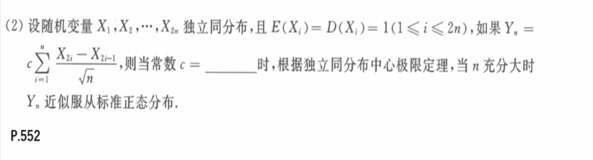

# 大数定理 中心极限定理

## 切比雪夫不等式

**一个数偏离其期望的概率的上限：**$P\{|X-E(X)| \ge \epsilon\} \le \frac {D(X)}{\epsilon^2}$  

1. 
   解题思路：切比雪夫不等式一定要题目中给了才能用，它求得的是变量偏离其期望的概率的上限。这里如果一眼看不出来可以$Z=X-Y$，然后把大括号中化简成关于$Z$的切比雪夫不等式，然后求解。

## 大数定律

**依概率收敛：**$\lim\limits_{n\rarr\infin}P\{|X_n - a| < \epsilon\} = 1$ 

**均值依概率收敛于数学期望**

* 切比雪夫大数定律：独立、期望存在、方差有上界；均值依概率收敛于其数学期望
* 伯努利大数定律：独立、同服从0-1分布；均值依概率收敛于其数学期望$p$ 
* 辛钦大数定律：独立同分布、期望为$\mu$；均值依概率收敛域其数学期望$p$，$\lim\limits_{n\rarr\infin}P\{|\frac1n\sum\limits_{i=1}^{n} X_i-\mu|\le \epsilon\} = 1$，

1. 
   解题思路：大数定律，如果没有说是独立同分布，那就是切比雪夫大数定律，前提条件是期望存在，方差上界。
   A/D：概率密度和$i$取值无关，立刻判断是独立同分布，即想到辛钦大数定律，要求期望存在。对A/D分别求期望，A中级数收敛，期望存在；D中反常积分不收敛，因此期望不存在。
   B/C：概率密度和$i$取值有关，立刻判断是切比雪夫大数定律，要求期望存在，方差上界；选项B：$E(X_i) = i, D(X_i) = i^2$，选项C：$E(X_i) = i, D(X_i) = i$；都不符合条件，因此排除。
2. 
   **辛钦大数定律：**一定要同分布，一定要数学期望存在；离散型期望存在要求级数收敛，连续型期望存在要求反常积分收敛。一定要注意，大数定律的前提条件；
3. 
   **依概率收敛：**$n$足够大的时候，一定是依概率收敛于其**数学期望**。

## 中心极限定理

**大量独立同分布均值近似服从正态分布：**$\overline X \sim N(\mu, \frac{\sigma^2}{n})$ ；特殊$Y_n \sim B(n,p) \sim N(np, np(1-p))$ ，期望方差存在

1. 
   **中心极限定理：**前提条件：独立、同分布、期望、方差
2. 
   **中心极限定理：**$X_n \sim B(n,p)$当次数$n$足够大时，可以用正态分布拟合伯努利分布，即$X_n \sim N(n,np(1-p))$ 
3. 
   均匀分布：$\mu = 0, \sigma^2 = \frac 13$，然后将待求不等式转换为标准正态分布。
4. 
   解题思路：独立同分布中心定理要么$\overline X$，要么$X\sim(n,p)$，如果两不沾就一定要化简。这里有求和，明显需要构造$\overline X$，这里直接两个一拆开就行，然后利用独立的两个正态分布线性组合还是正态分布，其期望线性叠加，方差平方乘平方系数叠加。或者直接换元法，利用$Z=X_{2i} - X_{2i-1}$，其期望为0，方差为2，然后对$Z$进行标准化。

## 本章总结

1. 切比雪夫不等式

   **一个数偏离其期望的概率的上限：**$P\{|X-E(X)| \ge \epsilon\} \le \frac {D(X)}{\epsilon^2}$  

2. 大数定律

   **依概率收敛：**$\lim\limits_{n\rarr\infin}P\{|X_n - a| < \epsilon\} = 1$ 

   **均值依概率收敛于数学期望**

   * 切比雪夫大数定律：独立、==期望存在、方差有上界=；均值依概率收敛于其数学期望=
   * 伯努利大数定律：独立、同服从0-1分布；均值依概率收敛于其数学期望$p$ 
   * 辛钦大数定律：独立同分布、==期望==为$\mu$；均值依概率收敛域其数学期望$p$，$\lim\limits_{n\rarr\infin}P\{|\frac1n\sum\limits_{i=1}^{n} X_i-\mu|\le \epsilon\} = 1$

3. 中心极限定理

   **大量独立同分布均值近似服从正态分布：**$\overline X \sim N(\mu, \frac{\sigma^2}{n})$ ；特殊$Y_n \sim B(n,p) \sim N(np, np(1-p))$ ，==期望方差存在==

   