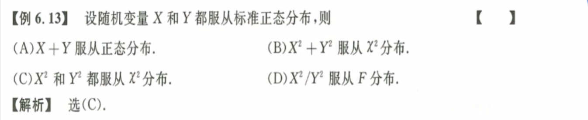

#  数理统计

## 常用统计量

**统计量-样本；数字特征-随机变量；注意区别**

1. 均值：$\overline X = \frac 1n \sum\limits_{i=1}^{n}X_i$ 
2. 方差：$S^2 = \frac 1 {n-1}\sum\limits_{i=1}^{n}(X_i-\overline X)^2 = \frac 1 {n-1}[\sum\limits_{i=1}^{n}(X_i^2)-n\bar X^2]$ 注意：$E(S^2) = \sigma^2,\ D(S^2) = \frac{2\sigma^4}{n-1}$ 
3. 标准差：$S = \sqrt{\frac 1 {n-1}\sum\limits_{i=1}^{n}(X_i-\overline X)^2}$ 
4. $k$阶原点矩：$A_k = \frac 1n \sum\limits_{i=1}^{n}X_i^k$ 
5. $k$阶中心矩：$B_k = \frac 1n \sum\limits_{i=1}^{n} (X_i-\overline X)^k$ 

1. 
   解题思路：不需要化简，直接根据概念写就可以了，$T_2$拆开两个部分，且前后两个部分都独立。
2. 
   ==易错== 解题思路：数字特征和统计量结合，方差的期望 $E(S^2) = \sigma^2$ 
3. 
   ==易错== 解题思路：见到平方找卡方，这里明显需要转换成卡方的可加性，注意与项数无关的$n$都可以看作常数。
4. 
   $E(S^2) = \sigma^2,\ D(S^2) = \frac{2\sigma^2}{n-1}$ ，于是很容易通过换元法求得$E(S^4)$ 
5. 
   ==不会== 第一问：就是求$T$的期望，即直接拆开求解即可；怎么求$D(\overline X^2)???$ 
   第二问：由于正态总体的独立性，即$\overline X, S^2$独立，因此$D(T)=D(\bar {X^2}) + \frac 1{n^2}D(S^2)$ ，前半部分比较难求，这里同样利用了看到平方找卡方，因此逐步化简为自由度为1的卡方分布。

## 统计量的分布

1. $\chi^2$ 分布 $\chi^2 \sim \chi^2(n)$
   1. 定义：$\chi^2 = X_1^2 + X_2^2 + \dots + X_n^2 = \sum\limits_{i=1}^{n}{X_i^2}$ ，则有$\chi^2 \sim \chi^2(n)$ 
   2. 前提：$X_1,\ X_2,\dots,X_n$相互独立，且都服从标准正态分布$N(0,1)$ 
   3. 数字特征：$E(\chi^2) = n,\ D(\chi^2) = 2n$
   4. 可加性：$\chi_1^2 + \chi_2^2 \sim \chi^2(n_1+n_2)$ 
2. $t$ 分布 $T\sim t(n)$ 
   1. 定义：$T = \frac {X}{\sqrt{Y/n}},\ 其中\ X\sim N(0,1),\ Y\sim \chi^2(n),\ 还有\ T^2 \sim F(1,n)$  
   2. 对称性：$t_{1-\alpha}(n) = -t_{\alpha}(n)$ 
   3. $n$充分大：由于分母期望为1，所以$n$充分大时t分布区域标准正态分布
3. $F$ 分布 $F \sim F(n_1, n_2)$
   1. 定义：$F = \frac{X/n_1}{Y/n_2},\ 其中\ X\sim \chi^2(n_1),\ Y\sim \chi^2(n_2)$ 
   2. 倒数：$\frac 1F \sim F(n_2, n_1)$ 
   3. $F_{1-\alpha}(n_1,n_2) = \frac 1 {F_{1}(n_2,n_1)}$ 

1. 
   卡方分布是一个广义的概念，这里只需要换元法，即令$Z_1 = X_1 + X_2 + X_3$，然后对换元后的变量进行标准化处理即可。千万不要试图拆解平方，耗时费力做不出来。
2. 
   方法同上，即换元，然后**标准化**，即得到结果。一个平方就是一个自由度。
3. 
   ==分子分母看起来都是正态分布== 熟悉卡方分布、t分布、F分布。看到绝对值，那么就有可能是根号一个平方，然后上下分别换元，即得到t分布。
4. 
   解题思路：根据t分布的定义和概念，将上述统计量等式化简即得到。正态分布一定要**标准化**。
5. 
   解题思路：观察题目，分子分母都有平方，那一定是卡方比卡方，F分布。
6. 
   ==易错== 不要随意拆开平方
7. 
   熟悉各种分布的构成，熟悉标准化的过程。
8. 
   **注意：**两个随机变量服从标准正态分布，但是没有说是简单随机样本，没有**独立性**的条件。
9. 
   **t分布的对称性：**t分布天生就和F分布具有对应关系，即$T\sim t(n)\ \rarr\ T^2 \sim F(1,n)$ ==灵活== 
10. 
    一定要记住一个公式$\sum\limits_{i=1}^{n}{(\frac{X_i-\overline X}{\sigma})^2} = \frac{S^2(n-1)}{\sigma^2} \sim \chi^2(n-1)$ 以及 $\sum\limits_{i=1}^{n}{(\frac{X_i-\mu}{\sigma})^2} \sim \chi^2(n)$ 
11. 
    

## 正态总体

* **单正态总体：**即$\overline X和S^2$ 相互独立
  1. $\overline X \sim N(\mu, \frac{\sigma^2}{n}),\quad \frac{\overline X - \mu}{\frac {\sigma}{\sqrt n}}\sim N(0,1)$  
  2. $\frac{(n-1)S^2} {\sigma^2} \sim \chi^2(n-1),\quad \frac 1{\sigma^2}\sum\limits_{i=1}^{n}(X_i - \mu)^2 \sim \chi^2(n)$ 
  3. $\frac{\overline X - \mu}{\frac {S}{\sqrt n}}\sim t(n-1)$ 

