# 极限连续

## 函数的几何特性

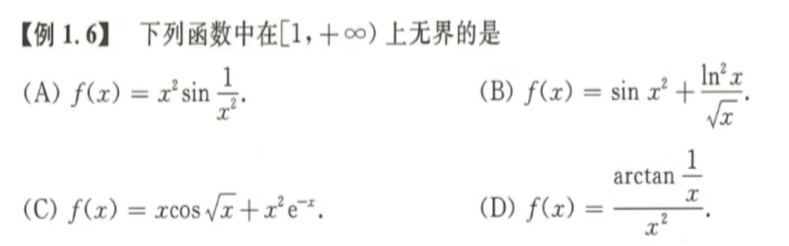
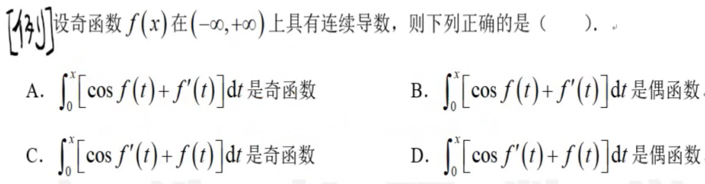
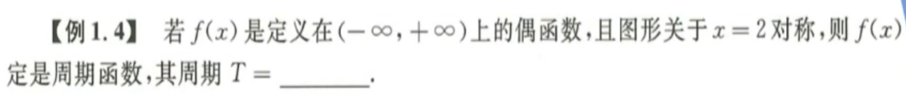

## 极限的概念与性质

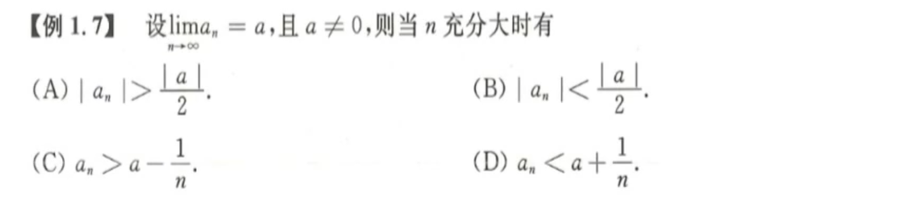

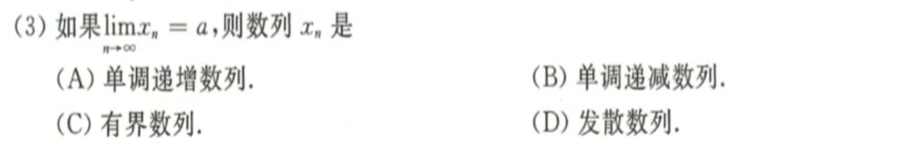
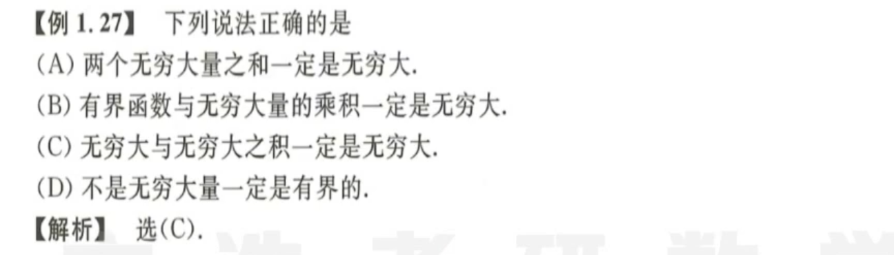

## 未定式极限的计算

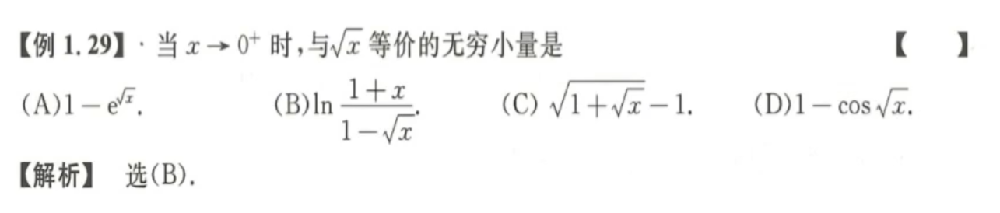
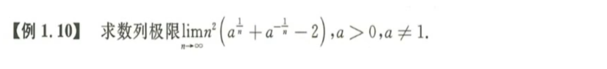
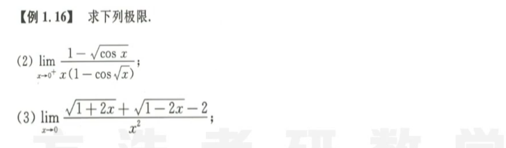
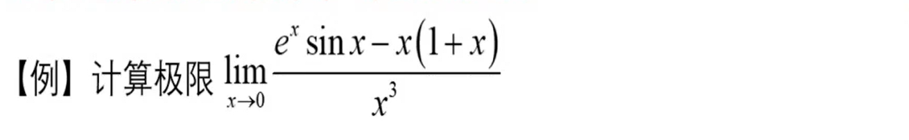
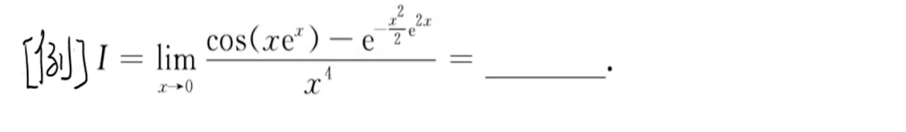

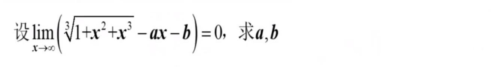
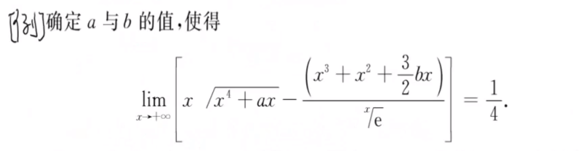
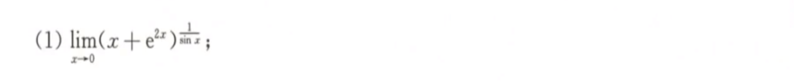
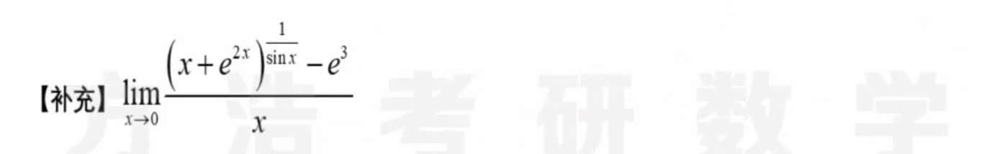

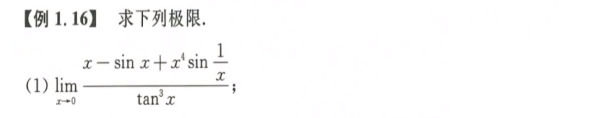

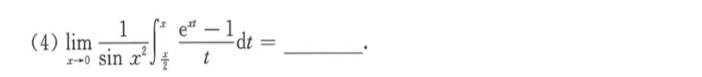
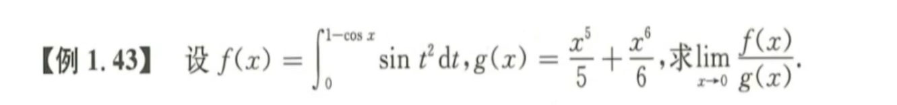
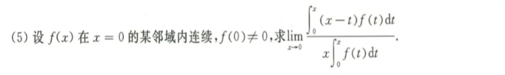

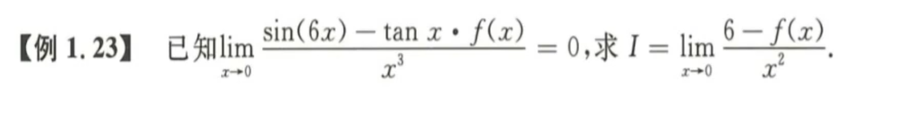

## 数列极限

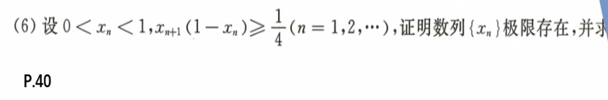
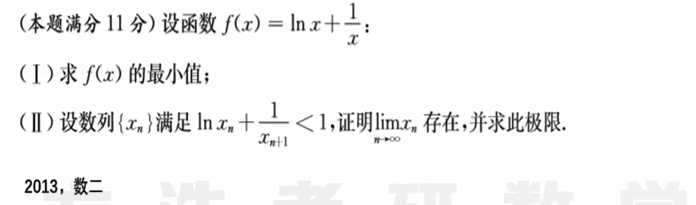
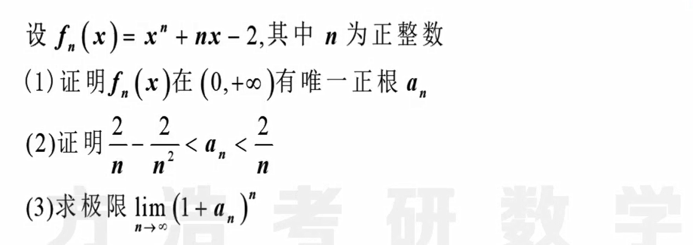
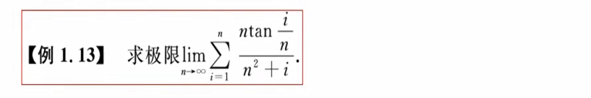 

## 函数连续性

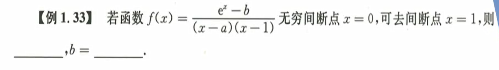
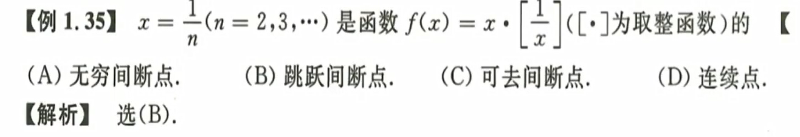

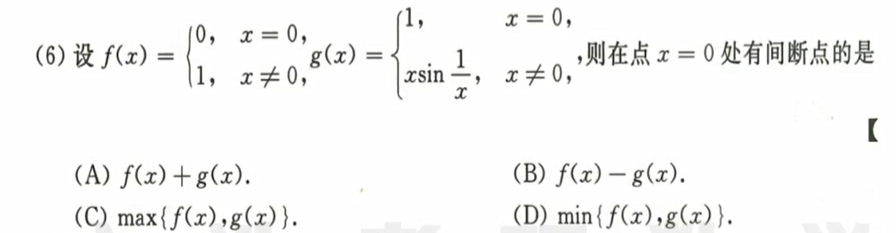
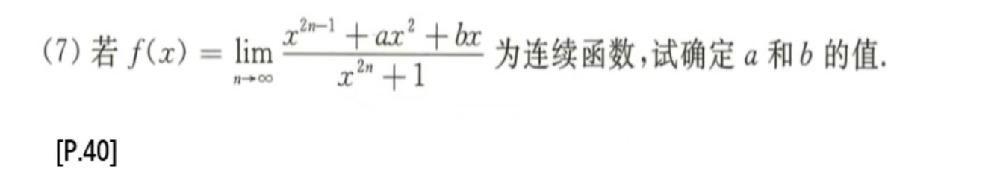

## 本章小结 

* 未定式极限 - ==分类== 10分
  * 无穷小：等价无穷小
  * 无穷大：提玛珐 Max
  * 幂指函数：$f^g = e^{glnf}$ 
  * 积分极限：洛必达法则
  * 不会做：夹逼定理（无穷小*有界=无穷小）
* 数列极限 10分
  * 单调有界
  * 夹逼定理
  * 定积分定义：用于求和结构
* 连续性 4分
  * 间断点：分类和定义
  * 零点定理：方程根的个数

* 没提到的
  * 拉格朗日中值定理：$f(b) - f(a) = (b-a)f^{'}(\xi)$ 
  * 积分中值定理：$\int_{a}^{b} {f(x)} \ dx = f(\xi)(b-a)$ 

