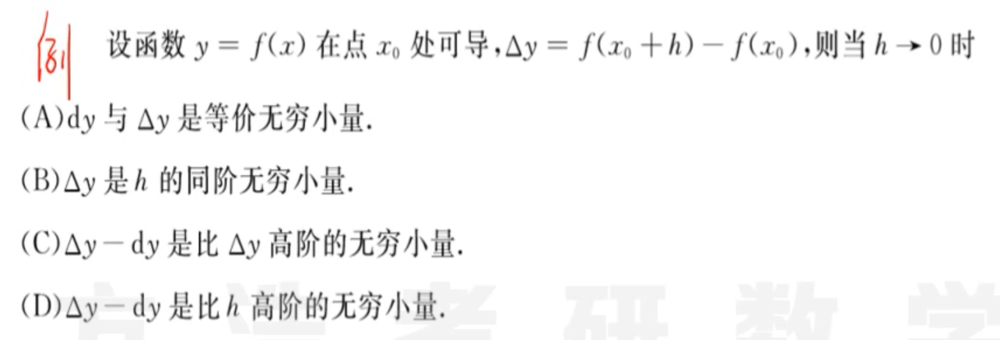
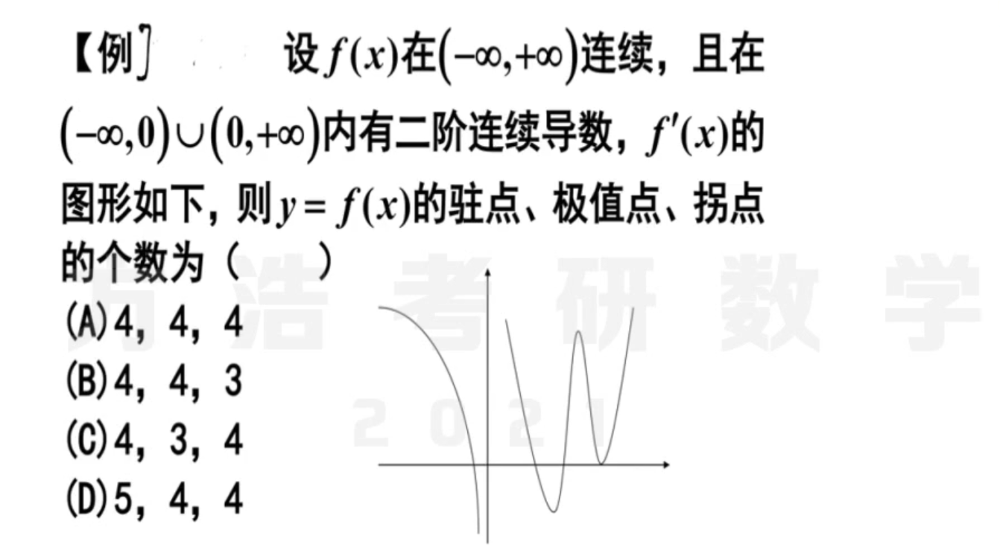

# 一元函数微分学

## 导数、微分的概念与性质

1. 

   解题思路：动静结合、左右兼备、极限存在；可导必然左右极限存在且相等；选项A无只能取到x>0的情况，排除；选项D中两个都是动点，无法取到动静结合；注意隐藏条件是每个都可以加上f(0)；对于选项B和C，利用导数定义构造，再分析极限存在的情况。

2. 

   解题思路：导数极限定理，即导函数左/右极限存在，则左/右导数存在且和对应的左/右极限相等；

3. 

   解题思路：==分段可导==带绝对值的判断是否可导，需要把每一个分段点挨个带入剩余的式子中，如果为零，则可导，否则不可。试判断这个式子在$x=a$点可导的条件$f(x) = |x-a|g(x)$；

4. 

   解题思路：利用定义，这点的导数存在且等于导函数极限（一个点连续即该左右极限存在相等且等于该点的值）

5. 

   解题思路：注意陷阱是在该点的导数/微分可能为零，所以别搞错了。

## 导数的计算

1. 

   解题思路：本题易误用洛必达法则，洛必达法则要求的是函数在该点的去心邻域内可导，而本题只给出了在该点的导数，所以记住规则以及对应的适用范围也很重要。不知道怎么写，就紧扣定义。

2. 

   解题思路：内外并行-判断外层可导之后，就可以根据复合函数求导公式展开；展开之后，判断内层是否可导，可导之后再根据定义计算；

3. 

   

4. 

   补充条件：$f''(1) = 1$ 

5. 

   解题思路：方法一：高阶导数的莱布尼茨公式；方法二：泰勒展开+无穷级数

6. 

   解题思路：和上题相同

7. 

   解题思路：方法一：高阶导数的莱布尼茨公式；方法二：泰勒展开+无穷小

## 微分中值定理及应用

1. 

   解题思路：观察需要证明的结果，构造函数；已有条件佷明显，利用罗尔定理即可；二阶导为零：三个相等的点、相等的一阶导

2. 

   解题思路：靠，这个题我肯定想不到。构造函数+积分中值定理+罗尔定理

3. 

   解题思路：看关键条件推出三个结论（分母在零点为零；右导数趋于零；局部保号性很关键）第一问由局部保号推出；第二问观察函数发现父子关系很紧密，由此想到罗尔定理的构造，然后根据第一问和题给条件，进一步找到两个导数为零的点。有点巧妙，但也不难。

4. 

   解题思路：拉格朗日中值定理在极限中的典型应用，不建议用和差化积；注意一点就是 $\xi$ 在计算的时候要给出严格的细估计，不可以直接等价于$x$。

5. 

   解题思路：典型的拉格朗日；左边拉格朗日，右边构造函数求导；右边注意换元会简单一些

   | 不等式求解方法 | 特点                         | 优点   | 缺点     | 优先级 |
   | -------------- | ---------------------------- | ------ | -------- | ------ |
   | 拉格朗日       | $m\le f'(\xi)\le M$          | 简单   | 精度低   | 1      |
   | 单调性         | $a \rarr a \ b \rarr x$ 求导 | 精度高 | 计算复杂 | 2      |

6. 

   解题思路：观察等式两边，利用拉格朗日中值定理、柯西中值定理巧妙构造；然后利用介值定理找到该点；再回去正推；盲狙法找到$f(c)=1$ 

7. 

   解题思路：泰勒中值定理-选展带凑（1. 选点-端点或区间中点；2. 展开；3. 带入-题给值或区间端点或多个点；4. 凑）；注意中值定理一定要在两个分隔区间进行；

8. 

   解题思路：要先识别用泰勒中值定理，然后判断在哪个点展开，然后看带入值；无非就是利用对称性和区间端点来展开；

## 极值点、拐点、渐近线

1. 

   解题思路：驻点：导函数为零；极值点：导函数在该点两侧异号，可能是导函数零点，也可能书不可导点；拐点：二阶导数在该点两侧异号，是一阶导数单调性改变的点；这类题，可以考虑用位移-速度-加速度思考。

2. 

   解题思路：这类题目极有可能用到连续性，局部保号性的相关知识；二阶可导推出函数和导数连续，再利用极限求得一阶导在零点处为零，二阶导在零点处为1；即为极小值。这道题也可以用特殊值法，取一个f(x)的特例即$f(x) = x^2$。

3. 

   解题思路：是否能对关系式求导非常关键，这里由于等号两边等价，即左边必然也可导。题给隐含条件，就是三阶可导。

4. 

   解题思路：利用局部保号性计算。即根据局部保号性判断一阶导数的正负值，也可以利用二阶导数取判断。局部保号性一定要熟悉！！！

5. 

   解题思路：隐函数求导，易得极小值；注意极小值的写法应该是 $y|_{x=1} = 2$，极小值具有局部性，说明这里的极小值是在一个确定的点取得的。

6. 

   解题思路：分类：垂直渐近线，水平渐近线，斜渐近线。注意间断点的类别，和渐近线判断的代数定义。

7. 

   解题思路：2020年数二真题，着重是极限求解和渐近线方程的定义。

## 方程根的问题

零点定理 -> 寻找异号的点：单调性、区间端点、实在不行就中间点

1. 

   解题思路：利用单调性，直接利用变限积分求导的性质。找特殊点，然后多次利用零点定理，找到其他的零点 。

2. 

   解题思路：数形结合+持之以恒的求导

3. 

    解题思路：分离变量，数形结合，单调性多次求导；也可以利用拉格朗日，在中间减少一些计算

4. 

   解题思路：拉格朗日（将导数和函数结合起来），利用二阶导数单调性，同时利用罗尔定理说明不能超过两个根。

## 曲率（数一、数二）

$K = \frac{|y''|}{(1+y^2)^{3/2}}$  

$R = \frac{(1+y^2)^{3/2}}{|y''|}$ 

1. 

2. 

3. 

   解题思路：拉格朗日可以用上

## 本章小结

1. 导数与微分

   1. 可导/微：动静结合，左右兼备，极限存在
   2. 微分的意义：$\Delta y = dy+o(\Delta x) = f'(x_0) \Delta x + o(\Delta x)$ 

2. 导数计算：复合函数、隐函数、参数方程、反函数、高阶导

3. 中值定理 - 注意区间需要分割

   1. 一阶导数（一次求导）
      1. 父子关系：罗尔定理（等式中）
      2. $a, b, f(a), f(b)$：拉格朗日或者柯西
   2. 高阶导数：泰勒中值定理（选 展 赋 凑）

4. 应用：驻点、极值点、拐点、不等式-拉格朗日/单调性、方程的根，曲率和渐近线

   

