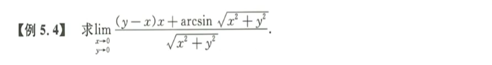

# 多元函数微分学

[toc]

## 连续、偏导、可微性

### 连续

* 高阶比低阶的用夹逼定理
* 不是高比低的举反例说明不存在
* 其他的不会做就选零

1. 
   解题思路：曲面=平面+高阶无穷小；
2. 
   解题思路：一看这道题，立刻夹逼定理；首先分离，右边是多元可化一元极限；分离之后，观察分子分母的阶数，然后引入绝对值符号，从而构造出极限为零。
3. 
   解题思路：观察极限，构造多元可化一元极限；$\lim\limits_{(x,y)\rarr (0, 0)}xyln(x^2+y^2) $ = $\lim\limits_{(x,y)\rarr (0, 0)} {\frac{xy}{x^2+y^2}(x^2+y^2)ln(x^2+y^2)}$，其中$\lim\limits_{(x,y)\rarr (0, 0)} \frac{xy}{x^2+y^2}$有界，而$\lim\limits_{(x,y)\rarr (0, 0)} (x^2+y^2)ln(x^2+y^2) = 0$，因此选C。
4. 
   解题思路：不等于零时，初等函数必连续；等于零时，观察等式上下阶数，判断极限不存在；通过举反例$y=kx$来否定极限的存在性；

### 偏导

1. 
   解题思路：在某点的偏导可以先代数，从而转化为一元函数的极限，计算出来；值得特别注意的时，一定要注意绝对值的存在，千万别遗漏。
2. 
   连续性：根据定义求函数在该点附近的极限值；
   可微性：先根据定义求出两个偏导，再根据全微分定义求证极限为零；

### 可微

1. 
   **研究可微的三种方法**：$\lim\limits_{(x,y)\rarr(0,0)} {\frac {f(x+\Delta x, y+\Delta y) - f(x, y) - (A\Delta x+B\Delta x)}{\sqrt{(\Delta x)^2 + (\Delta y)^2}}=0}$
   方法一：初等函数——在定义区间上一定可微。
   方法二：极限——题目给出了一个极限，然后凑出上述定义的形式；
   方法三：分段函数——啥都没给，即必然存在偏导，然后先求偏导，然后根据定义证明上述极限；
   提示：两个偏导数（二元函数）在该点都连续，则该点必可微。
2. 
   解题思路：这道题很灵活，$f(x,y) \sim {\rho}^2$，即$f(x,y)-f(0,0)-(A\Delta x+B\Delta y) = o(\rho)$，且$A=B=0$。立即可微，当然也可以特殊法，令$f(x,y) = x^2 + y^2$。
   思考：如果给出$\lim\limits_{x\rarr0\\y\rarr0}(\frac {f(x,y)-Ax-Bx-C}{\rho^n})=0$呢？如果是n=1且是极限存在呢？
3.  
   解题思路：一看到题目，极限-定量信息，可微-定性信息，一般只能由定量信息推到定性信息。这道题立马在A、B两个选项中选。这里C、D不太可能选，因为可微只能推出存在一个极限，但是从题给信息无法证明这个可能存在的极限是选项里的这个极限。
4. 
   解题思路：根据定义，直接写出答案$2a$。
   
5. 
   解题思路：方法一：先求$\frac {\part z}{\part x}$，再求$\frac{\part z}{\part y}$，得出结果。方法二：利用全微分形式不变性，两边先取对数，再取微分（类似隐函数求导但不同）。
   
* 求全微分两种方法：定义法、全微分形式不变性

## 多元函数求导法则

1. 
   解题思路：因为只需要对x求导，所以直接带入y的值。当y=2时，利用变限积分求导的性质求出一阶导数，然后巧妙求二阶导，简化计算，快速得到答案为4。
2. 
   解题思路：这道题由于是混合二阶偏导，所以不可以代入某个值转化为一阶偏导，必须严格按照定义来计算。但是可以简化的是，可以导一次代一次，因为对一个求完偏导之后就可以代入相应的值了。
3. 
   解题思路：题目全程和y都没有关系，所以首先代入y的值到函数和方程中。
4. 
   解题思路：这道题主要用于辨析显函数和隐函数概念，实际应该不会考。
   $\frac{du}{dx}=f'_1\times1 + f'_2\times \frac{dy}{dx} + f'_3\times \frac{dz}{dx}$    $\varphi'_1 \times 2x + \varphi'_2 \times cosx e^{sinx} + \varphi'_3 \frac{dz}{dx}=0$
5. 
   解题思路：二阶偏导运算 = 一阶偏导 + 四则运算 + CPR；其实也是根据定义来，根据一阶偏导数如何计算二阶偏导数，这道题是一个典型的例子。注意字母和符号的变化，最后是可以相互抵消的，千万别写错了。
6. 
   第一问：变量代换，注意对一阶偏导求导时不要遗漏关键项，以及二阶偏导的表示方法，符号不要写错了。
   第二问：严格按照定义将第一问的结果代入。
   第三问：这个问题有点开放，最后得到$u=f(\xi)+h(\eta)$，即$u(x,t) = f(x-at) + f(x + at)$。
7. 
   解题思路：这道题计算其实不难，主要考察偏导数的概念。重点在如何简化运算。当看到混合偏导的时候，初始不能代值，但是每求一个偏导可以代一个数的值以简化运算。例如先求z对x的偏导，那么求完之后就可以将x=1这个值代入。再求z对y的偏导，再代入y=1。
8. 
   解题思路：这道题最重要的是理解方程$F(\frac{xz}{y}, \frac{yz}{x})$这个条件的意义。即这个条件是怎么用的，设想一个类似的方程，里面有两个自变量和一个因变量，那么这个方程分别对两个自变量求导就是隐函数求导。这样一来，方程两边求导等于零就是一个很好的条件，由此获得和要求式子中相关的项，不确定的用符号代替先。计算的时候比较繁琐，千万不要搞错了系数。当然，提前通分在这里可以简化一些运算，这个属于技巧性的内容。

## 多元函数极值与最值

1. 
   解题思路：这个等式十分熟悉，在可微部分我们已经见过多次。由连续和极限的条件得$f(0,0)=0$，根据局部保号性，即$f(x,y)$在$(0,0)$的去心邻域内小于零，即在该点取极大值0。而根据前面全微分的定理，$f(x,y) \sim -sin(x^2 + y^2) \sim o(\rho)$，即在该点的全微分存在，该点的两个偏导都为零。
   做题警示：学到这里一定要返回去看一下全微分/全增量的定义和概念。
2. 
   **驻点：**两个一阶偏导都为零的点，立即确定为驻点。
   **极值点：**或者是驻点，或者是不连续的点。
   **极值点充分条件：**求二阶导数，$A=f''_{xx}, C=f''_{yy}, B=f''_{xy}$，如果$AC-B^2=0$则无法判断要另外讨论，如果$AC-B^2<0$则极值不存在；如果$AC-B^2>0$则极值存在，且$A<0$为极大值，$A>0$为极小值。
   **难点：**如何说明函数在点$(0,0)$处是否取极值。首先，在该点的函数值为零。如果极值存在，则严格根据定义**证明**在该点的去心邻域内函数的正负性；如果极值不存在，则通过**反例**即沿着不同路径的极限值不相等来说明极值不存在。
3. 
   解题思路： 隐函数求导是数一、数二最常见的。第一步：方程两边对x，y分别求一阶偏导。第二步：一阶导数为零的点找出来。第三步：继续求二阶导，求三个二阶偏导。第四步：代入数据进行检验。注意这道题的计算过程和步骤并不简单。求导过程中，注意观察哪些量后续求得为零，然后暂时不打开计算。
4. 
   解题思路：多元函数的条件极值——拉格朗日乘数法；$F(x,y) = f(x,y) + \lambda \varphi(x,y)$；分别对x和y求偏导，即得$f'_x(x,y) \times \varphi_y(x,y) = f'_y(x,y) \times \varphi_x(x,y)$；即交叉相乘；
5. 
   解题思路：最值要么在边界上取，要么在极值点取。回想一下极值点的必要条件（间断点或者驻点），极值点的充分条件（二阶偏导的关系$AC-B^2>0$）。
6. 
   解题思路：典型的二元拉格朗日乘数法，注意这是在一个平面上。而且构造函数的时候记得直接构造$f(x,y) = x^2 + y^2$，这样可以简化运算，而且不影响结果。
7. 
   方法一：消元，将其转换为平面上（二元函数）的问题，再用拉格朗日乘数法解决。
   方法二：直接利用三元计算，引入$\lambda$和$\mu$两个变元，然后求分别对$x,y,z$的偏导都为零。
8. 
   第一步：考察待求函数Z的极值，直接求其对x和y的偏导等于零，观察是否在区域内。
   第二步：考察待求函数在边界条件下的极值，即用拉格朗日乘数法，构造函数，解出答案。
9. 
   解题思路：就是求导，然后系数为零。及时抓住关键点，简化计算。

## 本章小结

1. 可微性
   1. 初等函数：自动可微
   2. 已知$z=f(x,y)$，求出$z'_x, z'_y$，然后计算$\lim \frac {\Delta z-dz} {\rho} = 0$。
   3. 已知一个极限，构造$\lim \frac {\Delta z-dz} {\rho} = 0$。
2. 求导法则
   1. 显函数：四则运算 -> CPR -> 合并
   2. 隐函数：直接求偏导（一阶二阶代入）
3. 极值最值
   1. 无条件：$AC-B^2 > 0$或者用定义。
   2. 有条件：拉格朗日乘数法，十字叉乘。
   3. 闭区域：结合无条件和有条件，然后比较。