# 常微分方程

## 一阶微分方程

1. 
   **变量不可分离的齐次方程：**换元之后，令$u=\frac yx$，从而分离变量，积分之后得到通解。
2. 
   解题思路：首先判断这是什么类型的微分方程；1. 变量可否分离；2. 是否是齐次方程；3. 是否是一阶线性微分方程；原题为微分线性方程，因此构造父子函数来解决这个问题。
3. 
   解题思路：观察方程，发现$e^{-y}$这一项格格不入，两边乘$e^{-y}$后观察发现接近一阶线性方程，然后换元之后发现果然很相似。因此化简为一阶线性微分方程。
4. 
   解题思路：这道题乍一看，变量不可分离，且$(\frac 1{x+y})$这个结构就很难处理。也不是齐次方程，也不是一阶线性，于是想到全微分的方法；$du(x,y) = \frac {\part u}{\part x}dx + \frac {\part u}{\part t}dy$ 。为了验证这个，我们可以利用连续二阶偏导相等的定理来进行验证，然后找出原函数。
5. 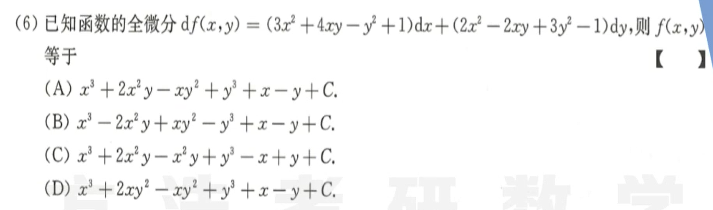
   解题思路：全微分方程，先验算二阶导，再对两个分别积分，注意不要漏了项。

## 可降阶微分方程

1. 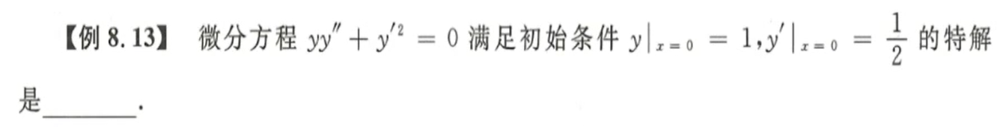
   解题思路：这道题是典型的二阶可降阶方程，即令$p = y'$，然后代入原式。重要的是，积分的时候，在这里不考虑积分的符号问题，而且不定积分一定不要漏了积分常量$C$。解出来$p$之后一定还要代入回去解出答案。
2. 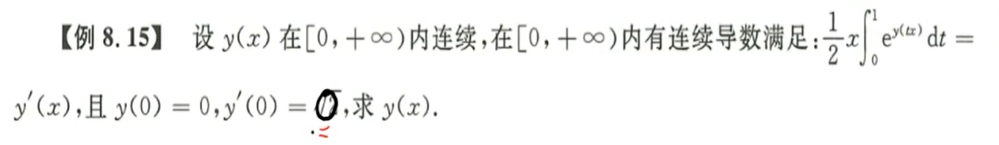
   解题思路：这道题考了变限积分求导的相关知识。这道题乍一看挺难的，不知道入手方向，但是只要看懂变限积分的关键，就可以知道换元再求导的基本思路。然后转化为一阶的微分方程继续求解。

##  高阶线性方程

1. 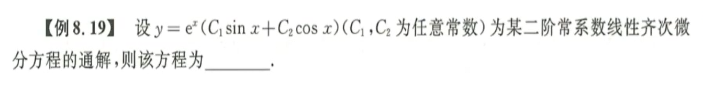
   解题思路：二阶常系数微分方程的特征方程。主要是复习一下二阶常系数微分方程解的结构和判别式。
2. 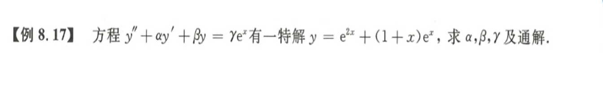
   解题思路：这个题目得关键在于熟悉二阶常系数微分方程解得结构。非齐次方程的特解=齐次方程的一个特解+非齐次方程的一个特解。在这里一定要想清楚，用观察法解体。熟悉齐次方程解的结构，熟悉非齐次方程特解的结构和相应的判别式。
3. 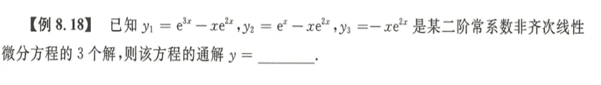
   解题思路：$非齐特解-非齐特解=齐次特解$
4. 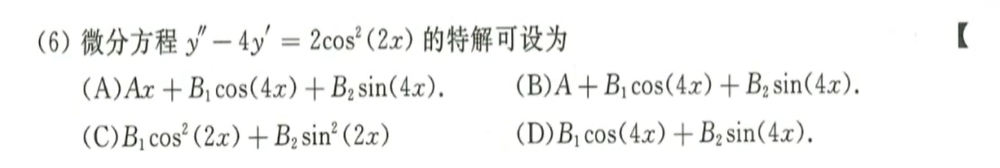
   解题思路：这道题的关键还是熟悉解的结构，以及何时需要加$x$，当多项式退化为常数，指数退化为常数的时候怎么处理。
5. 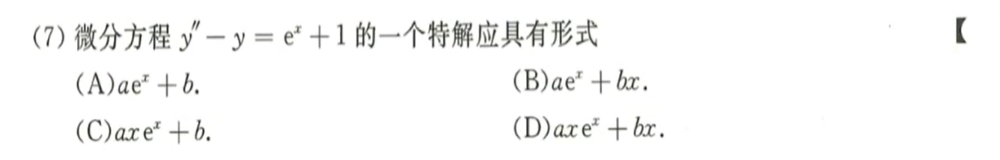
   解题思路：这道题的关键和上面一样，关键是计算特解的时候需要把右边拆开，指数算指数的，常数算常数的，三角算三角的。一定要熟悉解的结构。
6. 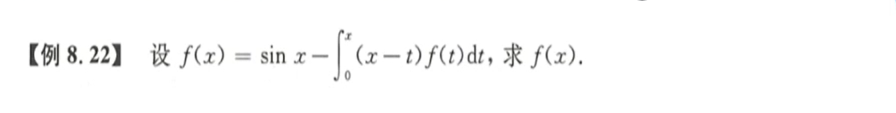
   解题思路：看到积分的，一定要想到求导。步骤一：拆分积分变量，分别积分；步骤二，两边求导。步骤三：求出微分方程齐次通解。步骤四：求出微分方程非齐次特解，可用莱布尼茨求导公式。步骤五，根据条件确定待定系数值，得到最终答案。
   注意事项：这道题不同于一般的求通解，还需要利用隐含条件$f(0) = 0, f'(0)=1$。
7. 
   步骤一：识别欧拉方程；步骤二：算子法+换元；步骤三：特征方程+齐次通解；步骤四：求解非齐次特解；

## 微分方程的应用

1. 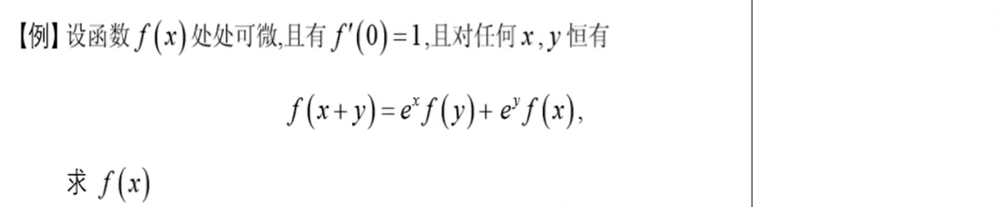
   解题思路：这道题有点难，综合性比较强。解题用到的知识都懂，但是如何把知识变为方法还是有点难的。首先观察题目，特别挑出了$f(0)$这个点，因此先求这个值。然后由题意该函数可微，因此应该构造$f'(x)$，这里对两边求导是一个比较令人费解的做法，易钻入盲区，但其实还可以通过定义来构造导数。取$y=\Delta x$，就有内味儿了。根据导数定义构造出等式，然后就是极限的求解，注意这里可以拆开极限分别求解。之后又得到一个一阶线性微分方程，两边构造，然后求解一阶线性。这道题综合性非常强，强力推荐。
2. 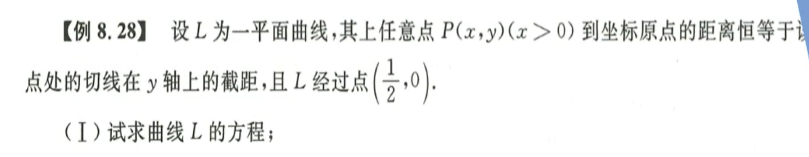
   步骤一：根据定义列出方程；步骤二：不要平方但化简；步骤三：发现是一阶齐次立刻换元；步骤四：换元之后积分；步骤五：代入原方程；
3. 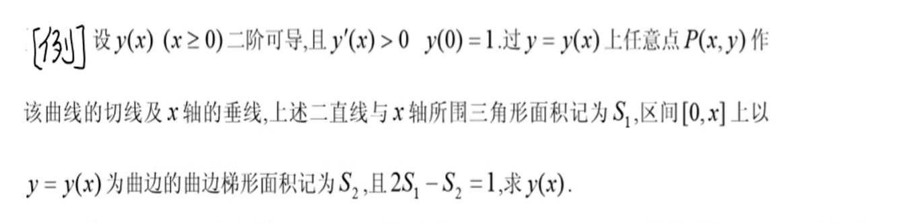
   解题思路：根据定义列出两个面积的表达式，然后化简之后，两边求导。
   ⚠特别注意：应用题和求通解不一样，需要根据实际情况求出积分常量的值，比如上下限相等积分为零。
4. 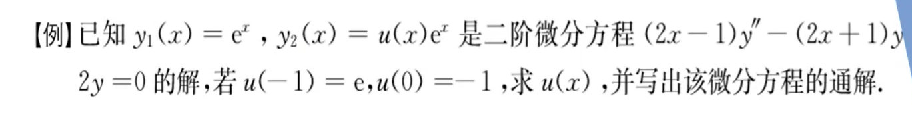
   解题思路：这是一道很好的题，来自2016年数学二真题；这道题其实乍一看有点简单，微分方程的通解无非就是两个线性无关解的线性组合。题目已经给了一个，那直接求另一个即可，即求出$u(x)$就可以，但是发现这又是一个二阶微分方程，而且还不是常系数的。中间还可以用上一阶线性微分方程的求解方法。利用定义，巧妙求解。灵活多变，不能死记硬背，而要活学活用，定义很重要。

## 连环算子法

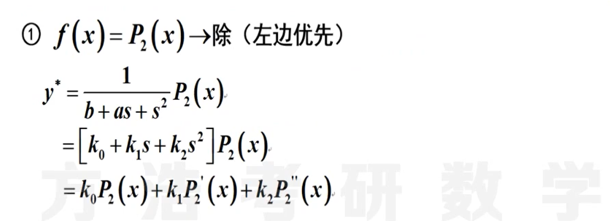
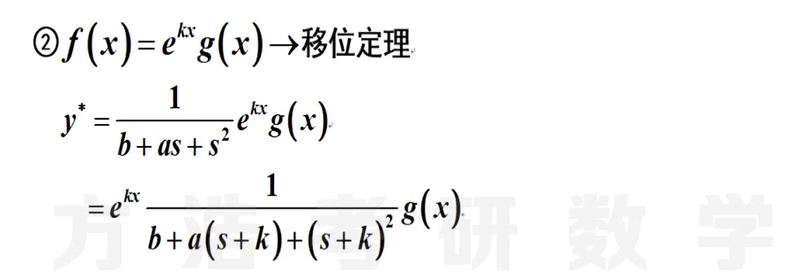
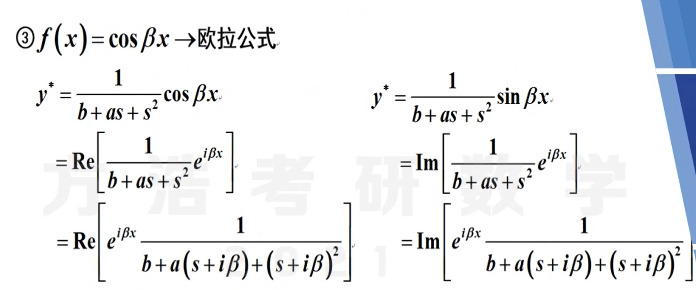

1. 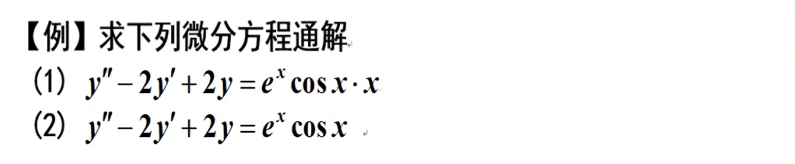
   解题思路：第一步-移位；第二步-欧拉；第三步-多项式除法； 

## 本章小结

1. 一阶微分方程
   1. 可分离变量：分离变量再积分
   2. 一阶齐次：换元法$u=\frac yx$
   3. 一阶线性：父子关系构造指数
2. 二阶微分方程
   1. 二阶非线性：降阶法换元$p=y'$
   2. 二阶线性
      1. 一般二阶线性：解的结构
      2. 二阶齐次：特征方程和通解的结构
      3. 常系数微分方程：待定系数法和连环算子法
3. 应用
   1. 建立方程
   2. 求导去积分号
   3. 求解
   4. 初值条件