# 无穷级数

## 数项级数敛散性判定

1. 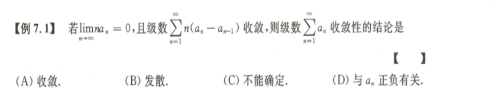
   解题思路：利用级数收敛的定义；级数收敛的必要条件是$\lim\limits_{n\rarr +\infin} a_n=0$；级数收敛的定义为$\lim\limits_{n\rarr+\infin}S_n = k$。越是抽象的级数，越要想到定义。
2. 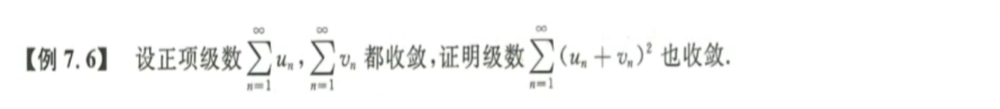
   解题思路：这里是抽象级数，因此优先考虑比较法，这里可以之间展开平方，然后放缩得到。
3. **正项级数审敛法：**
   ① 比较审敛-抽象级数；② 极限审敛-初等函数；③ 比值审敛-阶乘；④ 根植审敛-幂函数；
4. 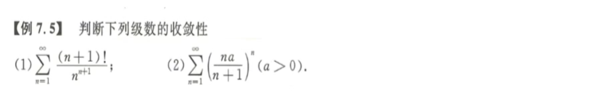
   第一题：看到阶乘的，一定想到比值法。极限$\rho<1$收敛，极限$\rho>1$发散，极限$\rho=1$不确定。
   第二题：看到幂函数，一定想到根植法。**带字母**，先分析通项；再取极限$\rho$，收敛半径$r=\frac 1{\rho}$。
5. 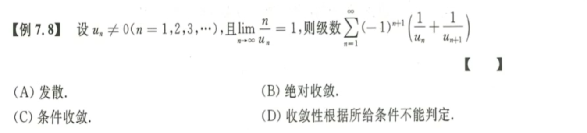
   步骤一：根据题给极限，由保号性得，$u_n>0$，有限项小于零不改变级数整体，这是无穷级数。
   步骤二：交错级数，立刻取绝对值审敛。这里无法比较审敛，但是由题给极限可以做一个比值审敛。
   步骤三：得到不是绝对收敛之后，立刻考察原级数单调性，无从考证，无法莱布尼茨。立刻定义。
   极限审敛：构造$\lim\limits_{n\rarr+\infin}\frac{u_n}{v_n}$，找到一个合适的$v_n$来证明$u_n$的收敛性，发散性。
   定义审敛：1. $\lim\limits_{n\rarr+\infin} u_n = 0$；2. $\lim\limits_{n\rarr+\infin} S_n = k$； 
6. 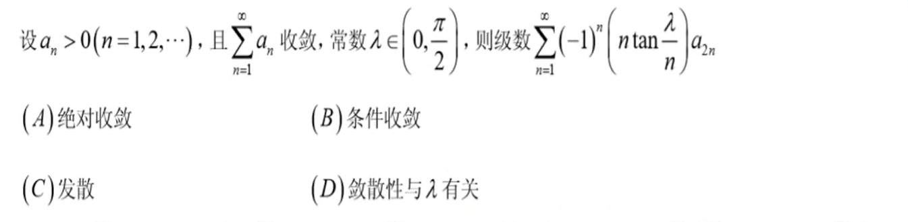
   解题思路：首先考察绝对收敛，取绝对值符号之后，再取等价无穷小，从而化简掉三角函数。
7. 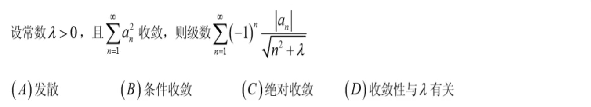
   解题思路： 先取绝对值，然后放缩 $ab<\frac{a^2+b^2}{2}$，想办法凑出题目给的条件。
8. 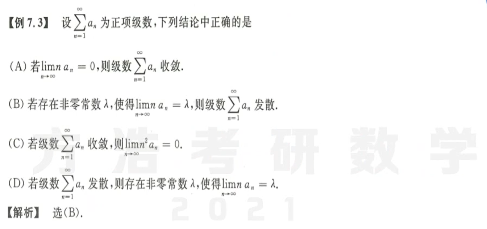
   解题思路：回顾一下学习全微分的时候，是通过极限推可微，还是可微推极限。只能由定量推定性，不能由定性推定量，因此CD一定错。而AB，利用极限审敛法就可以判断出来了，B中“同敛散”。
9. 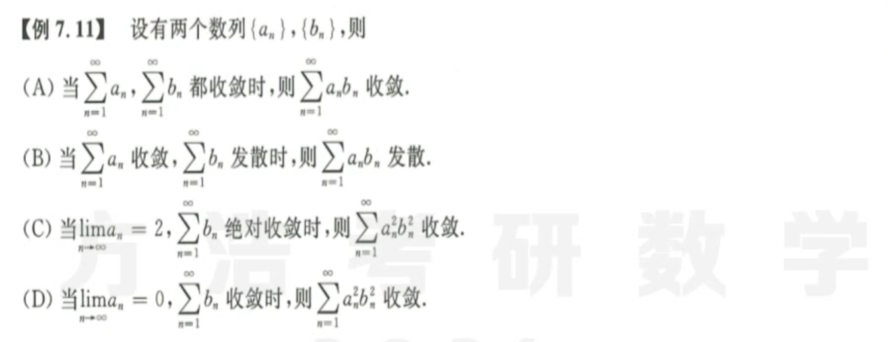
   解题思路：AB连什么级数都没有告诉，所以首先排除AB。CD两个选项分析；C选项，$b_n$绝对收敛，因此$|b_n|$收敛，由于$b_n^2 << |b_n|$，得到$b_n^2$收敛。因此C选项利用极限审敛得到待求极限与$b_n^2$同敛散。当然也可以利用$a_n$有界的性质对其进行放缩，使待求极限成为其数乘。
10. 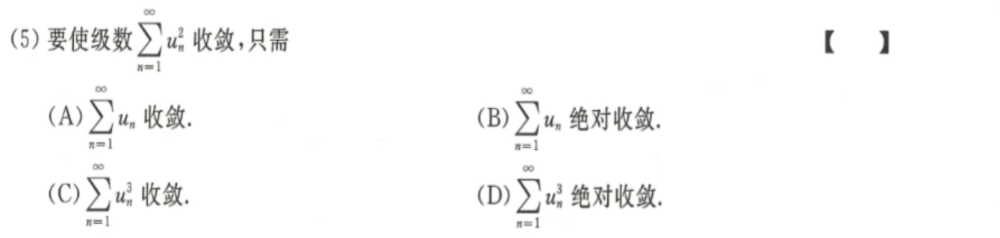
      解题思路：正项级数，只能选择B，绝对收敛就暗含了绝对值收敛，就可以放缩，$|u_n|>> u_n^2$。
11. 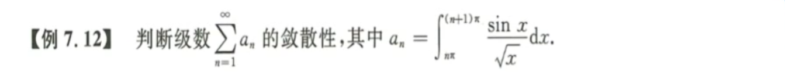
    解题思路：
12. 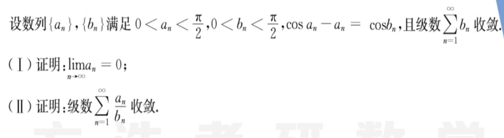
    解题思路：
13. 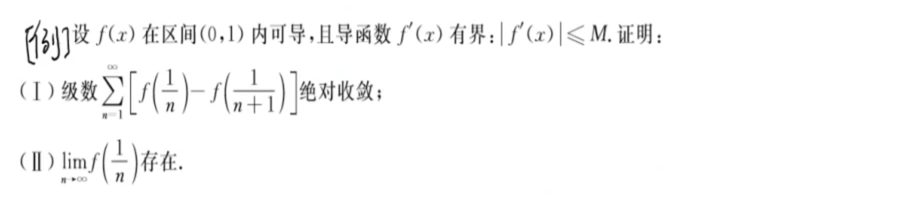
    第一问：一不小心就调到陷进里了，这里没有说$f(x)$单调性，因此无法取绝对值符号来解决问题。很敏感地看到导数，立刻想到拉格朗日中值定理，去掉函数符号。
    第二问：由于第一问绝对收敛，因此该级数也收敛，根据定义得到前n项和，因此得证。

## 幂级数的和函数

1. 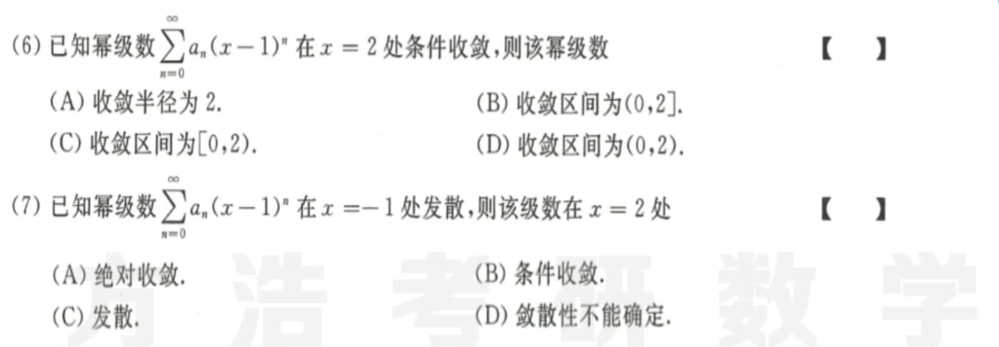
   概念题：首先上来就是换元，立刻换元，令$t=x-1$，将级数转为标准幂级数的形式。
2. 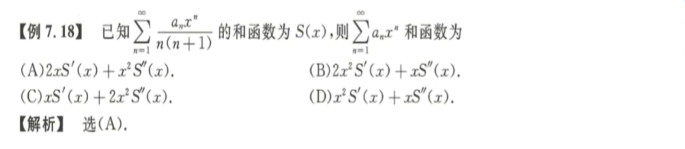
   解题思路： 观察答案，观察条件，发现需要凑$(xS(x))''$。
3. 幂级数求法$\sum\limits^{\infin}_{n=0}{(n^2-n+1)x^{2n+1}}$
   解题思路：分离一个$x$，然后换元$t=x^{2n}$，然后凑$x^n, nx^{n-1} \times x, n(n-1)x^{n-2}\times x^2$ 
4. 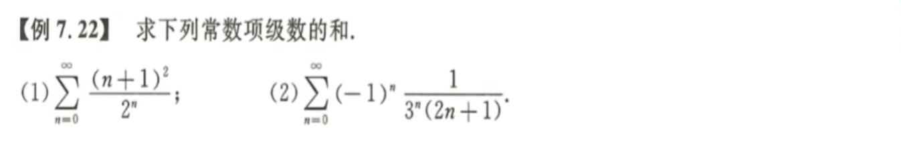
   第一题：乍一看没有思路，实际上就是多项式×指数的形式，化简成上面的标准形式就会了。
   第二题：如何凑出已知的级数，这里次数是很难配齐的，因为有$x^{2n}$，所以想到一个交错级数即$\sum\limits_{n=0}^{\infin}{\frac {(-1)^{n}x^{2n+1}}{2n+1}}=arctan x$，这样就解决了次数配不齐的问题。
5. 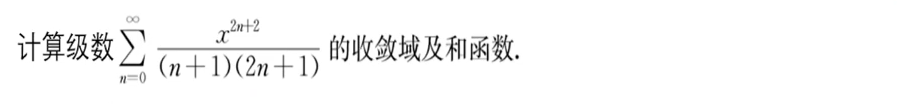
   步骤一：比值法/根植法求收敛半径，即得到收敛区间
   步骤二：考察收敛区间端点的敛散性，代入后提🐎法，然后利用极限审敛得到其于$\frac 1{2n^2}$同敛散
   步骤三：求和函数，拆-配-凑-补；当然也可以用积分做，但是更麻烦一点；
   注意：由于求出来的和在端点没定义，所以端点需要不上端点，补齐无定义的点。
6. 幂指数求和的思路
   拆 —— 复杂系数拆成简单的子型和母型级数
   配 —— 阶数与系数配齐
   凑 —— 凑出麦克劳林级数
   补 —— 补上结果中无定义的点，或者收敛域区间端点
7. 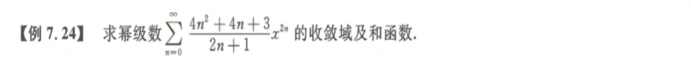
   提示一：$\lim\limits_{n \rarr \infin}(an^2 + bn + c)^{\frac 1n}=1$  
   提示二：$0^0=1$ 
8. 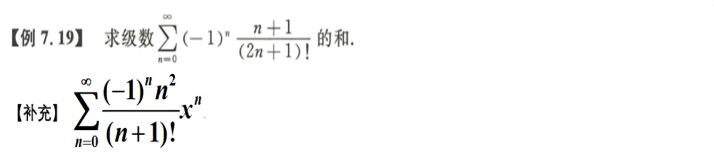
   阶乘：阶乘的特点就是可以和多项式凑出新的阶乘，碰到这种情况，一定要学会配出新的阶乘。
   $\frac {n+1}{(2n+1)!} = \frac 12 [\frac 1{(2n)!} + \frac 1{2n+1}]$，$\frac{n^2}{(n+1)!}={\frac 1{(n-1)!}-\frac 1{(n)!}+\frac 1{(n+1)!}}$，活学活用，阶乘特点。
   注意：这里出现了$\sum\limits_{n=0}{\frac 1{(n-1)!}}$，该怎么办呢？
9. 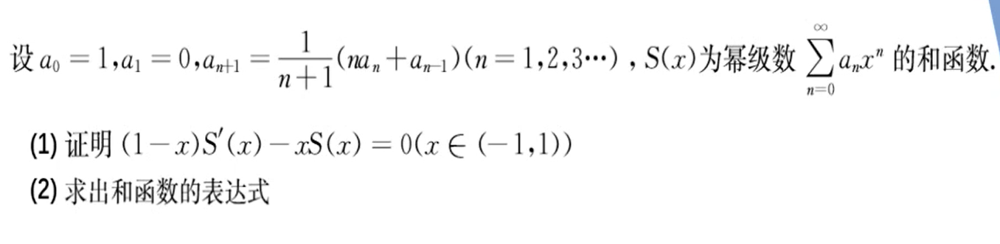
   解题思路：

