# 三重线面积分

## 三重积分计算

1. 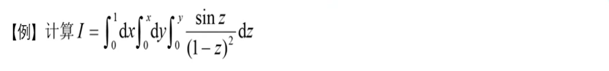
   三重积分交换积分顺序：把三重积分看作二重积分交换积分顺序，一次不行就来两次。
2. 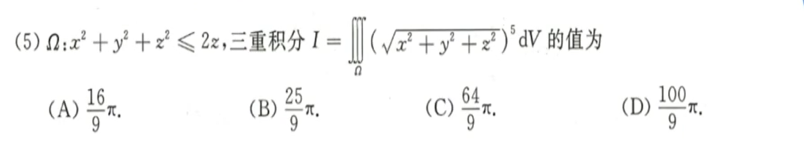
   球坐标下的三重积分；注意这里的易错点是$r^2\sin \theta$和$\theta$的取值范围；
3. 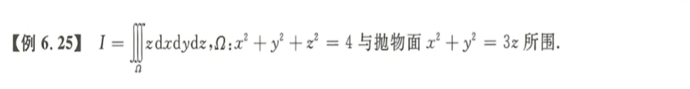
   画出图像：确定交线，确定两平面和$z$轴交点，画出简略图，然后看图积分。
   先一后二：根据$\frac 1 3(x^2+y^2) \le z \le \sqrt{4-(x^2+y^2)} $先对$z$积分，然后再极坐标积分。
   先二后一：利用图像，对$z$进行分段，即$0 \le z \le 1$和$1 \le z \le 2$，然后对应$x,y$分别的范围。
   柱面积分：先确定$z$的范围，然后再根据$r$的取值进行积分。
4. 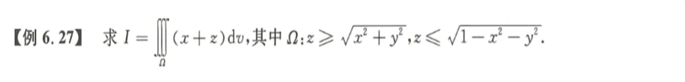
   奇偶性应用：如果积分区域关于$yOz$平面对称，且被积函数是关于$x$的奇函数，则积分为零。

## 曲线积分

1. 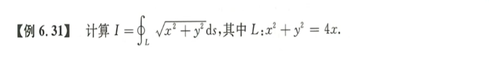
   Ⅰ类曲线积分：直角坐标、参数方程、极坐标、空间曲线积分、相互转化
   直角坐标：$\int{f(x,y) ds}=\int{f(x,y)\sqrt{1+y'^2}dx}$
   极坐标：$\int{f(x,y)ds} = \int{f(\rho\cos\theta, \rho\sin\theta)\sqrt{\rho^2+\rho'^2}d\theta}$ 
   参数方程：$\int{f(x,y)ds} = \int{f[(x(t), y(t)]\sqrt{x(t)'^2, y(t)'^2}dt}$ 
   空间曲线：$\int{f(x,y,z)ds} = \int{f[x(t), y(t), z(t)]\sqrt{x(t)'^2, y(t)'^2, z(t)'^2}dt}$ 
2. 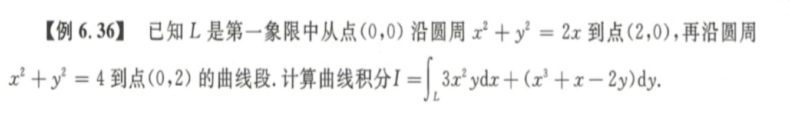
   Ⅱ型曲线积分：格林公式、化二为一
   格林公式：$\oint_L{Pdx+Qdy} = \iint\limits_D{(\frac{\part Q}{\part x}-\frac{\part P}{\part y})dxdy}$，左边为正
   一般计算：$\oint_L{Pdx+Qdy} = \int_a^b{[P+Q\times y_x']dx} = \int_\alpha^\beta{[P(t)x'(t)+Q(t)y'(t)]dt}$，注意有时需要分段
   空间曲线： $\oint_L{Pdx+Qdy+Rdz} = \int_a^b{[P+Q\times y_x'+R\times z_x']dx} = \int_\alpha^\beta{[P(t)x'(t) + Q(t)y'(t) + R(t)z'(t)]dt}$ 
3. 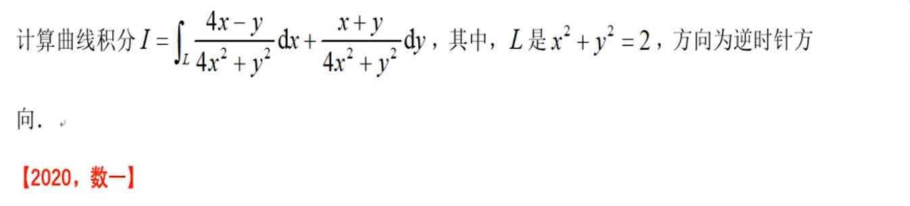
   方法一：补全法格林公式，由于原函数在$(0,0)$处无定义，因此补全该点附近的函数定义。
   方法二：三角换元，一定记得用周期性和奇偶性简化计算，不然算不出来，令$x=\sqrt 2 \cos t, y= \sqrt 2 \sin t$ 
   方法三：全微分法，此处略去。
4. 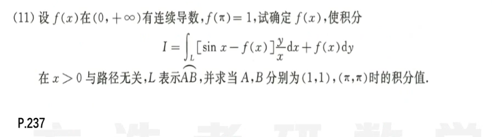
   **积分与路径无关：**$\int_L{P(x,y)dx+Q(x,y)dy}=\oint{Pdx+Qdx} = \frac {\part Q}{\part x} - \frac {\part P}{\part y}$ 
   **任意路径曲线积分：**这里是取直线，实际上是取直线或者与坐标轴平行的直线。
5. 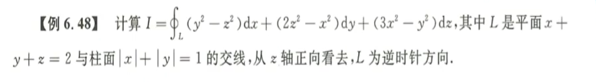
   空间曲线积分：斯托克斯公式、降维法
   **斯托克斯公式：**$\oint_\Gamma{Pdx+Qdy+Rdz} = \iint\limits_\Sigma{(\frac {\part R}{\part y} - \frac {\part Q}{\part z})dydz + (\frac {\part P}{\part z} - \frac {\part R}{\part x})dzdx + (\frac {\part Q}{\part x} - \frac {\part P}{\part y})dxdy}$ 
   $\begin{vmatrix}
   dydz & dzdx & dxdy\\
   \frac{\part}{\part x} & \frac{\part}{\part y} & \frac{\part}{\part z}\\
   P & Q & R\\
   \end{vmatrix}$ 
   **降维法：**$z = 2-x-y$，$dz = -dx -dy$，然后利用格林公式和对称性解答。
   **参数方程法：**把$x$看作是参数，然后这里由于有绝对值符号，所以函数需要分成四段进行积分，亲测可以算出来。
6. 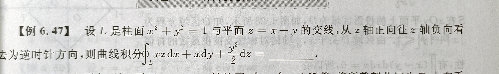

## 曲面积分

1. 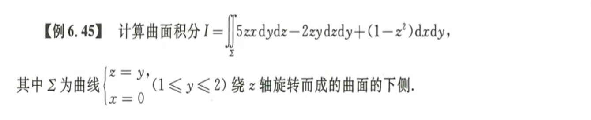
   **Ⅰ类曲面积分：奇偶性、轮换对称、一般方法**
   一般方法：$\iint\limits_\Sigma {f(x,y,z)dS = \iint\limits_{D_{xy}}{f[x,y,z(x,y)] \sqrt{1 + z_x'^2 + z_y'^2}}dxdy}$ 
   **Ⅱ类曲面积分：高斯公式、三合一公式、定义法**
   高 斯 公 式：$\oiint\limits_\Sigma {Pdydz+Qdzdx+Rdxdy} = \pm \iiint\limits_\Omega{(\frac{\part P}{\part x} + \frac{\part Q}{\part y} + \frac{\part R}{\part z})dv}$ ，向外为正
   三合一公式：$\iint\limits_\Sigma {Pdydz+Qdzdx+Rdxdy} = \pm \iint\limits_{D_{xy}} {(-z_xP-z_yQ+R)dxdy}$ ，曲面方向与$z$轴夹角小于$\frac \pi 2$为正
   一般：$\iint_\limits\Sigma{R(x,y,z)dxdy = \pm \iint\limits_{D_{xy}}} {R[x,y,z(x,y)]dxdy}$ ，曲面方向与$z$轴夹角小于$\frac \pi 2$为正
2. 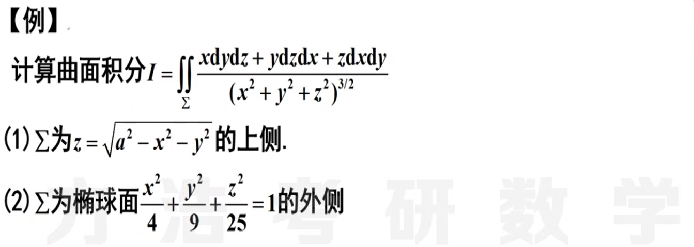
   第一题：**高斯**用的时候一定要把能够代入的全部代入，不然这里会出现无定义的点。这里也可以用三合一。
   第二题：**高斯**出现无法代入的无定义的点一定要扣掉，然后用一个分母为零的球体来替代。
3. 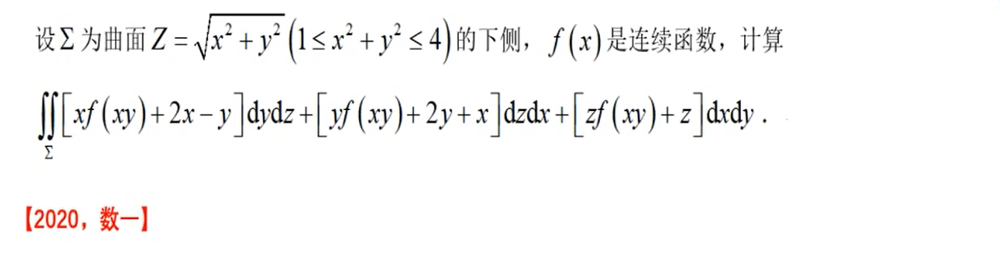
   **挖坑：**这里不能用高斯公式，因为这道题没有告诉$f(x)$可导。
   **三合一：**一定不要忘了三合一公式，不要只记得高斯。
4. 
