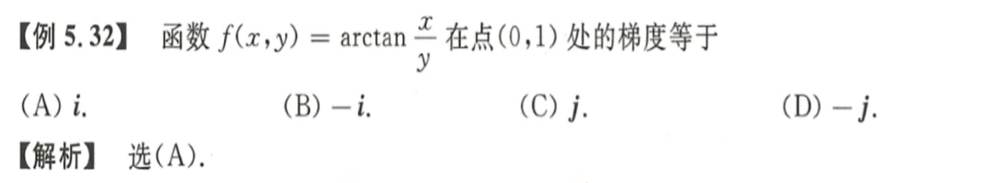
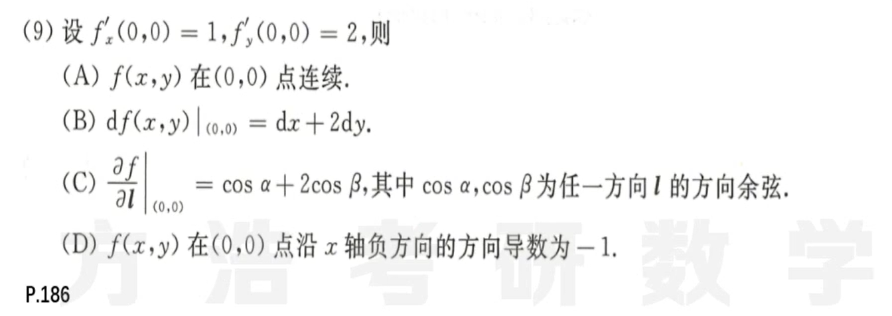
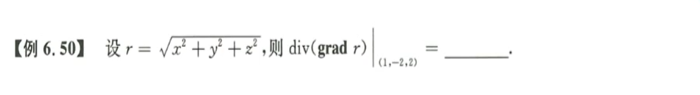
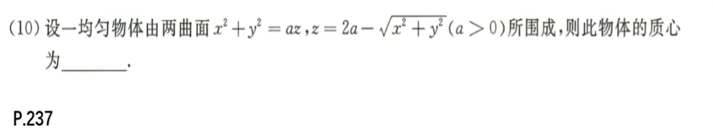
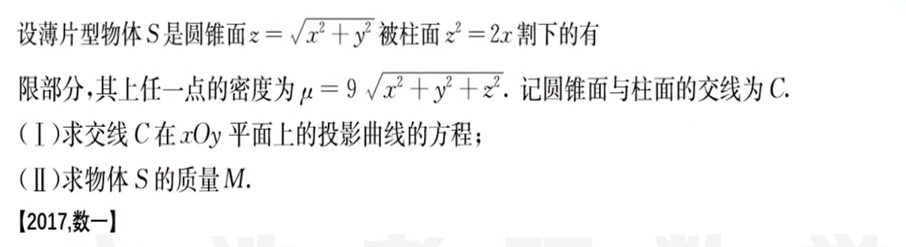
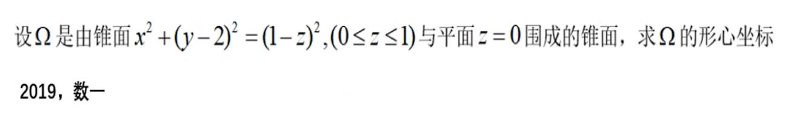

# 三重线面积分

## 三重积分计算

1. 
   三重积分交换积分顺序：把三重积分看作二重积分交换积分顺序，一次不行就来两次。
2. 
   球坐标下的三重积分；注意这里的易错点是$r^2\sin \theta$和$\theta$的取值范围；
3. 
   画出图像：确定交线，确定两平面和$z$轴交点，画出简略图，然后看图积分。
   先一后二：根据$\frac 1 3(x^2+y^2) \le z \le \sqrt{4-(x^2+y^2)} $先对$z$积分，然后再极坐标积分。
   先二后一：利用图像，对$z$进行分段，即$0 \le z \le 1$和$1 \le z \le 2$，然后对应$x,y$分别的范围。
   柱面积分：先确定$z$的范围，然后再根据$r$的取值进行积分。
4. 
   奇偶性应用：如果积分区域关于$yOz$平面对称，且被积函数是关于$x$的奇函数，则积分为零。

## 曲线积分

1. 
   **Ⅰ类曲线积分：直角坐标、参数方程、极坐标、空间曲线积分、相互转化**
   **直角坐标：**$\int{f(x,y) ds}=\int{f(x,y)\sqrt{1+y'^2}dx}$
   **极坐标：**$\int{f(x,y)ds} = \int{f(\rho\cos\theta, \rho\sin\theta)\sqrt{\rho^2+\rho'^2}d\theta}$ 
   **参数方程：**$\int{f(x,y)ds} = \int{f[(x(t), y(t)]\sqrt{x(t)'^2 + y(t)'^2}dt}$ 
   **空间曲线：**$\int{f(x,y,z)ds} = \int{f[x(t), y(t), z(t)]\sqrt{x(t)'^2 + y(t)'^2 + z(t)'^2}dt}$ 
2. 
   **Ⅱ型曲线积分：格林公式、化二为一**
   **格林公式：**$\oint_L{Pdx+Qdy} = \iint\limits_D{(\frac{\part Q}{\part x}-\frac{\part P}{\part y})dxdy}$，左边为正
   **一般计算：**$\oint_L{Pdx+Qdy} = \int_a^b{[P+Q\times y_x']dx} = \int_\alpha^\beta{[P(t)x'(t)+Q(t)y'(t)]dt}$，注意有时需要分段
   **空间曲线：** $\oint_L{Pdx+Qdy+Rdz} = \int_a^b{[P+Q\times y_x'+R\times z_x']dx} = \int_\alpha^\beta{[P(t)x'(t) + Q(t)y'(t) + R(t)z'(t)]dt}$ 
3. 
   方法一：补全法格林公式，由于原函数在$(0,0)$处无定义，因此补全该点附近的函数定义。
   方法二：三角换元，一定记得用周期性和奇偶性简化计算，不然算不出来，令$x=\sqrt 2 \cos t, y= \sqrt 2 \sin t$ 
   方法三：全微分法，此处略去。
4. 
   **积分与路径无关：**$\int_L{P(x,y)dx+Q(x,y)dy}=\oint{Pdx+Qdx} = \frac {\part Q}{\part x} - \frac {\part P}{\part y}$ 
   **任意路径曲线积分：**这里是取直线，实际上是取直线或者与坐标轴平行的直线。
5. 
   **空间曲线积分：斯托克斯公式、降维法、参数方程法**
   **斯托克斯公式：**$\oint_\Gamma{Pdx+Qdy+Rdz} = \iint\limits_\Sigma{(\frac {\part R}{\part y} - \frac {\part Q}{\part z})dydz + (\frac {\part P}{\part z} - \frac {\part R}{\part x})dzdx + (\frac {\part Q}{\part x} - \frac {\part P}{\part y})dxdy}$ 
   $\begin{vmatrix}
   dydz & dzdx & dxdy\\
   \frac{\part}{\part x} & \frac{\part}{\part y} & \frac{\part}{\part z}\\
   P & Q & R\\
   \end{vmatrix}$ 转化为**Ⅱ类曲面积分**之后，再用**三合一**、**Ⅱ类一般**、**高斯**解决。
   **降维法：**$z = 2-x-y$，$dz = -dx -dy$，然后利用格林公式和对称性解答。
   **参数方程法：**把$x$看作是参数，然后这里由于有绝对值符号，所以函数需要分成四段进行积分，亲测可以算出来。
6. 
   解题思路：

## 曲面积分

1. 
   **Ⅰ类曲面积分：奇偶性、轮换对称、一般方法**
   **一般方法：**$\iint\limits_\Sigma {f(x,y,z)dS = \iint\limits_{D_{xy}}{f[x,y,z(x,y)] \sqrt{1 + z_x'^2 + z_y'^2}}dxdy}$ 
   **Ⅱ类曲面积分：高斯公式、三合一公式、定义法**
   **高 斯 公 式：**$\oiint\limits_\Sigma {Pdydz+Qdzdx+Rdxdy} = \pm \iiint\limits_\Omega{(\frac{\part P}{\part x} + \frac{\part Q}{\part y} + \frac{\part R}{\part z})dv}$ ，向外为正
   **三合一公式：**$\iint\limits_\Sigma {Pdydz+Qdzdx+Rdxdy} = \pm \iint\limits_{D_{xy}} {(-z_xP-z_yQ+R)dxdy}$ ，曲面方向与$z$轴夹角小于$\frac \pi 2$为正
   **一般：**$\iint_\limits\Sigma{R(x,y,z)dxdy = \pm \iint\limits_{D_{xy}}} {R[x,y,z(x,y)]dxdy}$ ，曲面方向与$z$轴夹角小于$\frac \pi 2$为正
2. 
   第一题：**高斯**用的时候一定要把能够代入的全部代入，不然这里会出现无定义的点。这里也可以用三合一。
   第二题：**高斯**出现无法代入的无定义的点一定要扣掉，然后用一个分母为零的球体来替代。
3. 
   **挖坑：**这里不能用高斯公式，因为这道题没有告诉$f(x)$可导。
   **三合一：**一定不要忘了三合一公式，不要只记得高斯。

## 梯度、散度、旋度、方向余弦

1. 梯度：$\nabla \vec F = \bold {grad\ F } =  F_x \vec i + F_y \vec j + F_z \vec k$ 
2. 散度：$div \vec F = \frac{\part P}{\part x}+\frac{\part Q}{\part Y}+\frac{\part R}{\part Z}$  其中$\vec F = P\vec i + Q\vec j + R\vec k$ 
3. 旋度：$\bold{rot F} = \begin{vmatrix}
   \vec i & \vec j & \vec k\\
   \frac{\part}{\part x} & \frac{\part}{\part y} & \frac{\part}{\part z}\\
   P & Q & R\\
   \end{vmatrix}$  其中$\vec F = P\vec i + Q\vec j + R\vec k$ 

1. 
   解题思路：略
1. 
   解题思路：A B C三个选项的前提都是可微，只有可微才能有这三个结论。要用定义计算。
   C选项中函数在$(0,0)$点处沿着某一方向的偏微分定义：$\lim\limits_{t\rarr0} {\frac{f(0+t\cos\alpha, 0+t\cos\beta)-f(0,0)} {t}}$ 
1. 
   

## 综合应用

1. 
   小技巧：对称性；形如$\int_a^{2a}(2x-a)^2dx$形式的积分，可以换元加快运算。
   质心定义：$z=\frac{\iiint zdv}{\iiint dv}$ 
   对称性怎么判断呢？关于$xOy$平面对称，即$F(x,y,z) = F(x,y,-z)$ 
2. 
   考点：方向导数、梯度、Ⅰ类曲面积分
3. 
   第一问：联立方程，令$z=0$即得到投影曲线的方程；
   第二问：判断这是一个Ⅰ类曲面积分，这个很重要，不然做了也白做。
4. 
   小提示：$\Omega$ 一般用来指一个体积空间，$\Sigma$ 一般用来指一个平面。
   **题目更正：$x^2 + (y-z)^2 = (1-z)^2$，围成的是锥体而非锥面。** 
   思路：数形结合、数形结合、数形结合、不然根本不知道这图形长啥样，咋积分呢？还要逆用形心公式。

## 本章小结

1. 三重积分
   1. 直角坐标
      1. 交换积分顺序
      2. 先一后二：穿线法
      3. 先二后一：截面法
   2. 球坐标：$(0\le\theta\le\pi, 0\le\varphi\le2\pi)$ 
      1. $x=r\sin\theta\cos\varphi$ 
      2. $y=r\sin\theta\sin\varphi$ 
      3. $z=r\cos\theta$ 
      4. ⚠：$dv=r^2\sin\theta\ dr\ d\theta\ d\varphi$ 
   3. 柱坐标：$(0\le\varphi\le2\pi)$ 
      1. $x = r \cos\varphi$ 
      2. $y=r\sin\varphi$ 
      3. $z=z$ 
      4. ⚠：$dv=r\ dr\ d\varphi\ dz$ 
   4. 奇偶性：尤其是奇函数
   5. 轮换对称性：部分轮换对称、完全轮换对称
   6. 回忆一下二重积分的极坐标补上$r$ 
2. 曲线积分
   1. Ⅰ类曲线-无方向
      1. 直角坐标：$\int{f(x,y) ds}=\int{f(x,y)\sqrt{1+y'^2}dx}$ 
      2. 参数方程：$\int{f(x,y)ds} = \int{f[(x(t), y(t)]\sqrt{x(t)'^2, y(t)'^2}dt}$ 
      3. 极坐标：$\int{f(x,y)ds} = \int{f(\rho\cos\theta, \rho\sin\theta)\sqrt{\rho^2+\rho'^2}d\theta}$ 
      
   2. Ⅱ类曲线-有方向
      1. 格林公式：$\oint_L{Pdx+Qdy} = \iint\limits_D{(\frac{\part Q}{\part x}-\frac{\part P}{\part y})dxdy}$，左边为正
      2. 一般计算：$\oint_L{Pdx+Qdy} = \int_a^b{[P+Q\times y_x']dx} = \int_\alpha^\beta{[P(t)x'(t)+Q(t)y'(t)]dt}$，注意有时需要分段
      
   3. Ⅰ类空间曲线：$\int{f(x,y,z)ds} = \int{f[x(t), y(t), z(t)]\sqrt{x(t)'^2 + y(t)'^2 + z(t)'^2}dt}$ 
   
   4. Ⅱ类空间曲线：
      1. 参数方程法：由于曲线通常为截面得到，这里通常需要分段计算。
         $\oint_L{Pdx+Qdy+Rdz} = \int_a^b{[P+Q\times y_x'+R\times z_x']dx} = \int_\alpha^\beta{[P(t)x'(t) + Q(t)y'(t) + R(t)z'(t)]dt}$ 
      2. 降维法：将题给的$z=(x,y)$和$dz$的值代入进去，降维成二维曲面（一般是平面）。
      3. 斯托克斯公式：将空间曲线转为Ⅱ类的空间曲面（一般是平面），然后利用三合一或者定义计算。
         $\begin{vmatrix}
         dydz & dzdx & dxdy\\
         \frac{\part}{\part x} & \frac{\part}{\part y} & \frac{\part}{\part z}\\
         P & Q & R\\
         \end{vmatrix}$ 
      
   5. Ⅰ类和Ⅱ类曲线之间的关系
   
      $\int_L{Pdx + Qdy} = \int_L{(P\cos\alpha + Q\cos\beta) ds}$ 
      其中$\cos\alpha, \cos\beta$是右向曲线$L$在该点的方向余弦。
3. 曲面积分
   1. Ⅰ类曲面-无方向-投影代入积分-投带积
   
      1. 一般方法：$\iint\limits_\Sigma {f(x,y,z)dS = \iint\limits_{D_{xy}}{f[x,y,z(x,y)] \sqrt{1 + z_x'^2 + z_y'^2}}dxdy}$ 
   
   2. Ⅱ类曲面-有方向
   
      1. 高 斯 公 式：$\oiint\limits_\Sigma {Pdydz+Qdzdx+Rdxdy} = \pm \iiint\limits_\Omega{(\frac{\part P}{\part x} + \frac{\part Q}{\part y} + \frac{\part R}{\part z})dv}$ ，向外为正
      2. 三合一公式：$\iint\limits_\Sigma {Pdydz+Qdzdx+Rdxdy} = \pm \iint\limits_{D_{xy}} {(-z_x'P-z_y'Q+R)dxdy}$ ，曲面方向与$z$轴夹角小于$\frac \pi 2$为正
      3. 一般：$\iint_\limits\Sigma{R(x,y,z)dxdy = \pm \iint\limits_{D_{xy}}} {R[x,y,z(x,y)]dxdy}$ ，曲面方向与$z$轴夹角小于$\frac \pi 2$为正
   
   3. Ⅰ类Ⅱ类曲面之间的关系
   
      $\iint\limits_\Sigma{Pdydz + Qdzdx + Rdxdy} = \iint\limits_\Sigma{(P \cos \alpha + Q\cos\beta + R\cos\gamma)dS}$ 
      其中$\cos\alpha, \cos\beta, \cos\gamma$是曲面$\Sigma$在点$(x,y,z)$处的正法线向量的方向余弦。

