# 行列式

## 计算行列式

1. 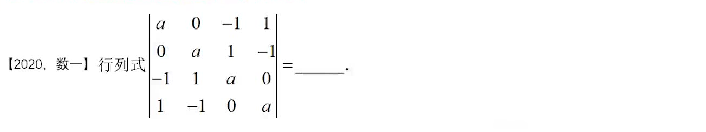
   拉普拉斯变换、上下三角变换
2. 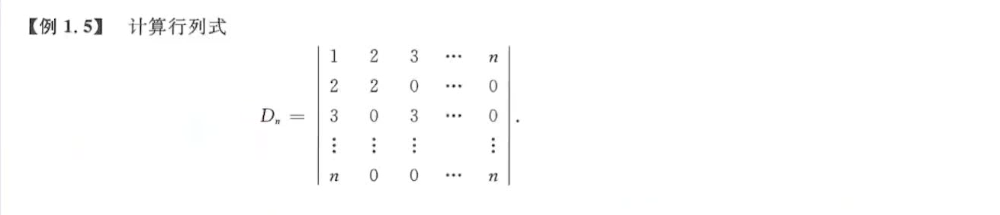
   解题思路：第一行减去第二行，再减去第三行，一直减到第n行，然后就把行列式转换为下三角行列式了。
3. 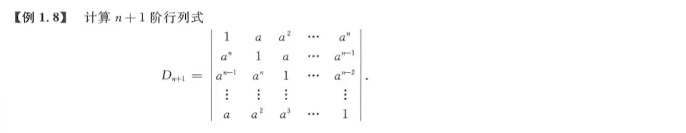
   解题思路：从第一行开始减去a倍的下一行的元素。注意，最后一行不减了。

## 抽象行列式

1. 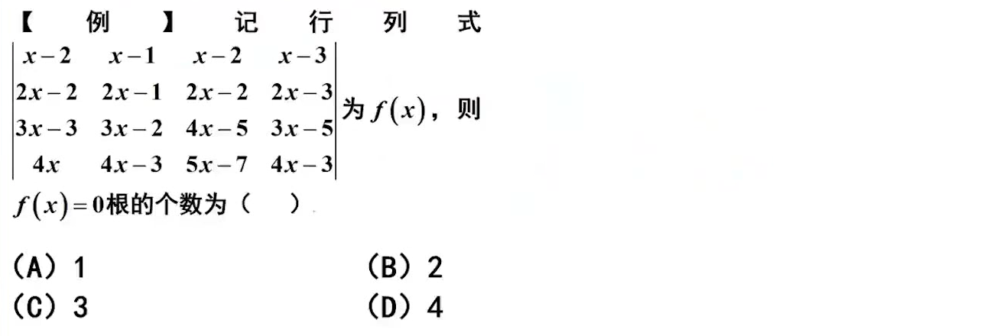
   解题思路：观察行列式，按列消元，然后凑出拉普拉斯变换。简化计算，得到最后结果。
2. 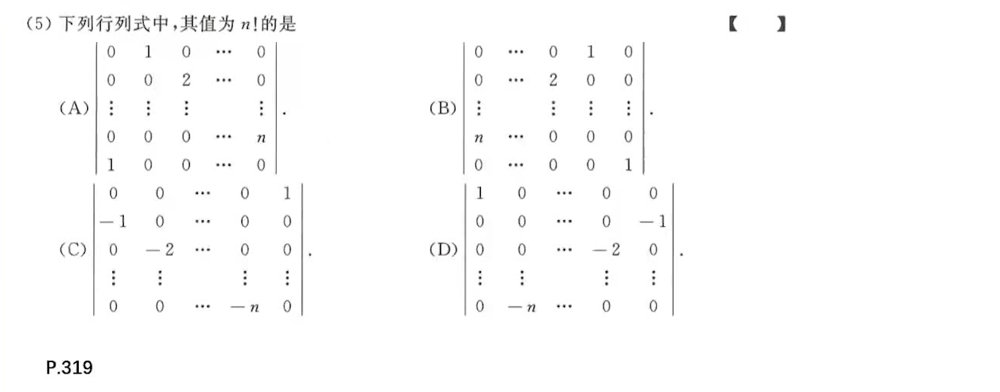
   解题思路：记住拉普拉斯变换用在副对角线上有一个系数$(-1)^{mn}$，记住代数余子式公式$A_{ij} = (-1)^{(i+j)}M_{ij}$，记住副对角线三角行列式的系数$(-1)^{\frac {n(n-1)}2}$ 
3. 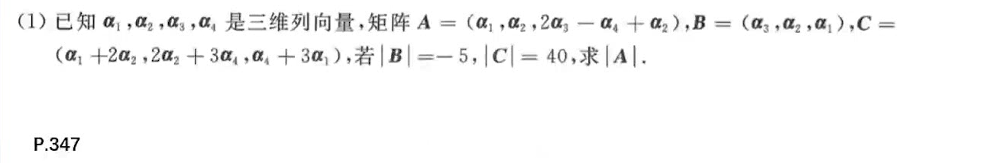
   拆开$|A|$，拆开$|B|$，拆开$|C|$，利用行列式的某一行（列）的倍数加到另一行（列），其值不变做。也可以结合矩阵乘法，将C看作两个矩阵的乘法，利用乘积的行列式等于行列式的乘积做。
4. 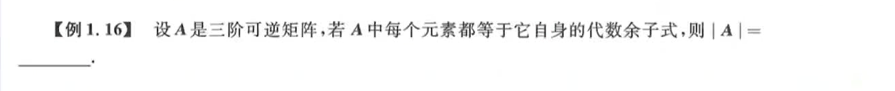
   关键概念：伴随矩阵、伴随矩阵、逆矩阵；基础是这个等式$\bold A^{-1} = \frac {\bold A^*}{|\bold A|}$。
5. 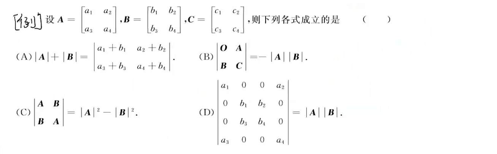
   提示：C选项行列式是不能这样分块计算的，除非满足拉普拉斯的条件，不然就是纯臆造。其他都是考察概念理解。
6. 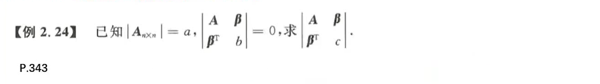
   考察点：行列式的加法，由于待求行列式的最右边一列可以拆开，且拆开之后满足拉普拉斯的条件，即得。

## 行列式的展开

1. 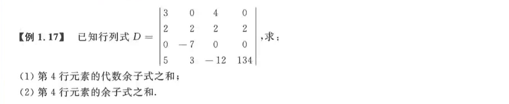
   思路：把第4行全部的元素换掉，然后求新的行列式的值
2. 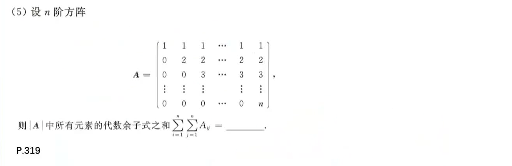
   **代数余子式：**展开定理，伴随矩阵
   理解题意，用展开定理，每一行分别换成全部是1，结果除了第一行外，其他展开都是零，即结果为$n!$ 
3. 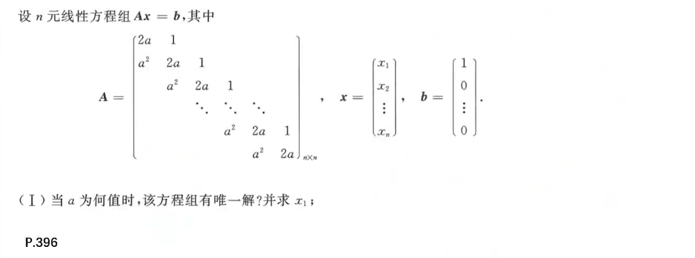
4. 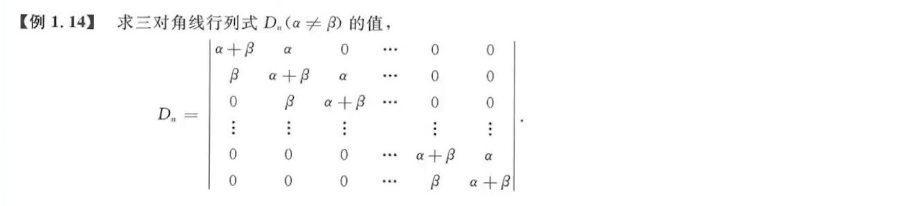

