#  二次型

## 二次型的标准型和规范型

1. 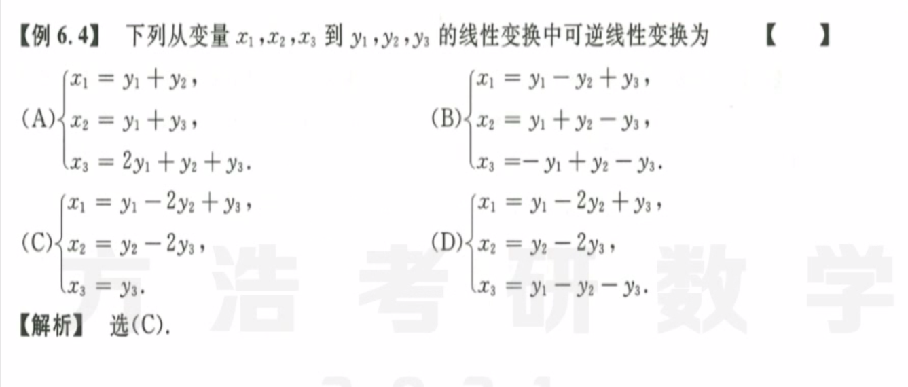
   **可逆变换：**直接看是否线性相关，即确定两个已知，是否推得第三个；或者直接看是否有倍数关系。$可逆\ne 正交$

2. 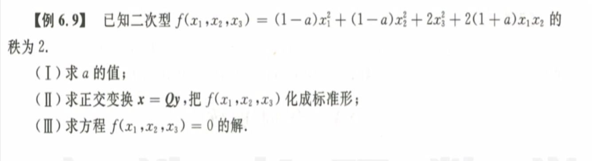
   第一步：求特征值，特征向量，正交矩阵。注意需要正交化和单位化两步，一定要仔细检查是否正交和单位化。
   第二步：由方程值等于零得到$y_2=y_3=0$，然后反推得到$x=(k,-k,0)$。

3. 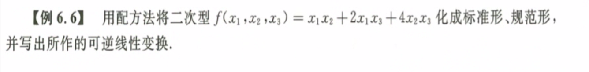
   解题思路：无中生有换元法$x_1 = y_1 + y_2, \ x_2 = y_1 - y_2, \ x_3 = y_3$，标准型在换元的最后一步一定要单位化处理。

4. 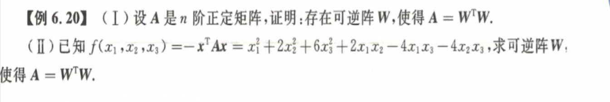
**概念辨析：**$P^{-1}AP = B \rarr A\cong B$（相似，求特征值特征向量，正交化单位化）；$Q^TAQ = B$（Q正交，相似）；$C^TAC=B \rarr A\simeq B$（合同，配方法）
   解题步骤：写出矩阵A，配方法，换元，写出变换矩阵，将转换系数矩阵和C联系起来，很快得到待求值。
   
5. 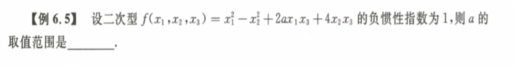
   **配方法：**配方法得到一个标准型，然后根据负惯性指数的定义得到$a$的范围。

6. 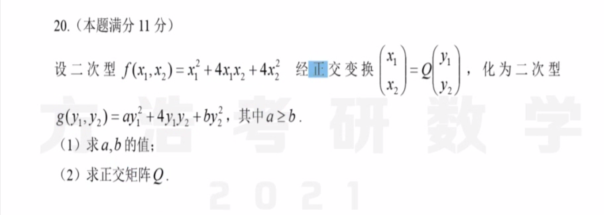
   **2020数学一（未做完）：**
记住下次计算的时候，按照标准的$|\lambda E-A| = 0$计算，然后向量取标准值。
   
7. 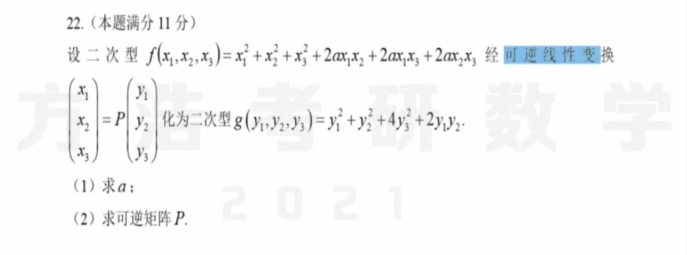
   **2020数学二（未做完）：**
第一问：可逆线性变换，即得到秩不变，即$r(A) = r(B) = 2$。
   第二问：由于两个矩阵合同，则两个矩阵都和特征值组成的矩阵合同，这里用配方法，即二者都合同于同一个对角 
   
8. 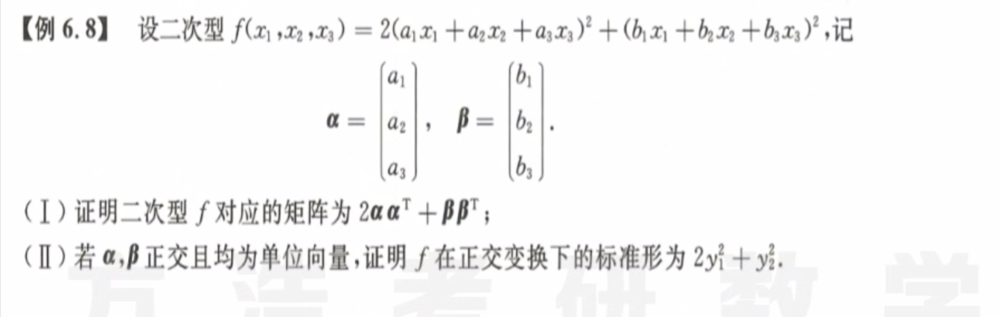
   解题思路：把多项式拆成向量乘法$(a_1x_1+a_2x_2+a_3x_3)^2 = x^TAA^Tx, 其中x=(x_1,x_2,x_3)^T, a=(a_1,a_2,a_3)^T$ 
第二问：标准型是怎么来的，是求特征值，特征向量，正交化，单位化处理得到的。那么得到的矩阵是什么，是特征值组成的对角矩阵，如果要证明标准型，那么求到三个秩即可，即$r=2,1,0$。由于A是实对称矩阵，则必定存在正交矩阵$Q^TAQ=Q^{-1}AQ=\Lambda$。
   
9. 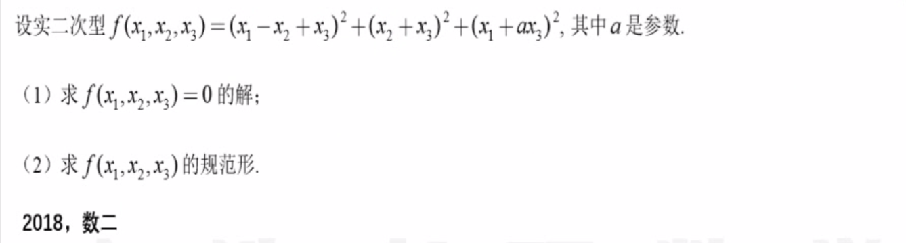
**规范型：**正交变换、配方法；规范型三角矩阵只有$1,-1,0$
   **注意！！！：**标准的配方法得到的矩阵可逆，且都线性无关，但是这里需要分情况讨论是否线性相关。

## 正定二次型

1. 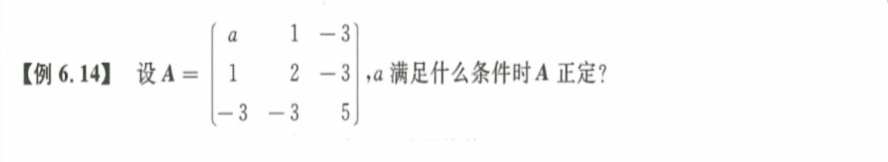
   **正定的性质：**① $\lambda_i > 0$，② $A\simeq E$，即 $\exists C, C^TAC = E$，③ $|A_i|>0$，④ $A=D^TD, |D|\ne 0$，⑤ $p=r=n$ 
2. 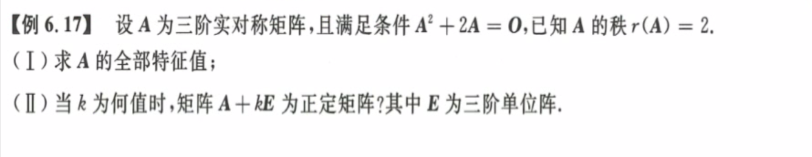
   第一问：根据矩阵运算后特征值的变化$A^k\rarr \lambda^k$，$f(A) \rarr f(\lambda)$，得到$\lambda^2+2\lambda=0$，即$\lambda \in {0,-2}$。根据对称矩阵相似的特点，即对称矩阵必可对角化，且$P^{-1}AP = \Lambda,\quad Q^TAQ=Q^{-1}AQ=\Lambda$，由$r(A)=2$得其有两个非零得特征值，即$\lambda=1, \lambda=-2(二重根)$ 
   第二问：由正定矩阵则得到特征值都大于零，这里利用$f(A) \rarr f(\lambda)$，得到$k>0, -2+k>0$，即$k>2$。

## 合同矩阵

* **概念辨析** $相似 \rarr 合同 \rarr 等价$ 
  * **相似** $A \sim B \quad P^{-1}AP=B$ ；
    * 充分条件：两个矩阵$A,B$可以相似对角化于同一个对角矩阵$\Lambda$
    * 必要条件：两个矩阵$A,B$有相同的特征值、行列式、迹
    * 性质：传递性，$A\sim B \rarr f(A) \rarr f(B),\ A^*\sim B^*,\ A^T\sim B^T,\ A^{-1}\sim B^{-1},\ AB\sim BA$ 
  * **合同** $A \simeq B \quad \exist C^{-1}, C^TAC=B$ 
    * 充要条件：$p_A=p_b, q_A=q_B$ ；正负特征值个数相同。
    * 充分条件：$A\sim B \rarr A\simeq B$ 
  * **等价** $A\cong B \Lrarr PAQ=B \Lrarr r(A) = r(B)$ 
    * 矩阵A经过有限次可逆的/初等变换得到矩阵B
  * **秩**
    * $r(A+B) \le r(A)＋r(B)$ 
    * $r(AB) \le r(A),\ r(AB) \le r(B)$ 
    * $AB=O \rarr r(A) + r(B) \le n$ 

1. 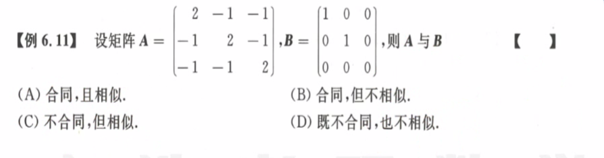
   解题思路： 

## 本章小结

**二次型的矩阵都是对称矩阵，都有正交矩阵Q使得** $Q^TAQ=Q^{-1}AQ=\Lambda$ 

1. 标准型 规范型
   1. 正交变换：$Q^TAQ= B$ 
   2. 配方法：$C^TAC= B$ 
   3. 惯性指数：$p+q=r(A)$ $p,q$分别为正负惯性指数，也等于正负特征值个数。
2. 正定
   1. $p=n, q=0$ 
   2. $\lambda_i > 0$ 
   3. $A=C^TEC$ 
3. 合同
   1. $p_A=p_B, q_A=q_B$ 
   2. 正负特征值个数相同

