# 随机事件

## 事件的关系与运算

1. 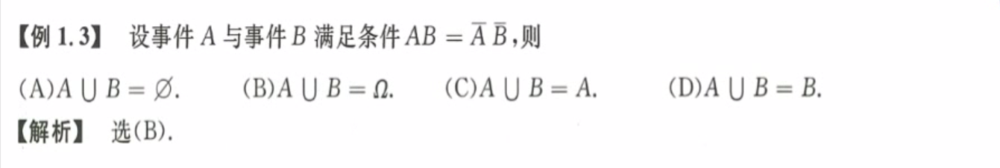
   解题思路：直接$\overline B = 1 - B, \overline A = 1 - A$  
2. 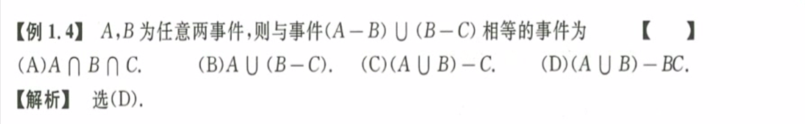
   解题思路：文氏图法
3. 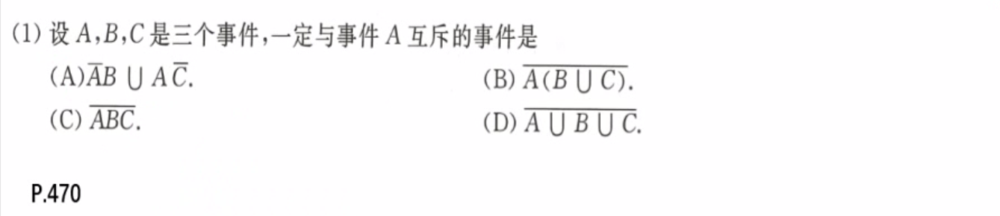
   解题思路：$\overline A$一定发生

## 概率的性质和计算

1. 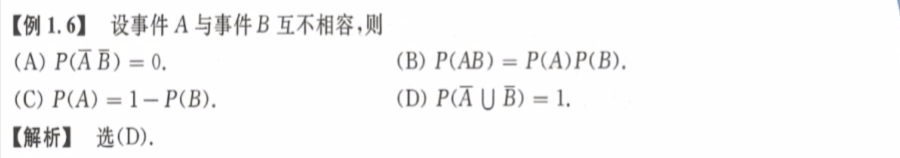
   概念：互不相容即，$P(AB) = 0$ 
2. 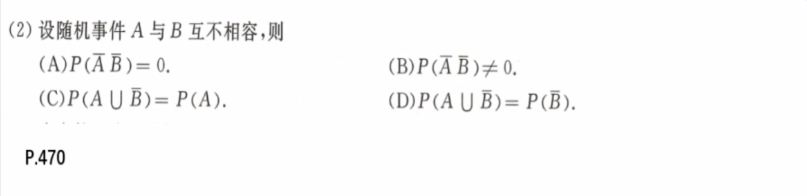
   **画图法或者特例法。**
3. 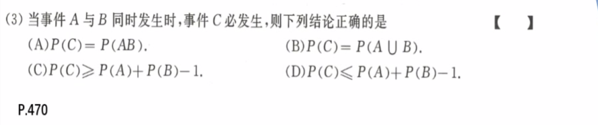
   画图法表示的时候，记住是AB在C中，而不是相反。
4. 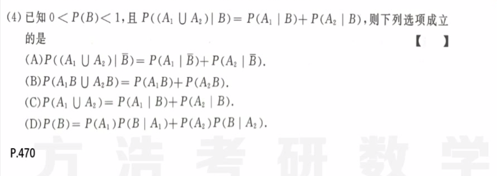
   画图，条件概率与一般概率的性质
5. 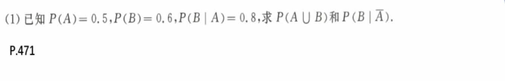
   画图，推导，得到公式。
6. 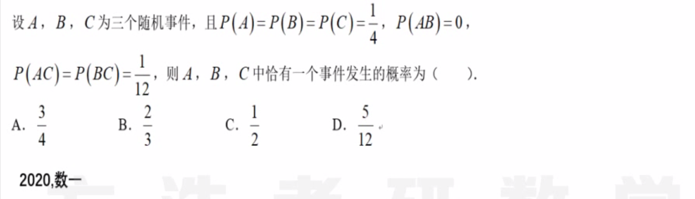
   $P(A \cup B \cup C) = ?$
7. 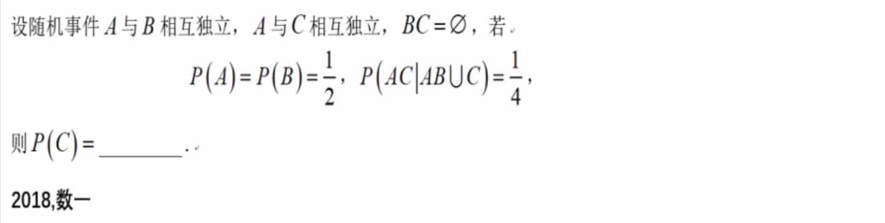
   $P(AC \cap (AB \cup C)) = P(AC)$，因为$AC \sube C$
8. 
   也可文氏图
9. 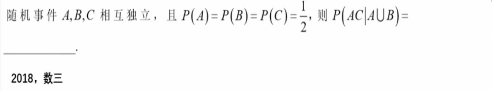

## 事件的独立性

1. 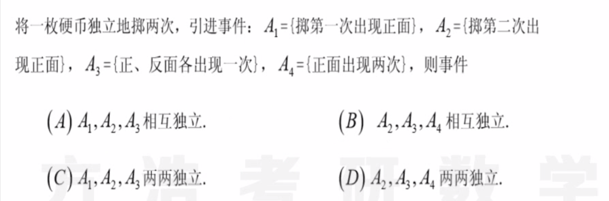
   快速排除法：$A_3,A_4$两个时间互斥，而互斥事件一般都不是独立的
2. 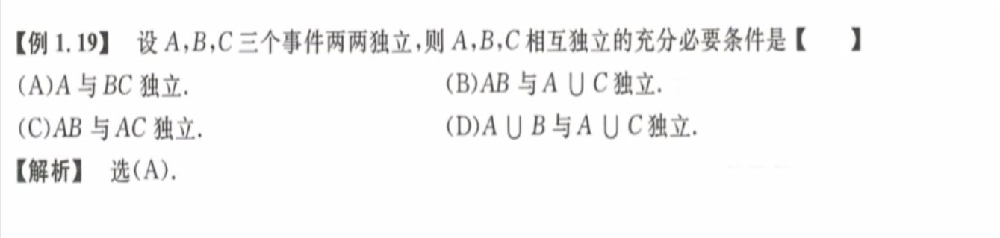
   充要条件就是$P(ABC)=P(A)P(B)P(C)$，找到能推出这个的条件
3. 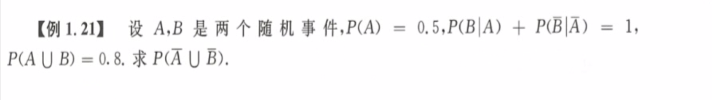
   首先判断AB独立，然后$P(\overline A \cup \overline B) = P(\overline{A \cap B})$ ，淡然根据定义也可以做 $P(A \cup B) = P(A) + P(B) - P(AB)$ 
4. 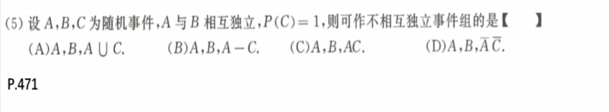
   看懂题意，注意空集、全集与任何集合都相互独立
5. 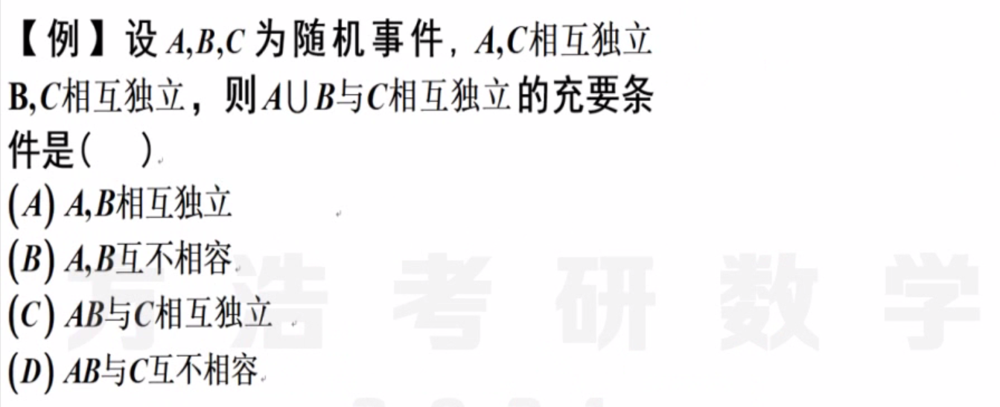
   数学化简，$P(A\cup B|C) = P(A \cup B)$，就是两个相互独立的充要条件。两边往同一个方向化简。

## 其他应用

1. 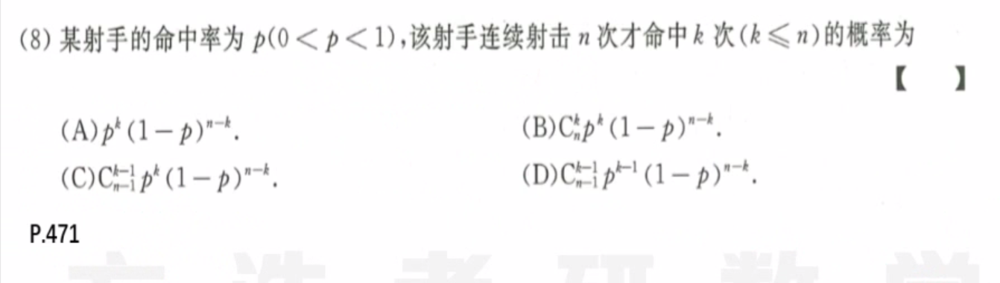

