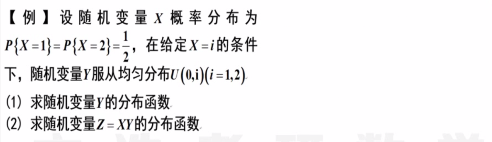

# 二维随机变量

## 二维分布概念与性质

1. 
   **规范性：**$F(x,y) :\quad F(-\infin, y) = 0,\ F(x, -\infin)=0,\ F(+\infin,+\infin) = 1$ ；第二问就直接看图列等式。
2. 
   **离散型二维概率：**列出表格、确定XY约束关系、挨个计算概率、验算概率规范性
3. 
   画表：用表格结合$X,\ Y$，然后直接看出概率分布。
4. 
   解题思路：规范性 - 和为零；事件相互独立 - 两个事件同时成立的概率等于分别成立的概率的乘积。
5. 
   解题思路：这道题综合性非常强，集成了二维随机变量的大部分知识点。第一问：$f_Y(y) = \int_{-y}^{+y}(6x^2)dx$，注意数形结合确定积分的上下限。第二问：$f_{X|Y}(x|y) = \frac {f(x,y)}{f_Y(y)}$，注意条件概率密度的定义。第三问：当一个随机变量取确定的值，则退化成为一个一维随机变量的分布，分母将$y=\frac12$代入其边缘分布函数，分子则将Y的值和X的范围代入二维密度函数，并对X进行积分。第四问：二维随机变量密度的条件概率，即画出图像找到分子分布所对应的区域分别积分，由于分母的条件分布已知，即可代入直接积分。
6. 
   解题思路：这道题的积分并不难，关键是要在平面上划分好多个区域，对每个区域分别讨论，注意区域边界的归属。
7. 
   解题思路：条件给的很清楚，关键是如何翻译成数学的语言。第一个给的是边缘密度，第二个给的是条件密度，要注意区分，二者的乘积就是联合密度。第二问也简单，就是计算一个区域内的二重积分。
   第三问：卷积公式 $Z = X - Y \ \rarr\ Y = h(X,Z) = X-Z \ \rarr\ f_Z(z) = \int_a^b|\frac{\part h}{\part z}|f(X, h) dx$，其中被积变量$x$的值由$Y$的范围确定，即将原积分区域中$Y$要满足的条件代入$X-Z$，即得到积分的上下限。

## 二维均匀、正态

1. 
   定义法：画出图像，求$F_U$，然后再求导，得到概率密度。
   卷积法：方法同上，但是注意被积变量要满足多个条件的交集，而且这里需要分段计算相加。
2. 
   考查二维分布的独立性，而这独立就是条件概率等于其本身的概率。
3. 
   **二维正态分布线性组合：**如果有$(X,Y) \sim N(\mu_1, \mu_2;\sigma_1^2,\sigma_1^2,\rho)$，则有两个变量的线性组合满足一维正态分布，即$(aX+bY) \sim N(a\mu_1+b\mu_2, a^2\sigma_1^2+b^2\sigma_2^2+2ab\rho\sigma_1\sigma_2)$，这道题应该转化为两个变量的线性组合。
4. 
   **二维正态分布：**$f(x,y) = \frac{1}{2\pi\sigma_1\sigma_2\sqrt{1-\rho^2}}\ exp\{- \frac 1 {2(1-\rho^2)}[\frac{(x-\mu_1)^2}{\sigma_1^2} + \frac{(y-\mu_2)^2}{\sigma_2^2} -2\rho \frac{(x-\mu_1)(y-\mu_2)}{\sigma_1 \sigma_2 }] \}$ 
   **一维正态分布：**$f(x) = \frac 1{\sqrt{2\pi}\sigma}e^{-\frac{(x-\mu^2)}{2\sigma^2}}$ 
   方法一：凑二维正态分布，这个方法不好，因为客观来说这里并没有给出二维正态分布的条件，有可能是不满足的，而且二维正态分布的公式非常难记忆，很容易出错。$f(x,y) \sim N(0,0;\frac12,1,\frac 1{ \sqrt{2}})$ 
   方法二：定义积分法，根据定义转化为二重积分，然后在积分的最后关头用一维正态分布的公式简化计算。第二问同理，再继续用就可以。

## 多维随机变量函数的分布

1. 
   解题思路：优先求出边缘分布，然后利用规范性和对称性，再求出一种情况的概率，相减很快就得到了概率分布表。
2. 
   第一问：全概率公式，离散连续混合型可以用全概率公式降维，化二维为一维。
   第二问：依然是全概率公式，但是这里在求解的时候需要消元，把z看作是参数。
   一定要找关键点，然后把区间分段，分段之后分别计算。
3. 
   定义法：还是牢牢抓住定义，如何从二维分布函数得到一维分布函数，如何紧扣定义解题。
   $F(X_1,Y) = P(X_1 \le x_1,Y \le y) = P(X_1 \le x_1,Y \le y,X_3=0)P(X_3=0) + P(X_1 \le x_1,Y \le y,X_3=1)P(X_3=1)$
4. 
   解题思路：还是定义法，根据较大值函数定义，将其去掉化简成一般概率形式。
5. 
   提示：CD选项，我们只能直接求较小值大于一个数或者较大值小于一个数的概率，否则取对立事件算。
6. 
   解题思路：用逻辑演算中的对立事件做，这里没说两个随机变量是独立的，所以只能通过逻辑演算来写，考试不考。
7. 
   解题思路：第一问和第二问都是卷积公式，然后积分，得到分布函数。
   第三问：将两个条件化简成为x和y的条件，将u和v看作参数，得到一个二重积分，积分之后得到概率，再判断独立
   一定注意积分区域，自己算的时候第一次算错了积分区域，血亏，一步一步不要赶。

## 本章小结

1. 二维分布
   1. 离散型：联合分布表（边缘分布、条件分布）
   2. 连续型：$f(x,y)$是根本，进而得到$F(x,y), f_X(x), f_Y(y), f_{Y|X}(y|x)$ 
   3. 独立性：
2. 二维正态分布
   1. 独立性：$\rho=0$ 
   2. 边缘：一维 - 正态，线性组合 - 正态
   3. 凑：配方、除系数、添因子
3. 二维随机变量函数分布
   1. 卷积公式
   2. 全概率公式
   3. 较大较小