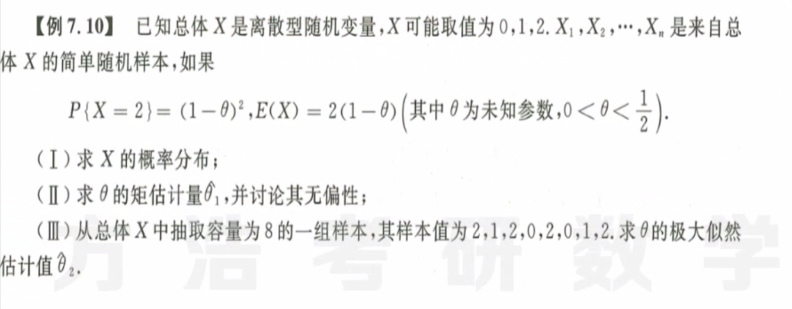
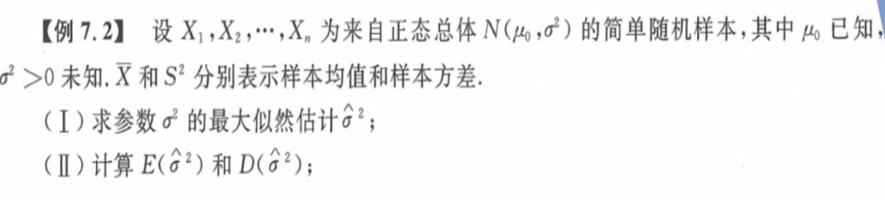
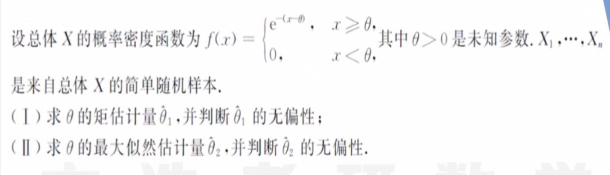
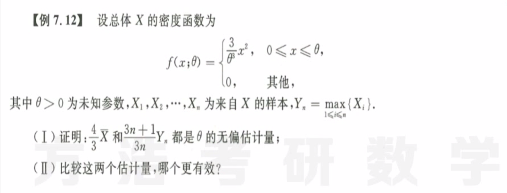
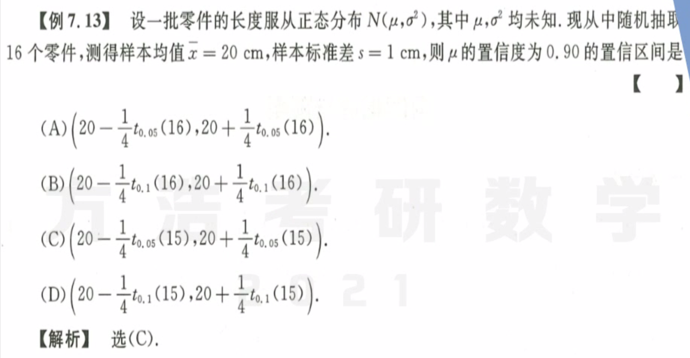
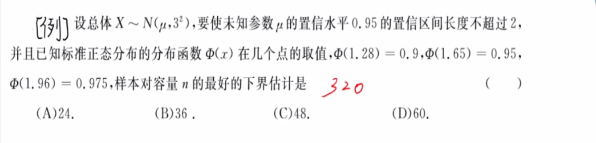
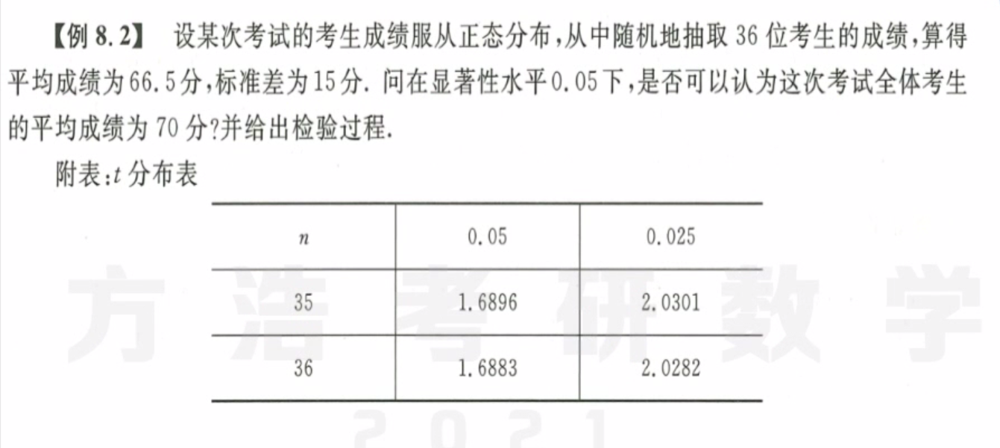
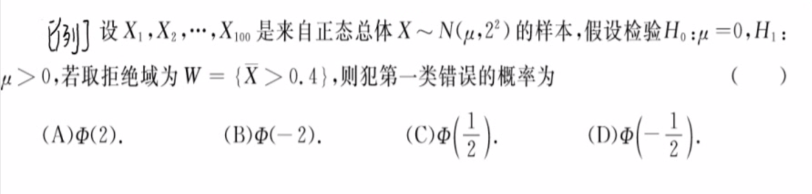

# 参数检验

**概率统计本人第一大错误 分不清$E(X^2), D(X)=E(X^2)-[E(X)]^2$ ！！！**

* **要用到的四大分布：**
  1. $U=\frac {\overline X - \mu}{\frac {\sigma_0} {\sqrt n}} \sim N(0,1)$ 
  2. $T=\frac {\overline X - \mu}{\frac {S} {\sqrt n}} \sim t(n-1)$ 
  3. $\chi^2= \frac{\sum\limits_{i=1}^{n}(X_i-\overline X)^2}{\sigma_0^2} \sim \chi^2(n-1)$ 
  4. $\chi^2= \frac{\sum\limits_{i=1}^{n}(X_i-\mu)^2}{\sigma_0^2} \sim \chi^2(n)$ 

 

## 估计

1. 
   解题思路：利用规范性求概率分布；利用矩估计（期望）求矩估计量$\hat \theta_1$，利用期望计算无偏性；记住似然函数的定义是每个样本取值概率的乘积，然后取对数求导。
2. 
   解题思路：根据定义，写出正态分布的连乘，就是关于$\sigma^2$的似然函数，老套路取对数求导得到极大似然估计。
   计算期望和方差，有平方找卡方，这里完美利用了卡方分布的期望和方差公式。
3. 
   **【好题】看清啊，这里的概率密度函数不是从零开始！！！第二问中的$\theta$有范围的呀！！！****
   第二问：$\theta = min(X_1,X_2,\dots,X_n)$ 所以要求无偏性就要得到$\theta$的分布函数，然后算期望。结果是有偏估计。
   要记住，最大似然和最小似然估计出来可能是一个最小值或者最大值函数，一定注意。
4. 
   解题思路：方法同上，无偏性，有效性；这里需要计算的有$f(x;\theta),F(x;\theta),F_Y,f_y$，期间需要多次积分；好在只是指数，没有复杂的分布函数。注意区别$E(X^2),D(X)$，求方差的时候注意系数平方再提出。

## 区间估计 假设检验

1. 
   解题思路：根据置信区间定义计算，找到同时有$n,\bar x,s$的$t$分布
2. 
   解题思路：差点就做出来了，看到正态分布，立刻想到分布1。
3. 
   解题思路：典型的双侧检验，那么单侧检验怎么计算呢？？？
4. 
   第一类错误就是**弃真**，在这里也就是落在拒绝域的概率，本来是对的，结果给拒绝了。

